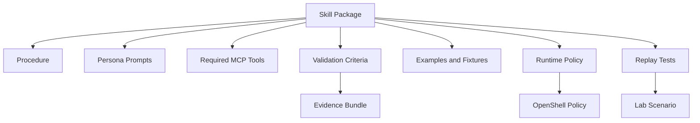
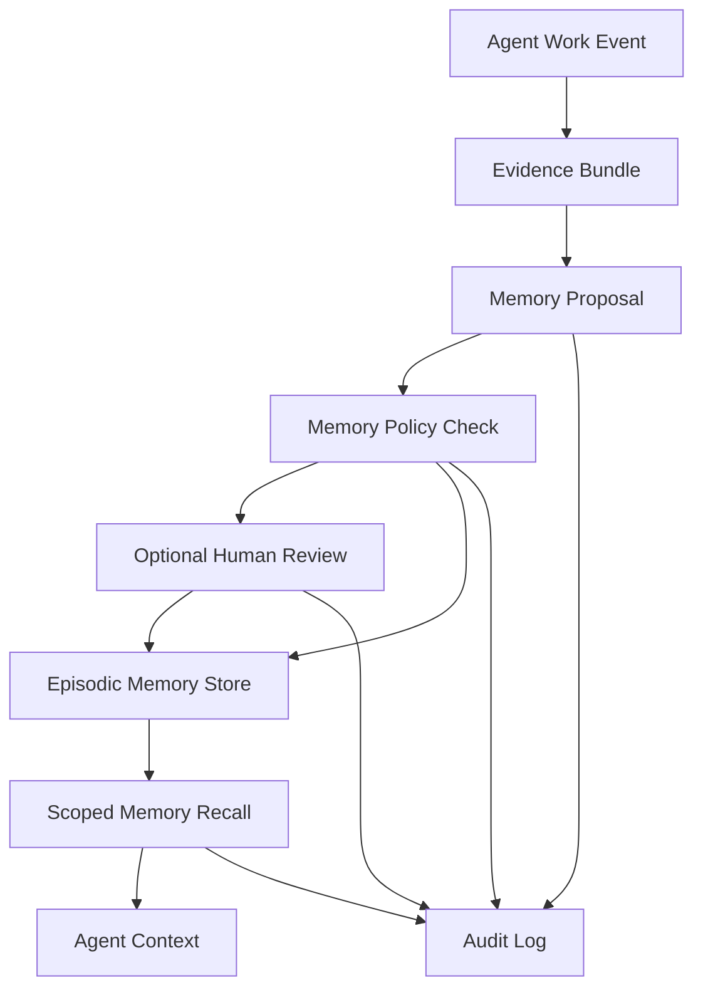
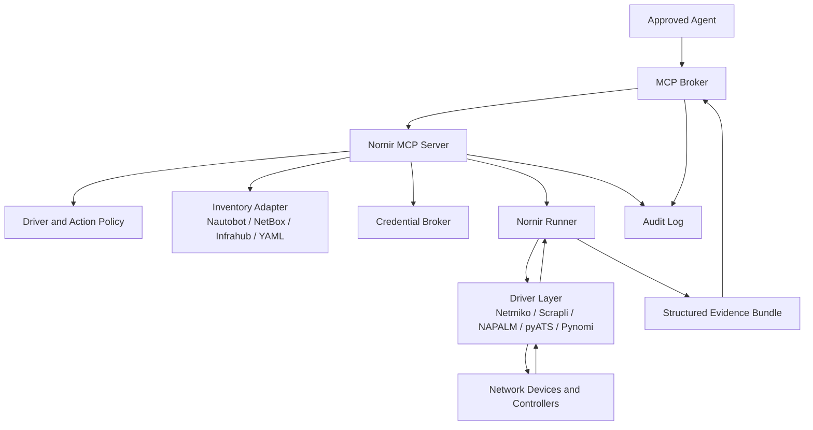
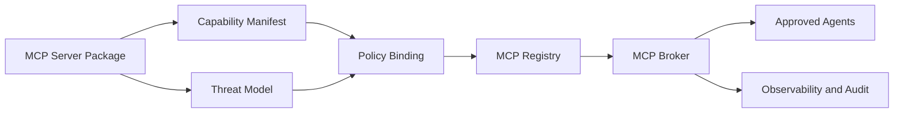
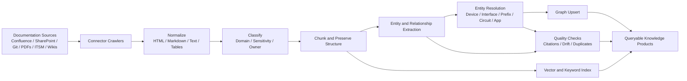
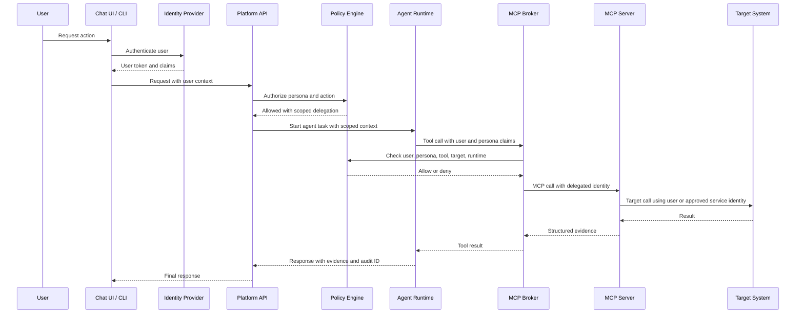
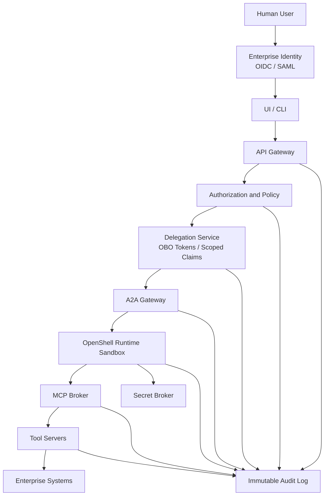
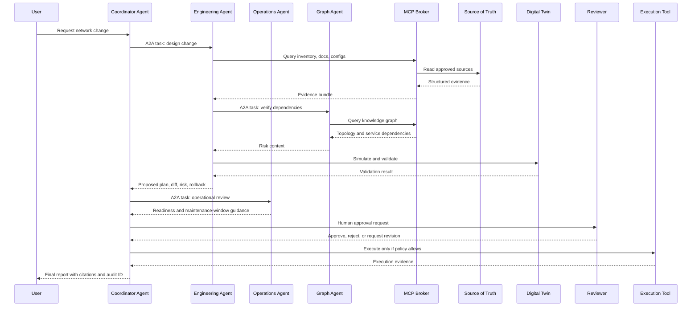

# The Agentic Network Platform

An open source, enterprise-ready framework for building secure network AI agents.

The goal is to create an "OpenClaw for networks": a local-first, policy-governed, multi-agent platform where specialized agents can reason over network documentation, topology, telemetry, configuration, incidents, and procedural knowledge, then act through controlled tools.

This repository starts as the design home for the lab and should evolve into a monorepo for related standalone projects. The lab should become the proving ground for MCP tools, A2A agent collaboration, NVIDIA OpenShell runtime policies, knowledge graph workflows, delegated identity, and enterprise security controls.

## North Star

Network teams need AI agents that can do real operational work without being given unchecked shell, credential, or API access. The platform should make useful network agents possible while keeping the blast radius small enough for enterprise customers to trust.

The platform should:

- Run agents inside NVIDIA OpenShell or compatible isolated runtimes.
- Use A2A for agent-to-agent communication and discovery.
- Use MCP for tool, context, and workflow integrations.
- Treat `nornir-mcp` as a primary standalone project: a Nornir-based MCP server for safe network interaction across Netmiko, Scrapli, NAPALM, pyATS, Pynomi, and future drivers.
- Support configurable personas such as engineering, operations, security, documentation, and change-management agents.
- Package procedural knowledge as versioned skills with validation criteria.
- Provide governed episodic memory so agents can recall prior investigations, decisions, incidents, approvals, and user/team preferences with traceable provenance.
- Build and maintain a network knowledge graph from documentation, source-of-truth systems, telemetry, configs, and tickets.
- Ingest documentation from systems such as Confluence, SharePoint, Git repositories, Google Drive, ServiceNow, and internal portals.
- Provide a first-class integration model for first-party and third-party MCP servers, including registration, capability discovery, policy binding, observability, and lifecycle management.
- Enforce delegated identity so chat, CLI, and API actions run on behalf of the user and cannot grant users elevated privileges merely because an agent or MCP server has broader service permissions.
- Develop through public issues and pull requests so every code change has a visible trail from request to review to merge.
- Enforce enterprise controls by default: least privilege, approval gates, audit logs, secrets isolation, signed tools, policy-as-code, and network egress control.
- Treat network changes as plans that must be validated, explained, approved, executed, and audited.

## Design Principles

1. Agents never get direct unrestricted access.
   Agents communicate with MCP brokers and tool servers. The runtime, broker, and policy layer enforce boundaries.

2. A2A is for collaboration, MCP is for capability.
   Agents coordinate with other agents over A2A. They use MCP to reach tools, data, workflows, and controlled actions.

3. Standalone projects should be independently useful.
   Core capabilities such as `nornir-mcp` should be able to run inside the platform or as standalone open source projects.

4. Read-only is the default.
   Destructive or state-changing actions require explicit policy, approval, simulation, and audit trails.

5. Identity is delegated, not inherited.
   Effective permissions are the intersection of the user identity, persona policy, MCP server policy, and downstream target permissions.

6. Knowledge must be traceable.
   Every answer, graph edge, and recommendation should link back to source documents, telemetry, configs, tickets, or tool output.

7. Network operations require evidence.
   The agent should show command output, topology evidence, config diffs, validation results, and rollback options before action.

8. Memory is a governed system, not hidden prompt state.
   Episodic memory should be scoped, inspectable, redactable, policy-controlled, and tied to evidence.

9. The lab must look like an enterprise.
   The home lab should include identity, secrets, policy, observability, source-of-truth, graph storage, document ingestion, GitOps, and isolated tool execution.

10. Trust comes from process evidence.
    Every code change should be tied to an issue, pull request, review, checks, and audit trail, even when one AI-assisted implementer writes most of the code.

## Open Source Trust Workflow

The project uses an issue-driven development model documented in [Issue-Driven Development Workflow](docs/governance/issue-driven-development.md).

Once the repository is published, code changes should follow:

```text
maintainer prompt -> issue -> branch -> pull request -> checks -> human review -> merge -> issue closed
```

This supports a single-writer, public-review model:

- The maintainer can prompt the AI agent to draft issues.
- The AI agent can implement the issue on a branch and open a PR.
- The PR links back to the issue with `Closes #123`, `Fixes #123`, or `Resolves #123`.
- Automated checks provide objective validation.
- A human maintainer approves before merge.
- The merged PR closes the issue and leaves a public trail.

Repository governance files:

- [CONTRIBUTING.md](CONTRIBUTING.md)
- [Issue-driven workflow](docs/governance/issue-driven-development.md)
- [Feature issue form](.github/ISSUE_TEMPLATE/feature.yml)
- [Bug issue form](.github/ISSUE_TEMPLATE/bug.yml)
- [Design issue form](.github/ISSUE_TEMPLATE/design.yml)
- [Pull request template](.github/pull_request_template.md)

## Web UI

The production web app lives in [apps/web](apps/web/README.md).

The imported UI design reference lives in [docs/design/network-agent-platform-ui](docs/design/network-agent-platform-ui/README.md).

Deployment decision: the UI should run as a dedicated service, not inside an NVIDIA OpenShell agent sandbox. OpenShell is the isolated agent runtime; the UI is the human-facing control plane that calls Platform APIs with delegated identity.

See [Web UI Deployment Architecture](docs/architecture/web-ui-deployment.md).

## Agent Runtime Design

The first capability-focused runtime design is captured in [OpenShell Nornir Agent Runtime Architecture](docs/architecture/openshell-nornir-agent-runtime.md).

It defines the secure OpenShell sandbox model, governed terminal access, Nornir-first execution environment, custom script controls, settings database inheritance, Git-backed configuration flow, and the initial capability phases for collection and automation planning.

## High-Level Architecture

```mermaid
flowchart TB
    user[Network Engineer or Operator]
    ui[Web UI / CLI / Chat Interface]
    api[Platform API Gateway]
    identity[Identity and Delegation Broker<br/>OIDC / OBO Tokens / RBAC Claims]
    policy[Policy Engine<br/>OPA / Cedar / OpenShell Policy]
    registry[Agent Registry<br/>Personas and A2A Cards]
    mcpRegistry[MCP Server Registry<br/>Capabilities / Scopes / Policies]
    orchestrator[Coordinator Agent]

    subgraph a2a[A2A Agent Mesh]
        eng[Engineering Agent]
        ops[Operations Agent]
        sec[Security Agent]
        docs[Documentation Agent]
        change[Change Agent]
        graphAgent[Graph Steward Agent]
        memoryAgent[Memory Steward Agent]
    end

    subgraph runtime[Isolated Agent Runtime]
        openshell[NVIDIA OpenShell Sandboxes]
        secrets[Runtime Secret Broker]
        audit[Audit and Session Recorder]
    end

    subgraph mcp[MCP Capability Plane]
        inventory[MCP: Source of Truth<br/>Nautobot / NetBox / Infrahub]
        nornir[MCP: Nornir Network Execution<br/>Netmiko / Scrapli / NAPALM / pyATS]
        telemetry[MCP: Telemetry<br/>Prometheus / Elastic / Logs]
        config[MCP: Config and GitOps<br/>Git / Ansible / NAPALM]
        graph[MCP: Knowledge Graph<br/>Neo4j / RDF / Graph DB]
        docsMcp[MCP: Documents<br/>Confluence / SharePoint / Git]
        changeMcp[MCP: ITSM and Change<br/>ServiceNow / Jira]
        labMcp[MCP: Lab Control<br/>OKD / Proxmox / Containerlab]
    end

    subgraph data[Knowledge and Evidence Stores]
        kg[Network Knowledge Graph]
        episodic[Episodic Memory Store]
        vector[Vector Index]
        object[Raw Document and Evidence Store]
        events[Event and Audit Store]
    end

    subgraph network[Network Lab and Enterprise Targets]
        sim[Digital Twin / Batfish / Containerlab]
        devices[Network Devices and Controllers]
        k8s[OKD / Kubernetes]
    end

    user --> ui --> api
    api --> identity
    identity --> policy
    policy --> registry
    policy --> mcpRegistry
    registry --> orchestrator
    orchestrator <--> a2a
    a2a --> openshell
    openshell --> secrets
    openshell --> audit
    openshell --> mcp
    mcpRegistry --> mcp
    mcp --> data
    mcp --> network
    audit --> events
```

## Runtime Model

The core runtime assumption is that every agent runs in an isolated execution boundary. NVIDIA OpenShell is the preferred target because it is designed for policy-governed autonomous agent execution with sandboxing, filesystem limits, network controls, and declarative runtime policy.

The platform should still define a runtime adapter so the control plane can support more than one execution backend later.

```mermaid
flowchart LR
    task[User Request or Event]
    planner[Coordinator Agent<br/>A2A Client and Server]
    card[Agent Card Lookup]
    persona[Persona Resolution]
    sandbox[OpenShell Sandbox]
    broker[MCP Broker]
    tool[Approved MCP Tool Server]
    result[Evidence Bundle]
    review[Human / Policy Review]
    action[Execution or Closeout]

    task --> planner
    planner --> card
    card --> persona
    persona --> sandbox
    sandbox --> broker
    broker --> tool
    tool --> result
    result --> review
    review --> action
    action --> planner
```



## Monorepo and Project Model

The Agentic Network Platform should be a monorepo for independently useful projects that share platform contracts, policy, test fixtures, and lab infrastructure.

The repo should support two modes:

- Standalone mode: a project such as [Nornir MCP](projects/nornir-mcp/README.md) can be installed, tested, and run without the full agent platform.
- Integrated mode: the same project registers with the platform MCP registry, inherits identity and policy controls, emits audit events, and becomes available to approved agents.

```mermaid
flowchart TB
    root[The Agentic Network Platform Monorepo]
    contracts[Shared Contracts<br/>MCP / A2A / Identity / Evidence]
    policy[Shared Policy<br/>OPA / OpenShell / Approval Rules]
    lab[Shared Lab Fixtures<br/>OKD / Proxmox / Containerlab]
    tests[Shared Test Harness<br/>Replay / Policy / Integration]

    subgraph projects[Standalone Projects]
        nornir[Nornir MCP]
        docs[Document Ingestion MCP]
        graph[Knowledge Graph MCP]
        memory[Episodic Memory MCP]
        change[Change Management MCP]
    end

    root --> contracts
    root --> policy
    root --> lab
    root --> tests
    root --> projects
    contracts --> projects
    policy --> projects
    tests --> projects
```

Each standalone project should have:

- Its own README, package metadata, tests, examples, and release notes.
- A clear API and MCP capability manifest.
- A threat model and policy profile.
- Local development fixtures.
- Integration tests against the platform MCP broker.
- A path to run outside the platform for open source adoption.

## Agent Personas

Personas should be configuration, not hardcoded classes. A persona defines the agent mission, allowed skills, allowed MCP tools, model routing preferences, required approval levels, and runtime policy.

Example persona shape:

```yaml
id: network-engineering-agent
display_name: Network Engineering Agent
mission: Design, validate, and propose network changes with evidence.
runtime:
  provider: openshell
  policy: policies/openshell/network-engineering.yaml
models:
  default: local-nemotron-or-compatible
  fallback: approved-frontier-model
a2a:
  card: agents/network-engineering/card.yaml
skills:
  - skills/bgp-troubleshooting
  - skills/config-diff-review
  - skills/change-risk-assessment
mcp_tools:
  read:
    - sot.inventory.lookup
    - nornir.inventory.query
    - nornir.command.run_readonly
    - telemetry.query
    - graph.query
    - docs.search
    - git.read
  write:
    - nornir.config.plan
    - git.propose_change
    - change.create_draft
approvals:
  required_for:
    - nornir.command.write
    - nornir.config.apply
    - network.device.write
    - git.merge
    - change.execute
memory:
  episodic: enabled
  scopes:
    - tenant
    - persona
    - case
    - user
  write_policy: policy_approved
  retention: 180d
```

Initial personas:

- Engineering Agent: designs changes, validates configs, produces diffs, checks standards, and prepares implementation plans.
- Operations Agent: triages incidents, correlates telemetry, checks runbooks, and recommends restore actions.
- Security Agent: reviews access, policy, exposed services, vulnerable devices, and risky tool use.
- Documentation Agent: ingests docs, reconciles stale pages, cites sources, and proposes documentation updates.
- Change Agent: builds change records, validates required evidence, tracks approvals, and coordinates execution windows.
- Graph Steward Agent: maintains entity resolution, graph quality, stale edges, and source attribution.
- Memory Steward Agent: maintains episodic recall quality, retention, redaction, deduplication, and source attribution.
- Lab Agent: manages OKD, Proxmox, Containerlab, test devices, mock controllers, and validation fixtures.

## Skills for Procedural Knowledge

Skills are versioned procedural packages. They should be testable, reviewable, and bound to policy.

A skill should include:

- `skill.yaml`: name, owner, version, required tools, approval level, and risk rating.
- `procedure.md`: human-readable workflow.
- `prompts/`: agent instructions and role-specific task framing.
- `validators/`: deterministic checks for success or failure.
- `examples/`: known-good inputs, outputs, command traces, and evidence bundles.
- `policy/`: runtime and tool permissions required by the skill.
- `tests/`: replayable scenarios against lab fixtures.



## Episodic Memory

Episodic memory is a first-class platform requirement. It captures what happened during prior agent work so future agents can use relevant operational experience without relying only on static documentation or vector search.

The platform should remember:

- Prior investigations, hypotheses, dead ends, and final conclusions.
- Incident timelines, symptoms, affected services, commands run, and evidence gathered.
- Change plans, approvals, execution results, rollback notes, and post-change validation.
- User and team preferences that affect workflow, such as required evidence, escalation paths, and preferred validation surfaces.
- Lab experiments, MCP tool behavior, parser outcomes, failed tests, and successful remediation patterns.
- Agent collaboration traces, including which persona contributed what decision or evidence.

Memory must be governed:

- Memory writes go through a memory service or MCP tool, not direct agent-local files.
- Each memory has tenant, user, persona, case, source, sensitivity, retention, and provenance metadata.
- Sensitive memories support redaction, expiration, legal hold, and deletion workflows.
- Agents can propose memories, but policy decides whether they are stored automatically, queued for review, or rejected.
- Memory recall must cite the memory record and its source evidence.
- Memory access is filtered by identity, role, tenant, persona, and case context.
- Memory stores must be auditable and replayable for incident review and model evaluation.



Episodic memory is separate from the knowledge graph, but they should reinforce each other. The knowledge graph represents durable network facts and relationships. Episodic memory represents time-bound experience: what was tried, who approved it, why a path was rejected, what evidence existed at the time, and what the agent should remember next time.

## MCP Tool Plane

MCP servers should be small, composable, and policy-aware. Agents should not know vendor credentials or direct API details. The MCP broker handles auth, policy checks, tool discovery, request logging, and result shaping.

Initial MCP tool domains:

- Inventory and source of truth: Nautobot, NetBox, Infrahub, CMDB, IPAM.
- Network execution: `nornir-mcp` for inventory-backed command execution, collection, config planning, and driver routing across Netmiko, Scrapli, NAPALM, pyATS, Pynomi, and future adapters.
- Network config: Git, Ansible, NAPALM, pyATS, Scrapli, Nornir.
- Telemetry and logs: Prometheus, Grafana, Elastic, Loki, OpenTelemetry.
- Topology and graph: Neo4j, RDF stores, topology snapshots, dependency maps.
- Episodic memory: investigation history, incident memory, change memory, lab experiment recall, and persona-scoped preferences.
- Documentation: Confluence, SharePoint, Git, Markdown, PDFs, diagrams, Google Drive.
- Change and ticketing: ServiceNow, Jira, GitHub Issues, Linear.
- Lab control: OKD, Kubernetes, Proxmox, Containerlab, Batfish, virtual devices.
- Security: secrets broker, certificate inventory, IAM, vulnerability sources, policy review.

Tool design rules:

- Split read tools from write tools.
- Make every write tool support dry-run or plan mode.
- Return structured evidence, not only prose.
- Include source identifiers, timestamps, request IDs, and raw output references.
- Require idempotency keys for state-changing calls.
- Log tool input, policy decision, user, agent, and result digest.

## Nornir MCP

[Nornir MCP](projects/nornir-mcp/README.md) is a primary standalone project in this monorepo. It should provide a secure MCP server for network interaction using Nornir as the inventory and task-execution framework.

The purpose is to give agents a controlled way to interact with real networks without embedding network credentials, driver choices, or device-access logic inside agent prompts.

Core requirements:

- Use Nornir for inventory, host/group metadata, task execution, concurrency, and result aggregation.
- Support multiple network drivers and libraries, including Netmiko, Scrapli, NAPALM, pyATS, Pynomi, and vendor-specific adapters where needed.
- Maintain driver-selection knowledge as configuration and policy, not agent guesswork.
- Select drivers from inventory metadata such as platform, network OS, device role, hardware model, site, tag, capability, and command family.
- Support read-only collection as the default mode.
- Support write or config actions only through explicit policy, dry-run, approval, and audit.
- Return structured evidence with per-device status, raw output references, parsed output, timing, errors, and driver used.
- Integrate with source-of-truth systems for inventory and credentials without exposing secrets to agents.
- Provide replayable fixtures for lab validation, parser development, and regression testing.
- Run both as a standalone MCP server and as a registered platform capability.

Example driver policy:

```yaml
driver_rules:
  - name: load-balancers-use-scrapli
    match:
      device_role: load-balancer
    driver: scrapli
    transport: ssh
    allowed_actions:
      - show
      - collect

  - name: network-os-default-netmiko
    match:
      platform_family: network-os
    driver: netmiko
    transport: ssh
    allowed_actions:
      - show
      - collect

  - name: vmware-use-pynomi
    match:
      platform_family: vmware
    driver: pynomi
    allowed_actions:
      - query
      - collect
```



Initial MCP capabilities:

- `nornir.inventory.query`: search inventory and explain selected target sets.
- `nornir.driver.explain`: explain why a driver would be selected for a target.
- `nornir.command.run_readonly`: run approved read-only commands.
- `nornir.collect.parse`: collect raw output and parsed output for parser workflows.
- `nornir.config.plan`: generate config intent, diffs, and validation steps without applying.
- `nornir.config.apply`: apply approved config changes with strict policy and audit.
- `nornir.test.fixture_replay`: replay known device outputs for tests and demos.

## MCP Server Integration Model

Every MCP server should integrate through a standard platform lifecycle so first-party and third-party tools can be trusted consistently.



An MCP server must declare:

- Capabilities, schemas, and version.
- Read, write, destructive, and admin actions.
- Required identity scopes.
- Credential requirements.
- Network egress requirements.
- Data sensitivity and retention behavior.
- Audit event shape.
- Health checks and readiness checks.
- Standalone and platform-integrated run modes.

## Documentation Ingestion and Knowledge Graph Pipeline

The platform needs a product-quality ingestion pipeline, not a pile of ad hoc scrapers. Connectors should normalize documents into traceable evidence, then feed both retrieval indexes and the knowledge graph.



Knowledge graph core entities:

- Device, interface, VRF, VLAN, prefix, circuit, provider, site, rack, cluster, service, application, owner, policy, incident, change, document, procedure, telemetry signal, config artifact.

Important graph relationships:

- `CONNECTS_TO`, `DEPENDS_ON`, `OWNED_BY`, `DOCUMENTED_BY`, `OBSERVED_IN`, `CHANGED_BY`, `VALIDATED_BY`, `IMPLEMENTS_POLICY`, `HAS_RUNBOOK`, `HAS_RISK`, `AFFECTS_SERVICE`.

The graph should store provenance on every edge:

- source system
- source URL or object ID
- extraction method
- confidence score
- observed timestamp
- last verified timestamp
- owning connector

## Delegated Identity and Authorization

The chat interface, CLI, and API must operate on behalf of the authenticated user. Agents and MCP servers must not become privilege-escalation paths.

The platform should compute effective permissions for every request:

```text
effective_permission = user_permission
  intersect persona_permission
  intersect mcp_server_permission
  intersect target_system_permission
  intersect runtime_policy
```

Requirements:

- Authenticate users through enterprise identity providers such as OIDC or SAML.
- Preserve user identity, groups, roles, tenant, session, and request ID through the agent and MCP call chain.
- Use on-behalf-of tokens, scoped delegation tokens, or signed internal claims when calling MCP servers.
- Prefer per-user downstream authorization when the target system supports it.
- Use service accounts only when paired with explicit impersonation, policy checks, and user attribution.
- Prevent agents from invoking tools that the user is not allowed to use, even if the agent persona has the tool listed.
- Prevent MCP servers from executing target actions that exceed the user's downstream permissions.
- Bind approval workflows to the requesting user, approving user, agent persona, MCP server, target resource, and evidence bundle.
- Make audit records answer: who requested it, which agent planned it, which MCP server executed it, what identity was used downstream, what policy allowed it, and what changed.



## Enterprise Security Model

Security must be part of the first design, not a later hardening pass.



Required controls:

- Strong identity: OIDC/SAML, service identities, and workload identity.
- Delegated authorization: chat, CLI, agent, and MCP calls carry scoped user context instead of relying on broad agent credentials.
- Least privilege: persona-scoped tools, scoped credentials, and explicit write grants.
- Runtime isolation: OpenShell sandbox policies for filesystem, process, and network access.
- Tool isolation: MCP servers run separately from agent sandboxes.
- Secret isolation: agents request capabilities, not raw secrets.
- Privilege boundary: users cannot gain target-system permissions from the agent, and agents cannot exceed the user's allowed target scope.
- Memory isolation: episodic recall is scoped by tenant, role, user, persona, case, sensitivity, and retention policy.
- Policy-as-code: every tool call and agent action is evaluated before execution.
- Human approval: high-risk actions require explainable plans and approval records.
- Auditability: immutable logs for prompts, plans, tool calls, policy decisions, and evidence.
- Supply chain: signed tool servers, signed skill packages, SBOMs, dependency scanning.
- Data controls: source sensitivity labels, redaction, retention, and tenant boundaries.

## Network Change Workflow



## Lab Architecture

The lab should be a realistic proving ground for enterprise adoption.

```mermaid
flowchart TB
    subgraph lab[Home Lab Platform]
        okd[OKD / Kubernetes]
        gpu[NVIDIA GPU Host<br/>OpenShell Runtime Workers]
        proxmox[Proxmox Virtualization]
        registry[Private Container Registry]
        vault[Secrets and PKI]
        observability[Grafana / Prometheus / Logs]
    end

    subgraph net[Network Test Fabric]
        containerlab[Containerlab]
        virtualDevices[Virtual Routers and Switches]
        batfish[Batfish / Digital Twin]
    end

    subgraph platform[Agentic Network Platform]
        api[Platform API]
        a2a[A2A Gateway]
        mcp[MCP Broker]
        graph[Graph Store]
        docs[Document Pipeline]
        skills[Skill Registry]
    end

    okd --> api
    okd --> a2a
    okd --> mcp
    gpu --> a2a
    proxmox --> containerlab
    containerlab --> virtualDevices
    virtualDevices --> batfish
    mcp --> net
    platform --> observability
    platform --> vault
    platform --> registry
```

## Initial Repository Shape

Proposed future structure:

```text
.
├── README.md
├── apps/
│   └── web/
├── docs/
│   ├── architecture/
│   ├── adr/
│   ├── design/
│   ├── governance/
│   ├── security/
│   └── lab/
├── projects/
│   ├── nornir-mcp/
│   ├── document-ingestion-mcp/
│   ├── knowledge-graph-mcp/
│   ├── episodic-memory-mcp/
│   └── change-management-mcp/
├── packages/
│   ├── contracts/
│   ├── evidence/
│   ├── identity/
│   └── test-harness/
├── agents/
│   ├── coordinator/
│   ├── engineering/
│   ├── operations/
│   ├── security/
│   └── documentation/
├── skills/
│   ├── bgp-troubleshooting/
│   ├── config-diff-review/
│   └── incident-triage/
├── policy/
│   ├── openshell/
│   ├── opa/
│   └── approvals/
├── ingestion/
│   ├── connectors/
│   ├── pipelines/
│   └── evaluators/
├── graph/
│   ├── schema/
│   ├── migrations/
│   └── quality-rules/
├── memory/
│   ├── schema/
│   ├── retention/
│   ├── redaction/
│   └── evaluators/
├── lab/
│   ├── okd/
│   ├── proxmox/
│   ├── containerlab/
│   └── fixtures/
└── tests/
    ├── replay/
    ├── policy/
    └── integration/
```

## MVP Roadmap

### Phase 0: Design and Threat Model

- Define platform threat model.
- Define monorepo project standards for standalone and integrated MCP servers.
- Define issue-driven development, PR review, and merge governance.
- Define persona schema.
- Define skill package format.
- Define episodic memory schema, retention model, recall policy, and review workflow.
- Define `nornir-mcp` capability model, driver policy model, and evidence format.
- Define delegated identity and on-behalf-of authorization model.
- Define MCP broker requirements.
- Define A2A discovery and routing requirements.
- Define graph schema v0.
- Define lab target architecture.

### Phase 1: Read-Only Network Intelligence

- Run coordinator and two personas in OpenShell sandboxes.
- Implement A2A task routing between coordinator, engineering, and docs agents.
- Implement MCP tools for docs search, source-of-truth lookup, Git read, graph query, and read-only Nornir collection.
- Implement `nornir-mcp` standalone mode with inventory query, driver explanation, and read-only command execution.
- Publish initial roadmap issues for platform, `nornir-mcp`, identity, governance, and memory work.
- Build first documentation ingestion connector for Git and local Markdown.
- Build graph schema for devices, interfaces, prefixes, sites, owners, and documents.
- Implement read-only episodic memory recall for prior investigations and lab experiments.
- Produce cited answers with evidence bundles.

### Phase 2: Lab Automation and Validation

- Add Containerlab or virtual network fixture.
- Add config collection and parsing MCP tool.
- Add `nornir-mcp` driver policy tests for Netmiko, Scrapli, NAPALM, pyATS, and Pynomi paths.
- Add Batfish or equivalent validation path.
- Add skills for BGP troubleshooting and config diff review.
- Add governed memory writes for lab runs, failed validations, and successful remediation patterns.
- Add policy tests that prove agents cannot access blocked files, networks, or tools.

### Phase 3: Controlled Change Proposals

- Add GitOps change proposal tool.
- Add `nornir-mcp` config planning with dry-run, diff, validation, and approval requirements.
- Add dry-run config rendering and validation.
- Add human approval workflow.
- Add change-risk scoring.
- Add immutable audit records.
- Add change memory records for plan, approval, execution, validation, and rollback evidence.

### Phase 4: Enterprise Pilot Readiness

- Add OIDC/SAML integration.
- Add on-behalf-of identity propagation across chat, agents, MCP broker, MCP servers, and target systems.
- Add signed skill and tool packages.
- Add tenant isolation.
- Add memory redaction, expiration, export, and legal-hold workflows.
- Enforce branch protection, required PR reviews, and required status checks for `main`.
- Add complete observability dashboards.
- Add SOC2-style evidence collection.
- Add deployment guides for OKD/Kubernetes and isolated GPU hosts.

## Open Questions

- Should the first graph backend be Neo4j, RDF/SPARQL, PostgreSQL with Apache AGE, or a pluggable graph interface?
- Should OpenShell be the only supported runtime for v0, or should the runtime adapter support local containers for developer mode?
- Should A2A be exposed only internally at first, or should agents publish external A2A cards for interoperability testing?
- What source-of-truth system should anchor the first lab: Nautobot, NetBox, Infrahub, or a small built-in fixture?
- What is the first high-value skill: BGP troubleshooting, config diff review, incident triage, or documentation reconciliation?
- Which documentation connector should come first after Git and local files: Confluence or SharePoint?
- Should episodic memory start as PostgreSQL tables, a graph-adjacent store, or a dedicated event-sourced memory service?
- Should `nornir-mcp` default network OS devices to Netmiko and load balancers to Scrapli, or should the first release require every platform mapping to be explicitly configured?
- Should delegated identity use OAuth 2.0 token exchange, signed internal delegation tokens, target-native impersonation, or a combination by target system?

## References

- NVIDIA OpenShell overview: https://docs.nvidia.com/openshell/about/overview
- NVIDIA OpenShell GitHub: https://github.com/NVIDIA/OpenShell
- Agent2Agent protocol: https://github.com/a2aproject/A2A
- Model Context Protocol specification: https://modelcontextprotocol.io/specification/2025-06-18
