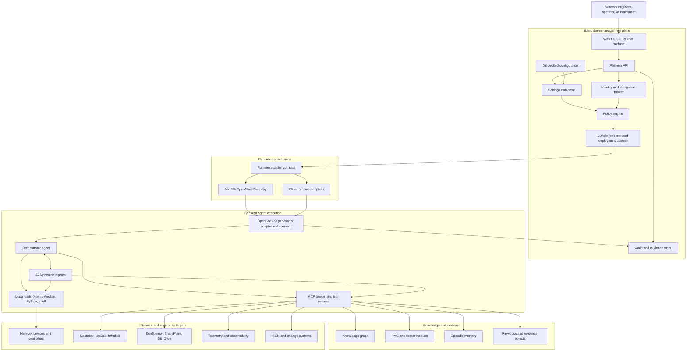
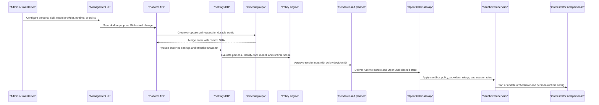
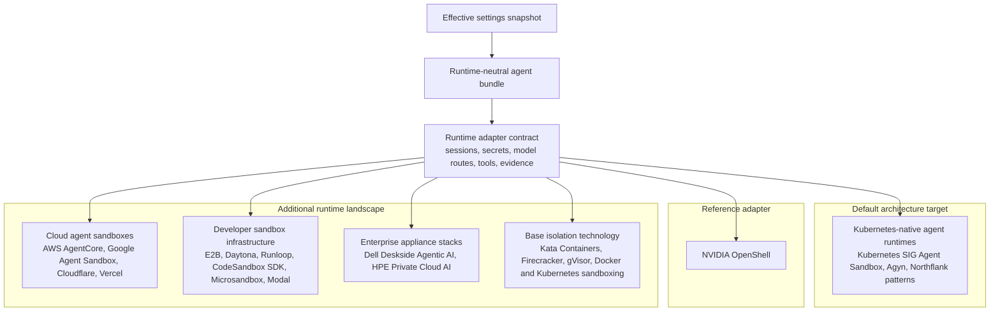
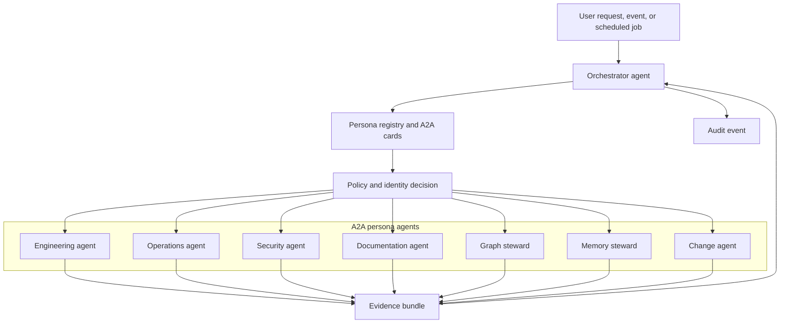
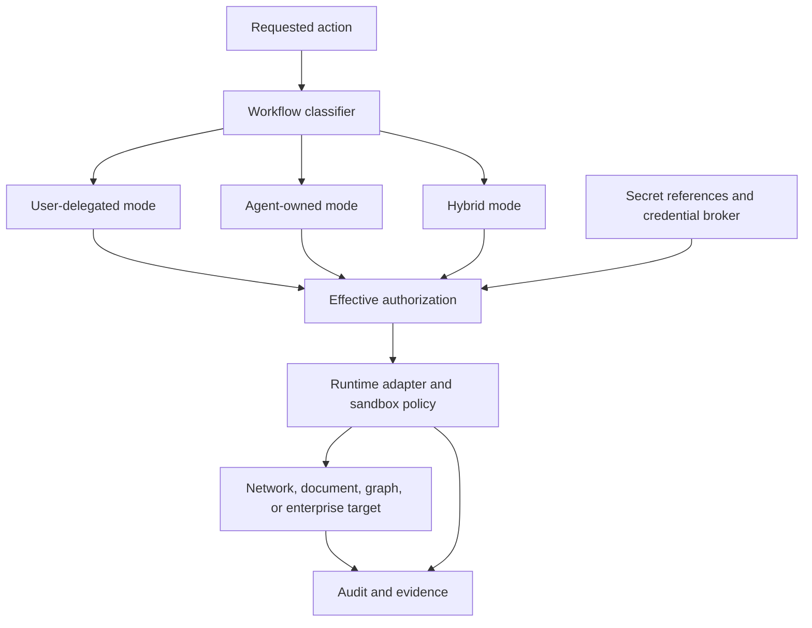
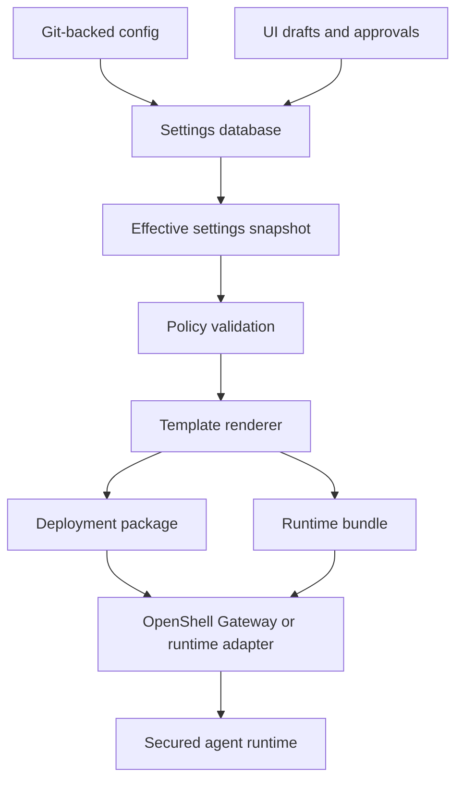

# The Agentic Network Platform

The Agentic Network Platform is an open source design effort for secure, enterprise-ready network AI agents.

This repository is currently a design repo. It captures the architecture, security model, runtime strategy, UI management plane, governance workflow, and standalone project boundaries needed to build an "OpenClaw for networks": a platform where network agents can reason over topology, documentation, telemetry, configuration, incidents, and procedural knowledge, then act through governed tools.

The design position is:

- The UI, Platform API, and settings database are a standalone management plane.
- Agents run in secured execution environments modeled around Kubernetes-native agent sandbox semantics.
- NVIDIA OpenShell is the first reference adapter and security baseline, while other runtimes can be supported through runtime adapters when customer environments require them.
- The orchestrator agent coordinates specialized persona agents over A2A.
- MCP and local runtime tools expose controlled capabilities such as Nornir, Ansible, graph query, document search, telemetry, Git, source-of-truth, and change systems.
- Durable configuration is Git-backed and hydrated into the database for UI, validation, effective-state computation, rendering, audit, and runtime delivery.
- Identity is explicit: interactive workflows use user-delegated credentials, while autonomous agentic workflows use scoped persona-owned credentials with FID/access governance.

## Design Map

| Area | Start here | Purpose |
| --- | --- | --- |
| Runtime strategy | [ADR-0001: Runtime Strategy](docs/adr/0001-runtime-strategy.md) | Kubernetes-native-agent-sandbox-first, OpenShell-reference-adapter-backed, runtime-adapter-driven decision. |
| Design principles | [Design Principles and Roadmap](docs/architecture/design-principles.md) | North star, platform principles, and MVP phase plan. |
| Runtime evaluation | [Runtime Execution Environment Evaluation](docs/architecture/runtime-execution-environment-evaluation.md) | Competitor landscape covering Kubernetes-native agent runtimes, cloud agent sandboxes, developer sandbox infrastructure, enterprise appliance stacks, and base isolation technology. |
| Agent runtime | [OpenShell Nornir Agent Runtime Architecture](docs/architecture/openshell-nornir-agent-runtime.md) | Secure terminal, OpenShell Gateway/Supervisor model, Nornir-first local runtime, Ansible, personas, and skills. |
| UI and deployment | [UI and Agent Deployment Framework Architecture](docs/architecture/ui-agent-deployment-framework.md) | How UI settings hydrate DB state, render bundles, and hand off deployment artifacts. |
| UI boundary | [Web UI Deployment Architecture](docs/architecture/web-ui-deployment.md) | Why the UI is a dedicated service, not a process inside the agent sandbox. |
| Threat model | [Threat Model](docs/architecture/threat-model.md) | Security invariant, assets, trust boundaries, and initial mitigations. |
| MCP integration | [MCP Integration Model](docs/architecture/mcp-integration.md) | Capability manifests, server lifecycle, broker policy, and audit requirements. |
| Skills | [Skills for Procedural Knowledge](docs/architecture/skills.md) | Skill package format, lifecycle, validation, and policy binding. |
| Knowledge graph | [Knowledge Graph and Documentation Ingestion](docs/architecture/knowledge-graph-and-ingestion.md) | Connector pipeline, graph entities, relationships, provenance, and quality gates. |
| Governance | [Issue-Driven Development Workflow](docs/governance/issue-driven-development.md) | Public issue, PR, review, and merge trail for open source trust. |
| ADR process | [Architecture Decision Records](docs/adr/README.md) | Long-lived decisions that affect security, runtime, identity, storage, or deployment. |
| Vocabulary | [Glossary](docs/glossary.md) | Shared terms for contributors and reviewers. |
| UI design reference | [Network Agent Platform UI Design](docs/design/network-agent-platform-ui/README.md) | Imported design reference and production UI direction. |
| Standalone projects | [Projects](projects/README.md) | Monorepo project model. |
| Nornir MCP | [Nornir MCP](projects/nornir-mcp/README.md) | Standalone MCP server for governed Nornir network interaction. |
| Contribution | [CONTRIBUTING.md](CONTRIBUTING.md) | How contributors should work in this repository. |
| Security reporting | [SECURITY.md](SECURITY.md) | Vulnerability reporting scope and process. |

## High-Level Architecture

The platform separates the human-facing management plane from the secured agent runtime. The management plane owns settings, identity, policy, deployment planning, and audit. The runtime executes agents and tools inside a constrained environment.



## Management Plane and OpenShell Gateway

The UI does not mutate agent sandboxes directly. UI changes become drafts, Git changes, effective settings snapshots, rendered bundles, and policy-checked runtime deliveries. For the OpenShell reference adapter, the platform delivers desired state through the NVIDIA OpenShell Gateway.



Runtime-delivered settings include:

- persona definitions, prompts, tools, skills, and A2A cards
- model provider routes and inference policy
- runtime image, filesystem, network, process, and terminal policy
- secret references and credential mappings
- MCP registry entries and tool scopes
- Nornir, Ansible, Python, and shell capability profiles
- memory, graph, RAG, evidence, and observability endpoints

## Runtime Strategy

The default product architecture is Kubernetes-native agent sandbox semantics: stable identity, persistent workspace, controlled network reachability, mediated terminal/session access, external secret references, and policy-visible execution. NVIDIA OpenShell is the first reference adapter and security baseline because it is purpose-built for policy-governed autonomous agent execution.

The product contract is still runtime-neutral: the platform renders an agent runtime bundle, then a runtime adapter translates it for the selected environment.

The main competitor pressure is not generic Docker or Kubernetes. It is the emerging class of isolated, stateful agent sandboxes and the enterprise stacks that package them. The detailed analysis lives in the [Runtime Execution Environment Evaluation](docs/architecture/runtime-execution-environment-evaluation.md).



Kubernetes-native agent sandboxes are the default architecture target because they map most closely to enterprise Kubernetes and OpenShift environments. OpenShell remains the recommended first adapter and security baseline. Cloud and developer sandboxes are useful expansion paths, appliance stacks are likely enterprise deployment channels, and base isolation technologies are implementation substrates rather than full platform competitors.

Adapters must declare missing or degraded controls. Portability should be honest: a runtime that cannot enforce terminal audit, model routing, network egress, secret references, or evidence capture is not equivalent to OpenShell.

## A2A Persona Control

The orchestrator is the default agent. It routes work to downstream personas over A2A and uses policy to decide which persona, identity mode, tools, model route, and runtime scope are valid for a task.



Example personas:

| Persona | Primary role | Typical tools |
| --- | --- | --- |
| Orchestrator | Route tasks, coordinate A2A agents, assemble evidence | A2A, policy, registry, evidence APIs |
| Engineering | Design, validate, and propose network changes | Nornir, Ansible, Git, graph query, validators |
| Operations | Triage incidents and run read-only diagnostics | Telemetry, Nornir read-only commands, memory recall |
| Security | Review identity, secrets, policy, and risky actions | Policy engine, audit search, secrets review |
| Documentation | Retrieve and reconcile operational documentation | Confluence, SharePoint, Git, RAG |
| Graph Steward | Maintain topology and relationship context | Knowledge graph, source-of-truth, evidence |
| Memory Steward | Govern recall and memory writes | Episodic memory, retention, redaction |
| Change Agent | Prepare and track controlled change workflows | ITSM, GitOps, approvals, validation |

## Identity and Credential Modes

The platform must not give users elevated access just because an agent or MCP server has powerful credentials. Every request is authorized by intersecting principal scope, persona policy, runtime policy, local tool policy, MCP tool policy, target permissions, credential scope, action risk, and approval state.



Credential modes:

| Mode | Used for | Rule |
| --- | --- | --- |
| User-delegated | Interactive and non-agentic workflows, chat-driven diagnostics, user-requested reads, approval actions | The agent acts on behalf of the authenticated user and cannot exceed the user's effective permissions. |
| Agent-owned | Autonomous scheduled collection, background graph enrichment, documentation ingestion, memory maintenance | The persona uses an explicit FID/service identity with owner, purpose, scopes, rotation, audit, and policy. |
| Hybrid | Workflows that start autonomously but need user authority for sensitive targets or state-changing actions | Background steps use persona identity; sensitive reads, plans, writes, and approvals require user delegation or change-control evidence. |

Secret values should not live in Git or normal database fields. Git and the database store secret references, provider metadata, certificate identifiers, and access policy. Runtime material is resolved through an approved secrets broker, OpenShell provider path, or customer secret system.

## Configuration and Deployment Flow

Git is the durable source for platform-impacting configuration. The database is the hydrated, queryable substrate for UI drafts, imported settings, effective runtime state, secret references, session state, sync status, and audit.



Deployment modes:

| Mode | Purpose |
| --- | --- |
| Local contributor | Docker or Podman, local DB, fixture inventory, and local development secrets. |
| Lab | Compose-based platform stack with OpenShell, Nornir, MCP servers, graph, memory, and observability defaults. |
| Kubernetes or OpenShift | Enterprise-style cluster deployment through generated Helm, Kustomize, OpenShift overlays, or customer GitOps. |
| Customer CI/CD handoff | The platform generates artifacts and PRs; the customer controls promotion, scanning, approval, and apply. |
| Hosted sandbox adapter | Optional future path for code execution or analysis where private network reachability is solved separately. |

## Capability Plan

The first capabilities should prove trust before write automation:

1. Read-only runtime with orchestrator and initial personas.
2. Nornir and Ansible available as governed local runtime tools.
3. MCP registry for source-of-truth, docs, graph, telemetry, Git, and network capabilities.
4. Git-backed settings imported into the database and rendered into runtime bundles.
5. Evidence bundles for every tool run, collection job, and agent recommendation.
6. Episodic memory with scope, provenance, redaction, retention, and review.
7. Config planning, dry-run, diff, and validation before any approved change execution.

## Open Source Trust Model

The project uses an issue-driven workflow so every material change has public process evidence:

```text
maintainer prompt -> issue -> branch -> pull request -> review -> validation -> merge -> issue closed
```

See [Issue-Driven Development Workflow](docs/governance/issue-driven-development.md), [CONTRIBUTING.md](CONTRIBUTING.md), and [SECURITY.md](SECURITY.md).
