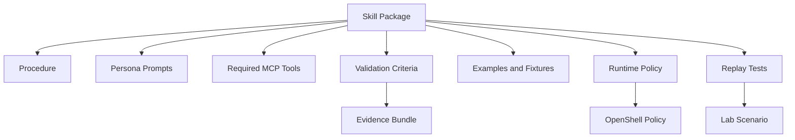
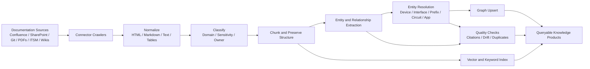
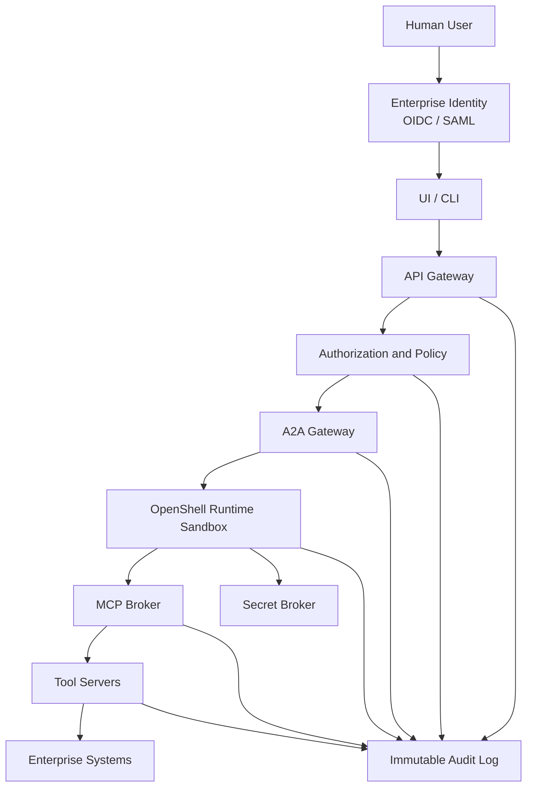
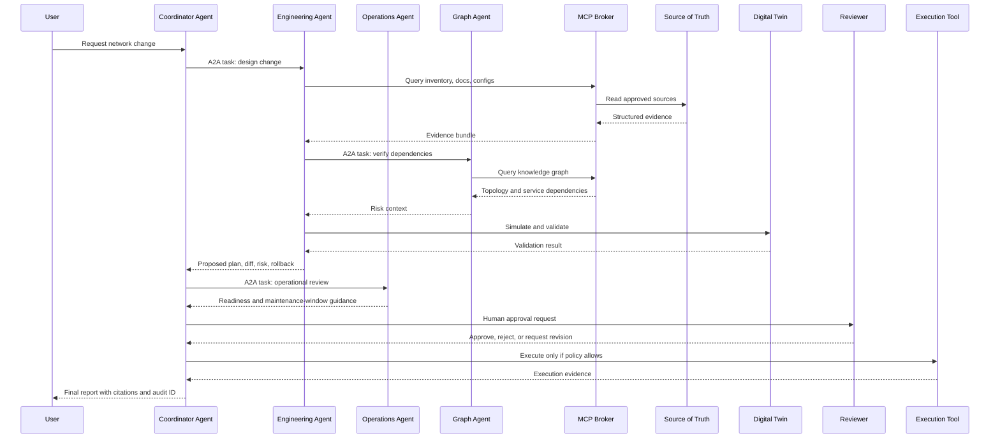

# The Agentic Network Platform

An open source, enterprise-ready framework for building secure network AI agents.

The goal is to create an "OpenClaw for networks": a local-first, policy-governed, multi-agent platform where specialized agents can reason over network documentation, topology, telemetry, configuration, incidents, and procedural knowledge, then act through controlled tools.

This repository starts as the design home for the lab. The lab should become the proving ground for MCP tools, A2A agent collaboration, NVIDIA OpenShell runtime policies, knowledge graph workflows, and enterprise security controls.

## North Star

Network teams need AI agents that can do real operational work without being given unchecked shell, credential, or API access. The platform should make useful network agents possible while keeping the blast radius small enough for enterprise customers to trust.

The platform should:

- Run agents inside NVIDIA OpenShell or compatible isolated runtimes.
- Use A2A for agent-to-agent communication and discovery.
- Use MCP for tool, context, and workflow integrations.
- Support configurable personas such as engineering, operations, security, documentation, and change-management agents.
- Package procedural knowledge as versioned skills with validation criteria.
- Build and maintain a network knowledge graph from documentation, source-of-truth systems, telemetry, configs, and tickets.
- Ingest documentation from systems such as Confluence, SharePoint, Git repositories, Google Drive, ServiceNow, and internal portals.
- Enforce enterprise controls by default: least privilege, approval gates, audit logs, secrets isolation, signed tools, policy-as-code, and network egress control.
- Treat network changes as plans that must be validated, explained, approved, executed, and audited.

## Design Principles

1. Agents never get direct unrestricted access.
   Agents communicate with MCP brokers and tool servers. The runtime, broker, and policy layer enforce boundaries.

2. A2A is for collaboration, MCP is for capability.
   Agents coordinate with other agents over A2A. They use MCP to reach tools, data, workflows, and controlled actions.

3. Read-only is the default.
   Destructive or state-changing actions require explicit policy, approval, simulation, and audit trails.

4. Knowledge must be traceable.
   Every answer, graph edge, and recommendation should link back to source documents, telemetry, configs, tickets, or tool output.

5. Network operations require evidence.
   The agent should show command output, topology evidence, config diffs, validation results, and rollback options before action.

6. The lab must look like an enterprise.
   The home lab should include identity, secrets, policy, observability, source-of-truth, graph storage, document ingestion, GitOps, and isolated tool execution.

## High-Level Architecture

```mermaid
flowchart TB
    user[Network Engineer or Operator]
    ui[Web UI / CLI / Chat Interface]
    api[Platform API Gateway]
    policy[Policy Engine<br/>OPA / Cedar / OpenShell Policy]
    registry[Agent Registry<br/>Personas and A2A Cards]
    orchestrator[Coordinator Agent]

    subgraph a2a[A2A Agent Mesh]
        eng[Engineering Agent]
        ops[Operations Agent]
        sec[Security Agent]
        docs[Documentation Agent]
        change[Change Agent]
        graphAgent[Graph Steward Agent]
    end

    subgraph runtime[Isolated Agent Runtime]
        openshell[NVIDIA OpenShell Sandboxes]
        secrets[Runtime Secret Broker]
        audit[Audit and Session Recorder]
    end

    subgraph mcp[MCP Capability Plane]
        inventory[MCP: Source of Truth<br/>Nautobot / NetBox / Infrahub]
        telemetry[MCP: Telemetry<br/>Prometheus / Elastic / Logs]
        config[MCP: Config and GitOps<br/>Git / Ansible / NAPALM]
        graph[MCP: Knowledge Graph<br/>Neo4j / RDF / Graph DB]
        docsMcp[MCP: Documents<br/>Confluence / SharePoint / Git]
        changeMcp[MCP: ITSM and Change<br/>ServiceNow / Jira]
        labMcp[MCP: Lab Control<br/>OKD / Proxmox / Containerlab]
    end

    subgraph data[Knowledge and Evidence Stores]
        kg[Network Knowledge Graph]
        vector[Vector Index]
        object[Raw Document and Evidence Store]
        events[Event and Audit Store]
    end

    subgraph network[Network Lab and Enterprise Targets]
        sim[Digital Twin / Batfish / Containerlab]
        devices[Network Devices and Controllers]
        k8s[OKD / Kubernetes]
    end

    user --> ui --> api
    api --> policy
    policy --> registry
    registry --> orchestrator
    orchestrator <--> a2a
    a2a --> openshell
    openshell --> secrets
    openshell --> audit
    openshell --> mcp
    mcp --> data
    mcp --> network
    audit --> events
```

## Runtime Model

The core runtime assumption is that every agent runs in an isolated execution boundary. NVIDIA OpenShell is the preferred target because it is designed for policy-governed autonomous agent execution with sandboxing, filesystem limits, network controls, and declarative runtime policy.

The platform should still define a runtime adapter so the control plane can support more than one execution backend later.

```mermaid
flowchart LR
    task[User Request or Event]
    planner[Coordinator Agent<br/>A2A Client and Server]
    card[Agent Card Lookup]
    persona[Persona Resolution]
    sandbox[OpenShell Sandbox]
    broker[MCP Broker]
    tool[Approved MCP Tool Server]
    result[Evidence Bundle]
    review[Human / Policy Review]
    action[Execution or Closeout]

    task --> planner
    planner --> card
    card --> persona
    persona --> sandbox
    sandbox --> broker
    broker --> tool
    tool --> result
    result --> review
    review --> action
    action --> planner
```



## Agent Personas

Personas should be configuration, not hardcoded classes. A persona defines the agent mission, allowed skills, allowed MCP tools, model routing preferences, required approval levels, and runtime policy.

Example persona shape:

```yaml
id: network-engineering-agent
display_name: Network Engineering Agent
mission: Design, validate, and propose network changes with evidence.
runtime:
  provider: openshell
  policy: policies/openshell/network-engineering.yaml
models:
  default: local-nemotron-or-compatible
  fallback: approved-frontier-model
a2a:
  card: agents/network-engineering/card.yaml
skills:
  - skills/bgp-troubleshooting
  - skills/config-diff-review
  - skills/change-risk-assessment
mcp_tools:
  read:
    - sot.inventory.lookup
    - telemetry.query
    - graph.query
    - docs.search
    - git.read
  write:
    - git.propose_change
    - change.create_draft
approvals:
  required_for:
    - network.device.write
    - git.merge
    - change.execute
```

Initial personas:

- Engineering Agent: designs changes, validates configs, produces diffs, checks standards, and prepares implementation plans.
- Operations Agent: triages incidents, correlates telemetry, checks runbooks, and recommends restore actions.
- Security Agent: reviews access, policy, exposed services, vulnerable devices, and risky tool use.
- Documentation Agent: ingests docs, reconciles stale pages, cites sources, and proposes documentation updates.
- Change Agent: builds change records, validates required evidence, tracks approvals, and coordinates execution windows.
- Graph Steward Agent: maintains entity resolution, graph quality, stale edges, and source attribution.
- Lab Agent: manages OKD, Proxmox, Containerlab, test devices, mock controllers, and validation fixtures.

## Skills for Procedural Knowledge

Skills are versioned procedural packages. They should be testable, reviewable, and bound to policy.

A skill should include:

- `skill.yaml`: name, owner, version, required tools, approval level, and risk rating.
- `procedure.md`: human-readable workflow.
- `prompts/`: agent instructions and role-specific task framing.
- `validators/`: deterministic checks for success or failure.
- `examples/`: known-good inputs, outputs, command traces, and evidence bundles.
- `policy/`: runtime and tool permissions required by the skill.
- `tests/`: replayable scenarios against lab fixtures.



## MCP Tool Plane

MCP servers should be small, composable, and policy-aware. Agents should not know vendor credentials or direct API details. The MCP broker handles auth, policy checks, tool discovery, request logging, and result shaping.

Initial MCP tool domains:

- Inventory and source of truth: Nautobot, NetBox, Infrahub, CMDB, IPAM.
- Network config: Git, Ansible, NAPALM, pyATS, Scrapli, Nornir.
- Telemetry and logs: Prometheus, Grafana, Elastic, Loki, OpenTelemetry.
- Topology and graph: Neo4j, RDF stores, topology snapshots, dependency maps.
- Documentation: Confluence, SharePoint, Git, Markdown, PDFs, diagrams, Google Drive.
- Change and ticketing: ServiceNow, Jira, GitHub Issues, Linear.
- Lab control: OKD, Kubernetes, Proxmox, Containerlab, Batfish, virtual devices.
- Security: secrets broker, certificate inventory, IAM, vulnerability sources, policy review.

Tool design rules:

- Split read tools from write tools.
- Make every write tool support dry-run or plan mode.
- Return structured evidence, not only prose.
- Include source identifiers, timestamps, request IDs, and raw output references.
- Require idempotency keys for state-changing calls.
- Log tool input, policy decision, user, agent, and result digest.

## Documentation Ingestion and Knowledge Graph Pipeline

The platform needs a product-quality ingestion pipeline, not a pile of ad hoc scrapers. Connectors should normalize documents into traceable evidence, then feed both retrieval indexes and the knowledge graph.



Knowledge graph core entities:

- Device, interface, VRF, VLAN, prefix, circuit, provider, site, rack, cluster, service, application, owner, policy, incident, change, document, procedure, telemetry signal, config artifact.

Important graph relationships:

- `CONNECTS_TO`, `DEPENDS_ON`, `OWNED_BY`, `DOCUMENTED_BY`, `OBSERVED_IN`, `CHANGED_BY`, `VALIDATED_BY`, `IMPLEMENTS_POLICY`, `HAS_RUNBOOK`, `HAS_RISK`, `AFFECTS_SERVICE`.

The graph should store provenance on every edge:

- source system
- source URL or object ID
- extraction method
- confidence score
- observed timestamp
- last verified timestamp
- owning connector

## Enterprise Security Model

Security must be part of the first design, not a later hardening pass.



Required controls:

- Strong identity: OIDC/SAML, service identities, and workload identity.
- Least privilege: persona-scoped tools, scoped credentials, and explicit write grants.
- Runtime isolation: OpenShell sandbox policies for filesystem, process, and network access.
- Tool isolation: MCP servers run separately from agent sandboxes.
- Secret isolation: agents request capabilities, not raw secrets.
- Policy-as-code: every tool call and agent action is evaluated before execution.
- Human approval: high-risk actions require explainable plans and approval records.
- Auditability: immutable logs for prompts, plans, tool calls, policy decisions, and evidence.
- Supply chain: signed tool servers, signed skill packages, SBOMs, dependency scanning.
- Data controls: source sensitivity labels, redaction, retention, and tenant boundaries.

## Network Change Workflow



## Lab Architecture

The lab should be a realistic proving ground for enterprise adoption.

```mermaid
flowchart TB
    subgraph lab[Home Lab Platform]
        okd[OKD / Kubernetes]
        gpu[NVIDIA GPU Host<br/>OpenShell Runtime Workers]
        proxmox[Proxmox Virtualization]
        registry[Private Container Registry]
        vault[Secrets and PKI]
        observability[Grafana / Prometheus / Logs]
    end

    subgraph net[Network Test Fabric]
        containerlab[Containerlab]
        virtualDevices[Virtual Routers and Switches]
        batfish[Batfish / Digital Twin]
    end

    subgraph platform[Agentic Network Platform]
        api[Platform API]
        a2a[A2A Gateway]
        mcp[MCP Broker]
        graph[Graph Store]
        docs[Document Pipeline]
        skills[Skill Registry]
    end

    okd --> api
    okd --> a2a
    okd --> mcp
    gpu --> a2a
    proxmox --> containerlab
    containerlab --> virtualDevices
    virtualDevices --> batfish
    mcp --> net
    platform --> observability
    platform --> vault
    platform --> registry
```

## Initial Repository Shape

Proposed future structure:

```text
.
├── README.md
├── docs/
│   ├── architecture/
│   ├── adr/
│   ├── security/
│   └── lab/
├── agents/
│   ├── coordinator/
│   ├── engineering/
│   ├── operations/
│   ├── security/
│   └── documentation/
├── skills/
│   ├── bgp-troubleshooting/
│   ├── config-diff-review/
│   └── incident-triage/
├── mcp-servers/
│   ├── inventory/
│   ├── telemetry/
│   ├── config/
│   ├── graph/
│   └── documents/
├── policy/
│   ├── openshell/
│   ├── opa/
│   └── approvals/
├── ingestion/
│   ├── connectors/
│   ├── pipelines/
│   └── evaluators/
├── graph/
│   ├── schema/
│   ├── migrations/
│   └── quality-rules/
├── lab/
│   ├── okd/
│   ├── proxmox/
│   ├── containerlab/
│   └── fixtures/
└── tests/
    ├── replay/
    ├── policy/
    └── integration/
```

## MVP Roadmap

### Phase 0: Design and Threat Model

- Define platform threat model.
- Define persona schema.
- Define skill package format.
- Define MCP broker requirements.
- Define A2A discovery and routing requirements.
- Define graph schema v0.
- Define lab target architecture.

### Phase 1: Read-Only Network Intelligence

- Run coordinator and two personas in OpenShell sandboxes.
- Implement A2A task routing between coordinator, engineering, and docs agents.
- Implement MCP tools for docs search, source-of-truth lookup, Git read, and graph query.
- Build first documentation ingestion connector for Git and local Markdown.
- Build graph schema for devices, interfaces, prefixes, sites, owners, and documents.
- Produce cited answers with evidence bundles.

### Phase 2: Lab Automation and Validation

- Add Containerlab or virtual network fixture.
- Add config collection and parsing MCP tool.
- Add Batfish or equivalent validation path.
- Add skills for BGP troubleshooting and config diff review.
- Add policy tests that prove agents cannot access blocked files, networks, or tools.

### Phase 3: Controlled Change Proposals

- Add GitOps change proposal tool.
- Add dry-run config rendering and validation.
- Add human approval workflow.
- Add change-risk scoring.
- Add immutable audit records.

### Phase 4: Enterprise Pilot Readiness

- Add OIDC/SAML integration.
- Add signed skill and tool packages.
- Add tenant isolation.
- Add complete observability dashboards.
- Add SOC2-style evidence collection.
- Add deployment guides for OKD/Kubernetes and isolated GPU hosts.

## Open Questions

- Should the first graph backend be Neo4j, RDF/SPARQL, PostgreSQL with Apache AGE, or a pluggable graph interface?
- Should OpenShell be the only supported runtime for v0, or should the runtime adapter support local containers for developer mode?
- Should A2A be exposed only internally at first, or should agents publish external A2A cards for interoperability testing?
- What source-of-truth system should anchor the first lab: Nautobot, NetBox, Infrahub, or a small built-in fixture?
- What is the first high-value skill: BGP troubleshooting, config diff review, incident triage, or documentation reconciliation?
- Which documentation connector should come first after Git and local files: Confluence or SharePoint?

## References

- NVIDIA OpenShell overview: https://docs.nvidia.com/openshell/about/overview
- NVIDIA OpenShell GitHub: https://github.com/NVIDIA/OpenShell
- Agent2Agent protocol: https://github.com/a2aproject/A2A
- Model Context Protocol specification: https://modelcontextprotocol.io/specification/2025-06-18
