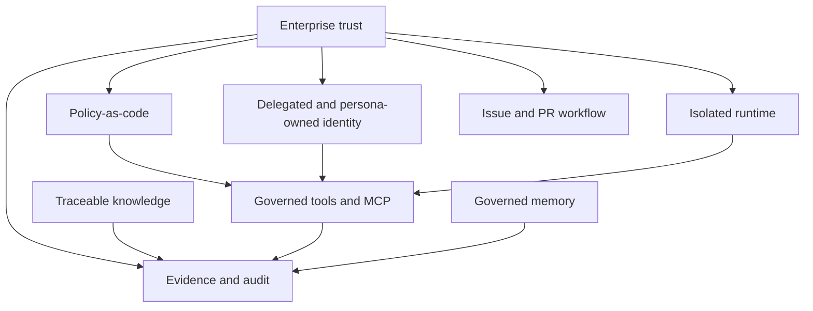
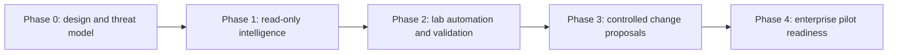

# Design Principles and Roadmap

Status: draft for review
Date: 2026-06-25
Issue: https://github.com/ColtMercer/the-agentic-network-platform/issues/25

This document preserves the platform design principles and MVP roadmap as maintained design material. The root README should summarize the project; this document owns the durable principles and phased capability plan.

## North Star

Network teams need AI agents that can do real operational work without being given unchecked shell, credential, API, model, or network access. The platform should make useful network agents possible while keeping the blast radius small enough for enterprise customers to trust.

The platform should:

- Run agents inside NVIDIA OpenShell or compatible isolated runtimes.
- Use A2A for agent-to-agent communication and discovery.
- Use MCP for tool, context, and workflow integrations.
- Treat `nornir-mcp` as a primary standalone project for safe network interaction across Netmiko, Scrapli, NAPALM, pyATS, pyVmomi, and future drivers.
- Support configurable personas such as engineering, operations, security, documentation, graph, memory, and change-management agents.
- Package procedural knowledge as versioned skills with validation criteria.
- Provide governed episodic memory so agents can recall prior investigations, decisions, incidents, approvals, and user or team preferences with traceable provenance.
- Build and maintain a network knowledge graph from documentation, source-of-truth systems, telemetry, configs, and tickets.
- Ingest documentation from systems such as Confluence, SharePoint, Git repositories, Google Drive, ServiceNow, and internal portals.
- Provide a first-class integration model for first-party and third-party MCP servers, including registration, capability discovery, policy binding, observability, and lifecycle management.
- Enforce delegated identity so chat, CLI, and API actions run on behalf of the user and cannot grant users elevated privileges merely because an agent or MCP server has broader service permissions.
- Develop through public issues and pull requests so every material change has a visible trail from request to review to merge.
- Enforce enterprise controls by default: least privilege, approval gates, audit logs, secrets isolation, signed tools, policy-as-code, and network egress control.
- Treat network changes as plans that must be validated, explained, approved, executed, and audited.

## Design Principles

1. Agents never get direct unrestricted access.
   Agents communicate with MCP brokers, local tool wrappers, platform APIs, and runtime relays. The runtime, broker, policy layer, identity layer, and credential broker enforce boundaries.

2. A2A is for collaboration, MCP is for capability.
   Agents coordinate with other agents over A2A. They use MCP to reach tools, data, workflows, and controlled actions.

3. Standalone projects should be independently useful.
   Core capabilities such as `nornir-mcp` should be able to run inside the platform or as standalone open source projects.

4. Read-only is the default.
   Destructive or state-changing actions require explicit policy, approval, simulation, and audit trails.

5. Identity is delegated, not inherited.
   Effective authorization intersects principal scope, persona policy, runtime policy, local tool policy, MCP tool policy, target permissions, credential scope, action risk, and approval state. The canonical invariant lives in [Threat Model](threat-model.md#core-security-invariant).

6. Knowledge must be traceable.
   Every answer, graph edge, and recommendation should link back to source documents, telemetry, configs, tickets, or tool output.

7. Network operations require evidence.
   The agent should show command output, topology evidence, config diffs, validation results, and rollback options before action.

8. Memory is a governed system, not hidden prompt state.
   Episodic memory should be scoped, inspectable, redactable, policy-controlled, and tied to evidence.

9. The lab must look like an enterprise.
   The home lab should include identity, secrets, policy, observability, source-of-truth, graph storage, document ingestion, GitOps, and isolated tool execution.

10. Trust comes from process evidence.
    Every code change should be tied to an issue, pull request, review, checks, and audit trail, even when one AI-assisted implementer writes most of the code.

## MVP Roadmap

### Platform Phase 0: Design and Threat Model

- Define platform threat model.
- Define monorepo project standards for standalone and integrated MCP servers.
- Define issue-driven development, PR review, and merge governance.
- Define persona schema.
- Define skill package format.
- Define episodic memory schema, retention model, recall policy, and review workflow.
- Define `nornir-mcp` capability model, driver policy model, and evidence format.
- Define delegated identity and on-behalf-of authorization model.
- Define MCP broker requirements.
- Define A2A discovery and routing requirements.
- Define graph schema v0.
- Define lab target architecture.

### Platform Phase 1: Read-Only Network Intelligence

- Run orchestrator and two personas in OpenShell sandboxes.
- Implement A2A task routing between orchestrator, engineering, and docs agents.
- Implement MCP tools for docs search, source-of-truth lookup, Git read, graph query, and read-only Nornir collection.
- Implement `nornir-mcp` standalone mode with inventory query, driver explanation, and read-only command execution.
- Publish initial roadmap issues for platform, `nornir-mcp`, identity, governance, and memory work.
- Build first documentation ingestion connector for Git and local Markdown.
- Build graph schema for devices, interfaces, prefixes, sites, owners, and documents.
- Implement read-only episodic memory recall for prior investigations and lab experiments.
- Produce cited answers with evidence bundles.

### Platform Phase 2: Lab Automation and Validation

- Add Containerlab or virtual network fixture.
- Add config collection and parsing MCP tool.
- Add `nornir-mcp` driver policy tests for Netmiko, Scrapli, NAPALM, pyATS, and pyVmomi paths.
- Add Batfish or equivalent validation path.
- Add skills for BGP troubleshooting and config diff review.
- Add governed memory writes for lab runs, failed validations, and successful remediation patterns.
- Add policy tests that prove agents cannot access blocked files, networks, or tools.

### Platform Phase 3: Controlled Change Proposals

- Add GitOps change proposal tool.
- Add `nornir-mcp` config planning with dry-run, diff, validation, and approval requirements.
- Add dry-run config rendering and validation.
- Add human approval workflow.
- Add change-risk scoring.
- Add immutable audit records.
- Add change memory records for plan, approval, execution, validation, and rollback evidence.

### Platform Phase 4: Enterprise Pilot Readiness

- Add OIDC/SAML integration.
- Add on-behalf-of identity propagation across chat, agents, MCP broker, MCP servers, and target systems.
- Add signed skill and tool packages.
- Add tenant isolation.
- Add memory redaction, expiration, export, and legal-hold workflows.
- Enforce branch protection, required PR reviews, and required status checks for `main`.
- Add complete observability dashboards.
- Add SOC2-style evidence collection.
- Add deployment guides for OKD/Kubernetes and isolated GPU hosts.

