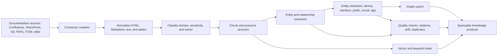
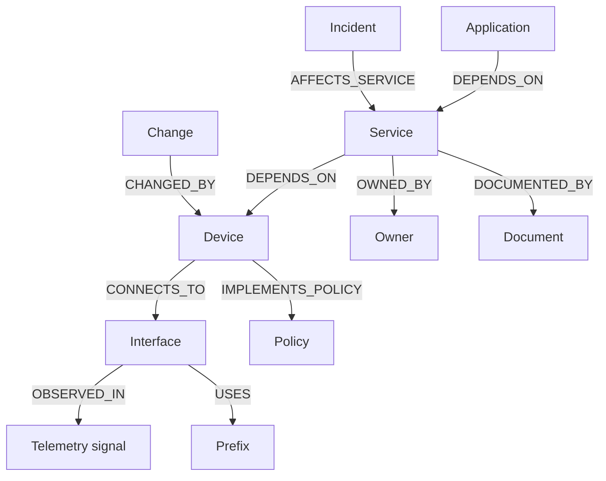

# Knowledge Graph and Documentation Ingestion

Status: draft for review
Date: 2026-06-25
Issue: https://github.com/ColtMercer/the-agentic-network-platform/issues/25

The platform needs a product-quality ingestion pipeline, not a pile of ad hoc scrapers. Connectors should normalize documents into traceable evidence, then feed both retrieval indexes and the network knowledge graph.

## Ingestion Pipeline

## Core Entities

The initial graph schema should represent network, operational, documentation, and service context.

| Entity | Examples |
| --- | --- |
| Network infrastructure | Device, interface, VRF, VLAN, prefix, circuit, provider, site, rack, cluster |
| Service context | Service, application, owner, dependency, SLO, customer impact |
| Operations context | Incident, change, maintenance window, validation, rollback plan |
| Knowledge context | Document, procedure, runbook, policy, config artifact, telemetry signal |
| Identity context | Team, owner, approver, persona, credential reference |

## Core Relationships

Important graph relationships:

- `CONNECTS_TO`
- `DEPENDS_ON`
- `OWNED_BY`
- `DOCUMENTED_BY`
- `OBSERVED_IN`
- `CHANGED_BY`
- `VALIDATED_BY`
- `IMPLEMENTS_POLICY`
- `HAS_RUNBOOK`
- `HAS_RISK`
- `AFFECTS_SERVICE`

## Provenance on Every Edge

Every graph edge should store provenance:

- source system
- source URL or object ID
- extraction method
- confidence score
- observed timestamp
- last verified timestamp
- owning connector
- source document hash or evidence object reference
- policy and sensitivity labels

## Quality Gates

Graph and ingestion quality should be tested continuously:

| Gate | Purpose |
| --- | --- |
| Citation coverage | Every extracted fact should point to source evidence. |
| Duplicate detection | Avoid duplicate devices, services, owners, and documents. |
| Drift detection | Detect when graph facts conflict with current source-of-truth or observed state. |
| Sensitivity filtering | Prevent restricted documents from becoming broadly visible graph facts. |
| Edge confidence | Rank extracted relationships by confidence and verification status. |
| Stale-edge review | Surface relationships that have not been observed or verified recently. |

## Initial Connectors

Recommended connector order:

1. Git and local Markdown.
2. Source-of-truth systems such as Nautobot, NetBox, or Infrahub.
3. Confluence or SharePoint.
4. Telemetry and observability systems.
5. ITSM and change systems.

