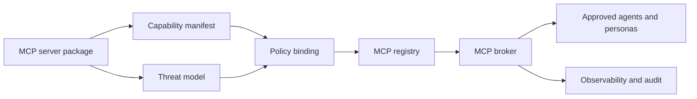
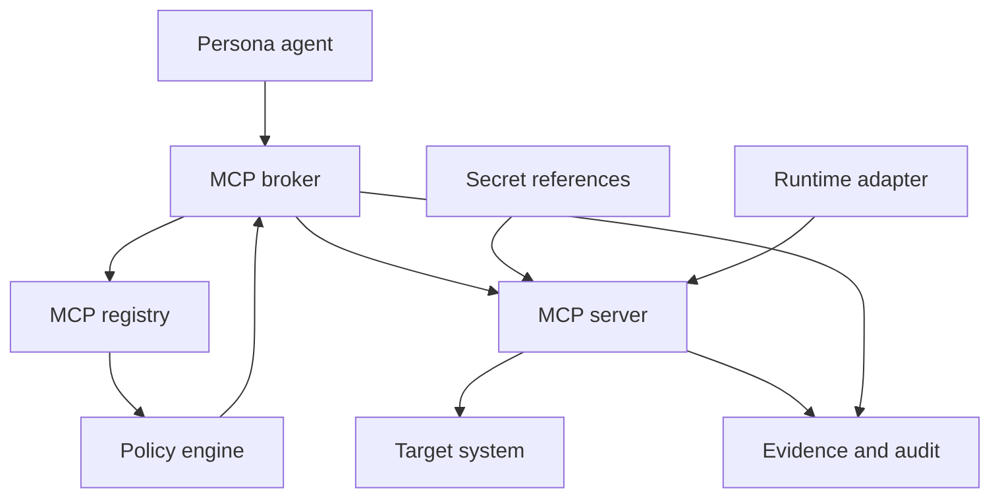

# MCP Integration Model

Status: draft for review
Date: 2026-06-25
Issue: https://github.com/ColtMercer/the-agentic-network-platform/issues/25

The platform should support first-party and third-party MCP servers through a standard integration lifecycle. MCP provides governed access to tools, data, workflows, and controlled actions. A2A coordinates agents; MCP exposes capabilities.

## Lifecycle Overview

Every MCP server should move through packaging, manifest declaration, threat modeling, policy binding, registry publication, broker routing, and observability.



## Capability Manifest

An MCP server must declare:

- Capabilities, schemas, and version.
- Read, write, destructive, and admin actions.
- Required identity scopes.
- Credential requirements.
- Network egress requirements.
- Data sensitivity and retention behavior.
- Audit event shape.
- Health checks and readiness checks.
- Standalone and platform-integrated run modes.
- Supported personas and approval levels.
- Evidence bundle outputs.

```yaml
server_id: nornir-mcp
version: 0.1.0
owner: network-engineering
run_modes:
  - standalone
  - platform-integrated
capabilities:
  - id: nornir.inventory.query
    action_risk: read
    schema: schemas/inventory-query.json
    required_identity_scopes:
      - network:inventory:read
    evidence: structured-json
  - id: nornir.config.plan
    action_risk: plan
    schema: schemas/config-plan.json
    required_identity_scopes:
      - network:config:plan
    approval: change-review
network_egress:
  - source-of-truth-api
  - network-management-subnet
credential_refs:
  - nornir-readonly
audit_events:
  - mcp.capability.invoked
  - mcp.capability.denied
  - mcp.evidence.produced
```

## Runtime and Policy Boundaries

The MCP broker should enforce which agents can call which capabilities. The runtime adapter should enforce local process, network, filesystem, and credential constraints. Target systems still enforce their own permissions.



Effective authorization must follow the platform invariant in [Threat Model](threat-model.md#core-security-invariant). MCP policy cannot grant access that user scope, persona policy, runtime policy, target permission, credential scope, action risk, or approval state denies.

## Required MCP Server States

| State | Meaning |
| --- | --- |
| Proposed | Manifest exists but threat model or policy is incomplete. |
| Review | Manifest, threat model, and policy are in PR review. |
| Approved | Server is allowed in a controlled environment. |
| Enabled | Server is available through the MCP broker for selected personas. |
| Degraded | Health or policy checks failed; selected capabilities may be disabled. |
| Disabled | Server is not callable. |
| Retired | Server remains documented for audit but is no longer eligible for deployment. |

## Required Evidence

Every MCP capability invocation should emit:

- request ID
- user or agent-owned identity
- persona ID
- server ID and version
- capability ID and version
- target scope
- policy decision ID
- credential reference IDs used
- action risk
- approval ID when required
- execution status
- evidence references
- audit event timestamp

