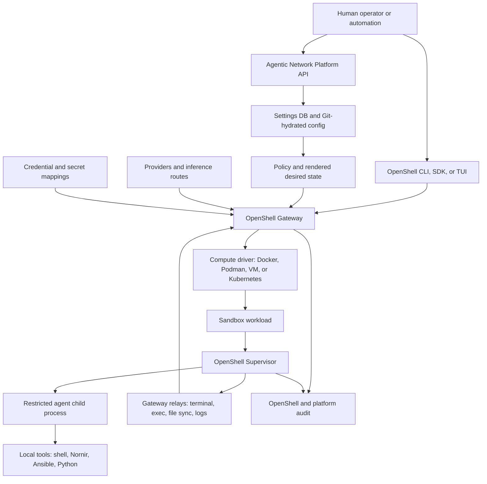
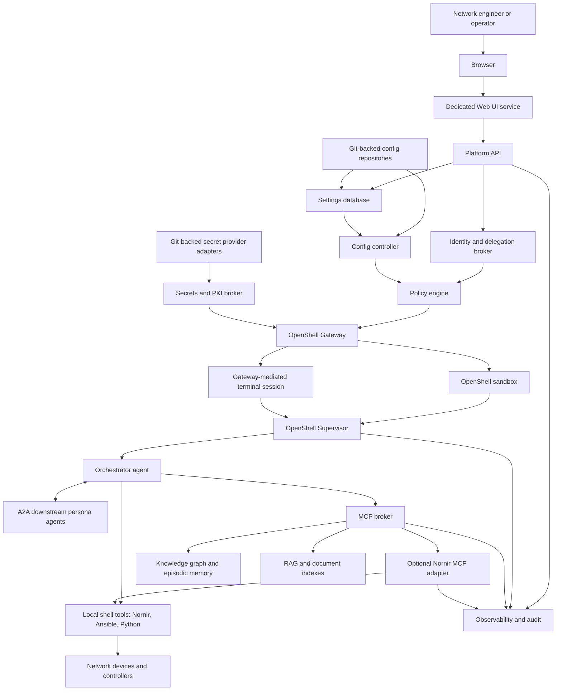
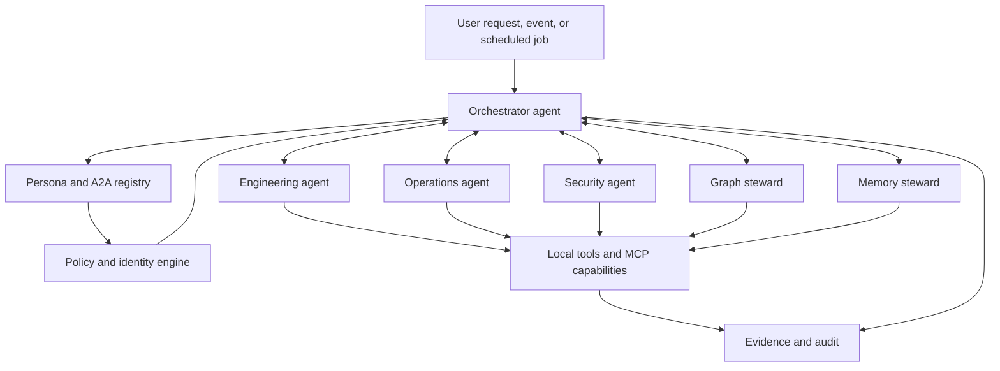
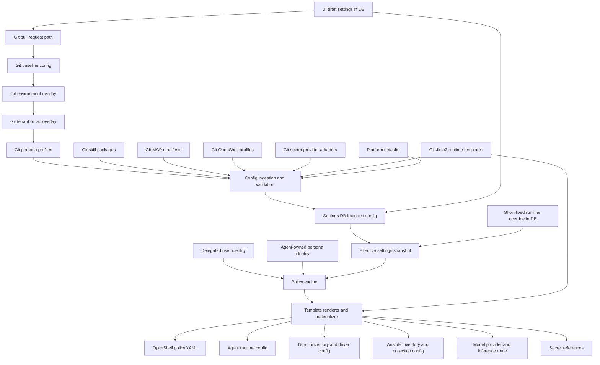
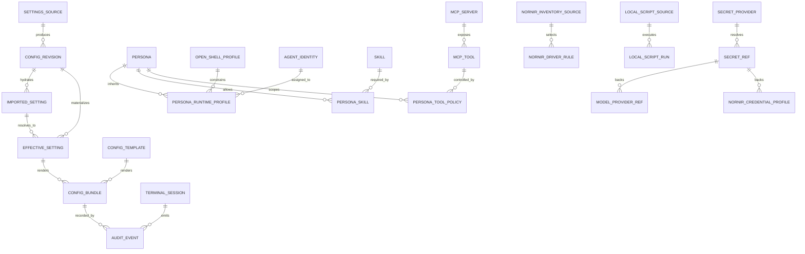
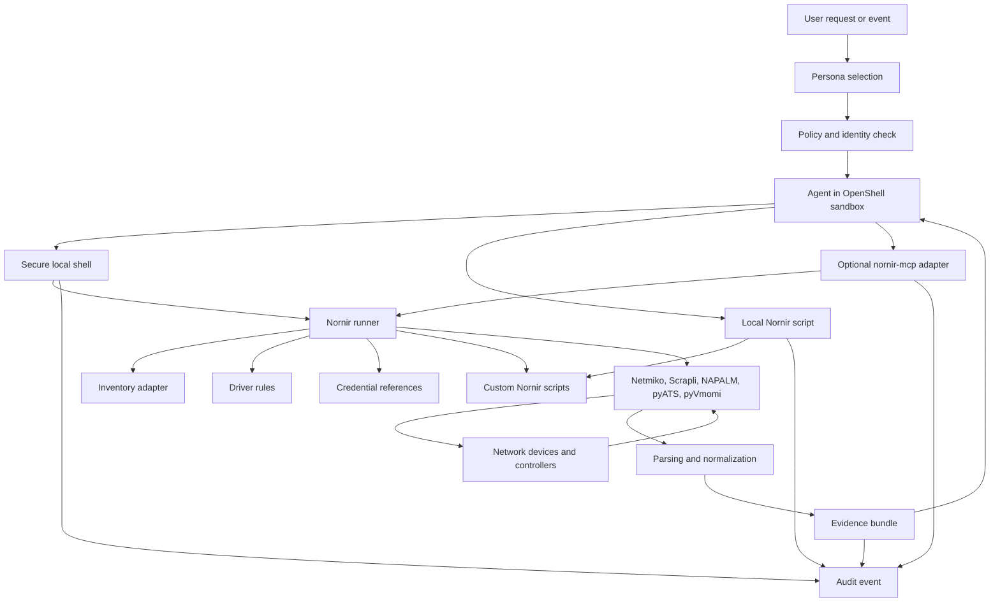
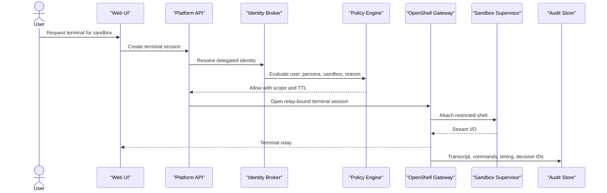
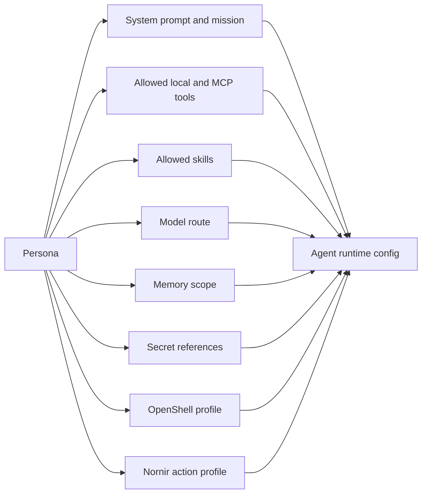

# OpenShell Nornir Agent Runtime Architecture

Status: draft for review
Date: 2026-06-24
Issue: https://github.com/ColtMercer/the-agentic-network-platform/issues/15

This document defines the first capability-focused runtime design for The Agentic Network Platform. The goal is to run network AI agents inside NVIDIA OpenShell while making Nornir a first-class local development and network automation environment.

The first implementation should prove capability: secure terminal access, local development inside an OpenShell sandbox, Nornir-driven network interaction, custom script execution, data collection, controlled automation planning, and A2A coordination between an orchestrator agent and downstream persona agents. Full change-control workflow is intentionally deferred, but the runtime must not be designed in a way that bypasses future approval gates.

## Design Inputs

- NVIDIA OpenShell runs autonomous AI agents in sandboxed environments with declarative policy for filesystem, network, process, credential, and inference controls.
- OpenShell separates the Gateway control plane from sandbox-local Supervisor enforcement. The Gateway owns durable state, settings delivery, policy revisions, provider records, authorization, and sandbox lifecycle. The Supervisor runs inside each sandbox and enforces process, filesystem, network, credential, inference, and observability policy locally.
- The platform UI is a dedicated service, not a process hosted inside the OpenShell sandbox.
- The settings model should consume Git-backed durable configuration, validate it, and populate the settings database. The database is the queryable platform substrate for UI drafts, imported config, effective runtime state, secret references, session state, sync status, and audit.
- Nornir is a first-class local runtime capability. It should be available in the shell and Python SDK for ad-hoc work and local code, while `nornir-mcp` remains an optional standalone adapter for exposing governed Nornir capabilities through the platform MCP broker.

References:

- NVIDIA OpenShell overview: https://docs.nvidia.com/openshell/about/overview
- NVIDIA OpenShell runtime model: https://docs.nvidia.com/openshell/about/how-it-works
- Existing UI deployment decision: [Web UI Deployment Architecture](web-ui-deployment.md)
- Canonical security invariant: [Threat Model](threat-model.md#core-security-invariant)

## OpenShell and Gateway Primer

OpenShell is the runtime boundary for the agent environment. It is not just a container image. The important mental model is a split between a control plane and a sandbox data plane:

- The CLI, SDK, or TUI is the user-facing OpenShell access path.
- The Gateway is the authenticated control plane. It owns API access, durable state, sandbox lifecycle, policy and settings delivery, provider records, inference routing, authorization decisions, and relay coordination.
- The Supervisor runs inside every sandbox. It is the local enforcement layer that starts the agent as a restricted child process and applies filesystem, process, network, credential, inference, logging, exec, file-transfer, and relay controls.
- Compute, credentials, identity, workload identity, secret stores, image pipelines, and GPU exposure stay behind driver or adapter boundaries. OpenShell integrates with those systems rather than absorbing them.



In this project, the Platform API and settings pipeline prepare the desired state that OpenShell should enforce. OpenShell remains responsible for sandbox lifecycle and runtime enforcement. The platform should not bypass the Gateway by mutating sandbox files or reaching directly into sandbox processes.

## Goals

- Run the AI agent inside an OpenShell-managed sandbox/container.
- Provide secure terminal access to a local development environment without bypassing platform identity, policy, secrets, or audit.
- Treat Nornir as a first-class runtime capability for inventory-backed network interaction.
- Support custom Nornir scripts for collection, diagnostics, parser development, and operational automation.
- Support Ansible CLI for teams that need playbook-driven collection or automation alongside Nornir.
- Allow future state-changing network automation without weakening the current design.
- Let Git-backed and UI-managed settings populate the database, then flow into runtime configuration through a controlled settings, policy, and rendering pipeline.
- Make personas, skills, MCP tools, model providers, secrets, identity, knowledge, memory, RAG, observability, and OpenShell runtime settings explicit and reviewable.

## Non-Goals

- No direct production change-control workflow in the first implementation.
- No unrestricted shell access to network credentials or platform secrets.
- No browser-to-MCP direct calls.
- No UI process inside the OpenShell agent sandbox as the production hosting model.
- No uncontrolled shared agent-global service account that lets any user or persona exceed policy.
- No assumption that every agent action is user-backed. Agent-owned identities are in scope for autonomous personas, but they must be explicit persona identities with scoped credentials, FID/access management, audit, and policy.

## Best-Practice Callouts

1. OpenShell should not be treated as just "a container."
   The platform should target the OpenShell Gateway/Supervisor contract. The Gateway receives desired state and owns durable runtime records. The sandbox Supervisor enforces local runtime policy.

2. The UI should not mutate sandbox files directly.
   UI changes should become database drafts, Git pull requests, or short-lived runtime overrides. Git-backed settings should be imported into the database after validation. A config controller should render and materialize effective settings into OpenShell policies and agent config.

3. The database should not store raw secrets.
   Store secret references, provider metadata, certificate identifiers, secret-provider adapter config, and access policy. Resolve secret material through a secrets broker or OpenShell provider path at runtime. Custom secret providers can be Git-backed, but extracted values such as TACACS keys from Cisco ISE should not be committed to Git or stored as raw DB fields.

4. Secure terminal access should not be SSH into the container.
   Terminal sessions should be explicit platform objects attached to a sandbox through the Gateway relay path, with delegated identity, policy checks, transcript capture, session TTL, and audit.

5. Custom scripts are a high-risk feature.
   Scripts should run inside the OpenShell sandbox with filesystem, network, process, dependency, and timeout controls. Scripts should come from trusted Git sources or signed uploads, produce evidence bundles, and use platform APIs for secrets and policy checks.

6. Write automation needs guardrails even before change control exists.
   Build read-only collection and `plan` capabilities first. Any write-like capability should default to dry-run, diff generation, validation, and evidence capture. Actual apply should stay disabled or approval-gated until change control is implemented.

7. Nornir driver selection should be policy and inventory, not prompt guesswork.
   Driver rules should be versioned configuration based on platform, device role, hardware model, command family, site, and target capability.

8. Template rendering is a good fit for runtime config, but not for authorization.
   A Jinja2-style render pipeline is appropriate for combining global settings, persona settings, skills, Git sources, and runtime profiles into OpenShell, agent, and Nornir config. Policy decisions should happen before rendering and rendered output should be schema-validated after rendering.

## Platform Connectivity



Key boundary: the browser calls only the UI and Platform API. Agents call governed capabilities through MCP, platform-provided endpoints, or local sandbox tooling. The sandbox does not become a hidden privileged control plane.

## Runtime Shape

The initial runtime should ship as an OpenShell sandbox image named `network-agent-runtime`. That image is the base execution environment, not the whole architecture. The primary resident process should be an orchestrator agent with platform-level coordination capability. As personas are added or deployed, the orchestrator gains downstream A2A agents that can be invoked for specialized work.

The orchestrator can have broad visibility into the capability catalog, persona registry, and active tasks, but that is not the same as unchecked execution power. Action authorization still comes from the effective identity, persona policy, runtime policy, target policy, and approval state.

The image should include:

- Python 3.12 or newer.
- `nornir`, `nornir-utils`, `nornir-netmiko`, `nornir-scrapli`, `nornir-napalm`.
- Network libraries: Netmiko, Scrapli, NAPALM, pyATS/Genie where licensing and packaging allow, TextFSM, TTP, ntc-templates, Jinja2.
- Ansible CLI, ansible-core, ansible-lint, and network collections selected by policy.
- Developer tools: `uv` or Poetry, pytest, ruff, mypy, rich, typer, ipython.
- Platform clients: MCP client, A2A client, Platform API client, evidence bundle writer.
- Local project workspace: checked-out Git repo, trusted script roots, generated evidence directory, read-only config mount, temporary scratch space.

The sandbox should receive:

- Persona runtime profile.
- MCP registry endpoint and token scoped to the delegated user and persona.
- A2A agent cards and downstream persona routing.
- Identity mode: user-delegated, agent-owned, or hybrid.
- Nornir inventory source config.
- Driver selection rules.
- Runtime policy bundle.
- Model provider route, preferably via OpenShell inference routing rather than raw provider credentials.
- Secret references, not raw long-lived secrets in static files.
- Knowledge, memory, and RAG endpoints scoped by identity and persona.

## Orchestrator and A2A Personas

The orchestrator agent is the runtime coordinator. It should know which personas exist, which downstream agents are healthy, what capabilities they expose, and which identity mode each persona uses.



Persona identity modes:

- `user_delegated`: the action is performed on behalf of a signed-in user. This is the default for chat, terminal, and manual operational tasks.
- `agent_owned`: the persona has its own non-human identity and scoped secrets for autonomous work, scheduled collection, background enrichment, or FID/access-managed integrations.
- `hybrid`: the persona can run background work with agent-owned credentials but must switch to user-delegated identity for sensitive or state-changing actions.

Agent-owned identities are valid for an agentic platform. They should be modeled as first-class principals, not hidden service accounts. Each should have owner, purpose, credential sources, rotation policy, allowed tools, allowed targets, schedule/event triggers, and audit expectations.

## Settings Inheritance and Materialization

Settings should have three lives:

- Durable desired configuration in Git.
- Imported and queryable configuration in the settings database.
- Effective materialized runtime state derived from database records, identity, policy, and templates.

Git should hold reviewed, versioned configuration. The database should be populated from Git-backed sources and should also hold drafts, imported config rows, effective materialized state, live sessions, secret references, sync status, user preferences, audit links, and short-lived runtime overrides.



Inheritance should be conservative:

- Configuration precedence can override defaults, but permissions are not simply additive.
- Effective authorization must follow the canonical invariant in [Threat Model](threat-model.md#core-security-invariant).
- Runtime overrides must have TTL, owner, reason, and audit ID.
- Any durable change should move through Git PR review.
- Rendered runtime config should be reproducible from database snapshot ID, template version, Git commit SHA, and policy revision.

This model is intentionally similar to a NetObs or Nautobot render pipeline: structured settings and source-of-truth records feed deterministic templates, and the resulting config is promoted to a runtime. The difference is that agent security policy must be evaluated before and after rendering because config output can grant shell, tool, model, secret, and network reach.

Short-lived runtime overrides should never become invisible permanent state. When an override expires, the effective snapshot should be recomputed from the selected Git revision, imported DB settings, and remaining valid overrides. Reconciliation jobs should detect drift between Git-backed imported settings and DB effective state, emit audit events, and show the UI whether the current runtime is Git-synced, draft, overridden, expired, or drifted.

## Settings Database Sketch



Minimum tables or collections:

- `settings_sources`: Git repositories, branches, paths, owners, sync status, validation status.
- `config_revisions`: immutable imported config revisions with commit SHA, source, environment, and validation result.
- `imported_settings`: normalized rows hydrated from Git-backed config sources.
- `effective_settings`: resolved configuration snapshots for tenant, environment, persona, runtime, and user scopes.
- `personas`: mission, prompt source, allowed skills, allowed tools, model preferences, approval requirements.
- `agent_identities`: user-delegated, agent-owned, and hybrid identity bindings for personas and scheduled work.
- `skills`: procedural knowledge packages, validators, examples, source policy, risk rating.
- `mcp_servers` and `mcp_tools`: manifests, health, schemas, scopes, audit behavior, action risk.
- `openshell_profiles`: sandbox image, filesystem policy, network egress, process policy, inference route, credential injection.
- `nornir_inventory_sources`: Nautobot, NetBox, Infrahub, Git/YAML, lab fixtures.
- `nornir_driver_rules`: driver selection rules and allowed action families.
- `script_sources`: Git-backed or signed script sources, dependency locks, trust state.
- `config_templates`: Jinja2 or equivalent templates with schema, owner, tests, and render target.
- `model_provider_refs`: provider type, endpoint metadata, inference route, secret reference, data-handling policy.
- `secret_providers`: Vault, cloud secret manager, Kubernetes, local development, Cisco ISE adapter, or custom Git-backed provider plugin metadata.
- `secret_refs`: pointers to external secret stores, PKI entries, rotation metadata, and access policy.
- `terminal_sessions`: sandbox, user, persona, reason, TTL, transcript reference, status.
- `audit_events`: identity, action, policy decision, request ID, evidence digest, result summary.

## UI Settings Coverage

The settings page should control or display these domains. Durable domains should be Git-backed by default, but every setting that affects runtime behavior should be hydrated into the database so the UI, API, renderer, policy engine, and audit pipeline can query the same effective state.

| UI setting | Runtime impact | Preferred source |
| --- | --- | --- |
| Personas | Agent mission, prompt, tools, skills, model route, approvals, memory scope | Git with DB effective snapshot |
| Skills | Procedural packages, validators, examples, required MCP tools, runtime policy | Git |
| MCP Servers and Tools | Tool manifests, health, schemas, risk tier, scopes, broker registration | Git plus DB hydration and health |
| Tool Explorer | Searchable tool docs, examples, schemas, glossary, policy decisions | Generated from MCP registry |
| Git-backed Config | Source repositories, branches, paths, PR flow, sync state, validation | Git plus DB sync state |
| Ingestion Pipelines | Documentation connectors, parsers, schedules, evidence destinations | Git plus DB run state |
| Event Sources | Kafka, NATS, EventBridge, Pub/Sub, Event Hubs, stream-to-persona routing | Git plus DB offsets |
| Model Providers | Provider metadata, inference routing, model allowlist, data policy | Git plus secret refs |
| OpenShell Runtime | Sandbox image, policy, filesystem, network, inference, sessions | Git plus DB session state |
| Knowledge Graph and Memory | Graph endpoints, entity rules, memory write policy, provenance, retention | Git plus DB operational state |
| Graph Explorer | Query presets, graph views, saved investigations | Git for shared views, DB for user views |
| RAG Configuration | Indexes, retrievers, chunking, citation policy, access filters | Git |
| RAG Testing | Test cases, expected citations, regression suites | Git plus DB run results |
| Episodic Memory | Recall scopes, retention, redaction, review queues, memory writes | Git policy plus DB records |
| Observability | Active provider, traces, logs, audit export, session evidence | Git plus DB active provider |
| Secrets and PKI | Secret references, cert references, custom secret-provider adapters, rotation policy, access grants | External secret store plus Git-backed provider config and DB refs |
| Identity and Delegation | OBO claims, agent-owned identities, effective permissions, approvals, impersonation controls | IdP, FID/access management, Git policy, DB bindings |

## Nornir as a First-Class Runtime Capability

Nornir should be available in four related forms:

1. Python library inside the `network-agent-runtime` sandbox for local development and custom scripts.
2. Local shell capability for ad-hoc operator and coding-agent work inside the governed OpenShell environment.
3. Local script runner for reviewed collection jobs and reusable automations that use the Nornir SDK directly.
4. Optional `nornir-mcp` adapter for exposing governed Nornir capabilities through the platform MCP broker.



Initial Nornir capability surface:

- `inventory.query`: show target set and inventory reasoning.
- `driver.explain`: explain which driver will be used and why.
- `command.run_readonly`: run approved read-only commands.
- `collect.parse`: collect raw and parsed output for parser workflows.
- `script.validate`: lint, policy-check, and dry-run a custom script.
- `script.run`: execute an approved script in a constrained sandbox job.
- `collection.summarize`: compact large collection results into manifests, summaries, indexes, and evidence pointers.
- `config.plan`: create diffs, validation steps, and risk evidence without applying.
- `config.apply`: future capability; disabled by default until change control exists.

Example driver rules:

```yaml
driver_rules:
  - name: load-balancers-use-scrapli
    match:
      device_role: load-balancer
    driver: scrapli
    transport: ssh
    allowed_actions:
      - show
      - collect

  - name: network-os-default-netmiko
    match:
      platform_family: network-os
    driver: netmiko
    transport: ssh
    allowed_actions:
      - show
      - collect

  - name: vmware-use-pyvmomi
    match:
      platform_family: vmware
    driver: pyvmomi
    allowed_actions:
      - query
      - collect
```

## Custom Script Model

Custom Nornir scripts should be real Python, but they should run through a platform wrapper instead of arbitrary shell execution.

Recommended script contract:

```python
def run(ctx):
    targets = ctx.inventory.select(role="border", site="lab")
    result = ctx.nornir.run_readonly(
        targets=targets,
        command="show bgp summary",
        parser="textfsm",
    )
    ctx.evidence.attach("bgp-summary", result)
    ctx.collection.summarize("bgp-summary", result, strategy="per_site_digest")
    return ctx.output.table(result)
```

The `ctx` object should provide:

- `ctx.identity`: delegated user and effective permissions.
- `ctx.persona`: active persona and policy profile.
- `ctx.inventory`: target selection and inventory explanation.
- `ctx.nornir`: approved Nornir task helpers.
- `ctx.secrets`: reference-based access, never raw secret enumeration.
- `ctx.policy`: check whether an action is allowed.
- `ctx.evidence`: attach raw output, parsed output, diffs, and validation results.
- `ctx.collection`: compact large result sets into summaries, manifests, indexes, and retrieval handles.
- `ctx.memory`: propose episodic memory records with provenance.
- `ctx.graph`: query topology and dependency context.

Script controls:

- Git-backed source by default.
- Dependency lock file.
- Static checks before execution.
- Runtime timeout, CPU, memory, and network limits.
- Read-only filesystem except approved workspace paths.
- No direct access to raw platform secrets.
- Evidence bundle required for every run.
- Audit event for validation, execution, policy decisions, and result digest.

Large collection jobs should avoid dumping all raw network output into an agent context window. The platform should store raw output and parsed results as evidence artifacts, then generate a compact manifest with target count, failure count, unique patterns, top anomalies, parser coverage, and links to raw artifacts. The agent can retrieve exact slices only when needed.

## Secure Terminal Access

Terminal access is required for local development and operator trust, but it must be designed as a governed runtime feature.



Terminal sessions should include:

- User identity and delegated claims.
- Active persona and sandbox ID.
- Reason, ticket or issue reference, and TTL.
- Command transcript and output transcript.
- Files touched and generated evidence.
- Network destinations attempted.
- Policy decisions and denied actions.

Terminal access should not grant:

- Direct raw secret browsing.
- Unbounded outbound network access.
- Untracked file export.
- Root inside the sandbox.
- Access to other users' sessions or evidence.

## Persona Inheritance

Personas should shape the agent process and Nornir environment at runtime.



Example:

- Engineering Agent can use Nornir config planning, Git proposal tools, graph queries, and config validators.
- Operations Agent can use telemetry queries, read-only Nornir commands, incident memory, and runbook retrieval.
- Security Agent can inspect policy, audit, identity, secrets metadata, and risky tool use.
- Memory Steward can propose, deduplicate, redact, and expire episodic memories.

Persona rendering should use the same materialization pipeline as runtime config. The renderer should combine global settings, persona-specific settings, skills pulled from Git repositories, local tool profiles, model routes, memory scopes, and secret references into a versioned agent config bundle. That bundle should be inspectable in the UI before it is delivered to OpenShell.

## Capability Phases

Runtime Phase 1: read-only local runtime

- Build `network-agent-runtime` image.
- Run the orchestrator agent in OpenShell with a local dev workspace.
- Configure secure terminal session objects.
- Provide Nornir SDK, Nornir shell usage, Ansible CLI, inventory query, and read-only command execution.
- Emit evidence bundles and audit events.

Runtime Phase 2: custom scripts

- Add Git-backed script source registration.
- Add script validation and constrained script execution.
- Add parsed output capture and parser fixtures.
- Add large collection compaction so raw network output is stored as evidence and summarized for agent context.
- Add script run history in the UI.

Runtime Phase 3: data collection and pipelines

- Add scheduled and event-triggered Nornir collection jobs.
- Feed collected evidence into object storage, graph updates, RAG indexes, and episodic memory proposals.
- Add regression tests for parser and collection behavior.

Runtime Phase 4: automation planning

- Add Nornir `config.plan` for config diffs and validation.
- Add dry-run evidence and rollback planning.
- Keep Nornir `config.apply` disabled or approval-gated.

Runtime Phase 5: change execution

- Integrate change control, approvals, maintenance windows, and post-check evidence.
- Enable apply only through change-policy gates.

## Initial Implementation Artifacts

The first build should create:

- `apps/platform-api`: API skeleton for settings, terminal sessions, effective config, and audit.
- `apps/web`: UI integration with real settings and runtime APIs.
- `agents/orchestrator`: orchestrator agent and A2A routing.
- `projects/nornir-runtime`: local Nornir SDK helpers, script runner, collection compaction, and shell profiles.
- `projects/nornir-mcp`: optional standalone MCP adapter and Python package.
- `containers/network-agent-runtime`: OpenShell-compatible runtime image.
- `packages/settings-ingestor`: Git-backed config ingestion and DB hydration.
- `packages/config-controller`: settings resolution and OpenShell config materialization.
- `packages/config-renderer`: Jinja2 or equivalent rendering engine with schema validation.
- `packages/policy`: shared policy contracts and tests.
- `packages/evidence`: evidence bundle schema and writers.
- `configs/personas`: Git-backed persona definitions.
- `configs/openshell`: OpenShell runtime profiles and policies.
- `configs/nornir`: driver rules and inventory source definitions.
- `configs/templates`: runtime, persona, Nornir, Ansible, and OpenShell templates.

## Open Questions

- Which secret backend should the lab target first: local development secrets, Kubernetes Secrets, Vault, Infisical, or cloud-native secret managers?
- Should the first Nornir inventory source be Git/YAML, Nautobot, NetBox, or Infrahub?
- Should secure terminal session playback be stored as text transcripts, asciinema recordings, or both?
- Should custom scripts be committed through Git only, or should the UI support signed upload drafts that become PRs?
- Should custom secret providers include a Cisco ISE TACACS-key extractor in the first lab build, or should that remain an enterprise adapter example?
- Which model provider path should be first for the lab: local GPU, OpenAI-compatible gateway, Vertex AI, Bedrock, Azure, or OpenRouter?
- Which graph store should be first: Neo4j, Kuzu, RDF, or Postgres graph extensions?
