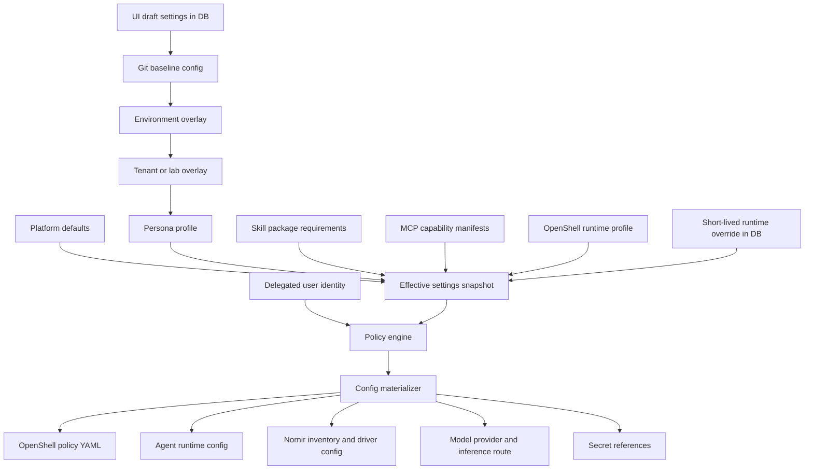
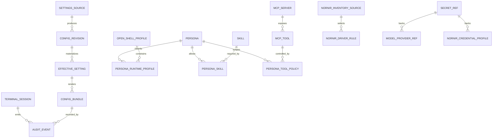
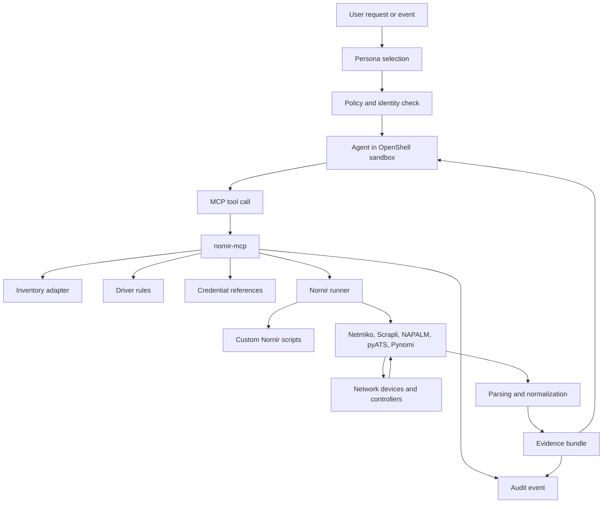
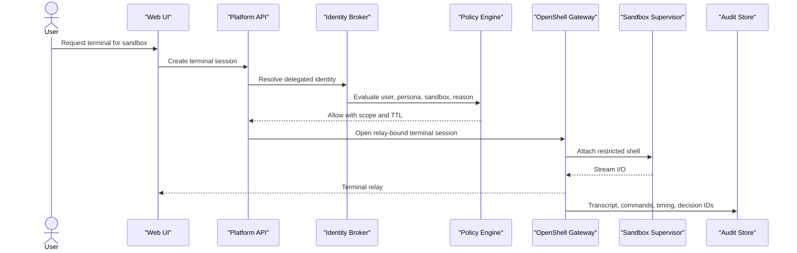
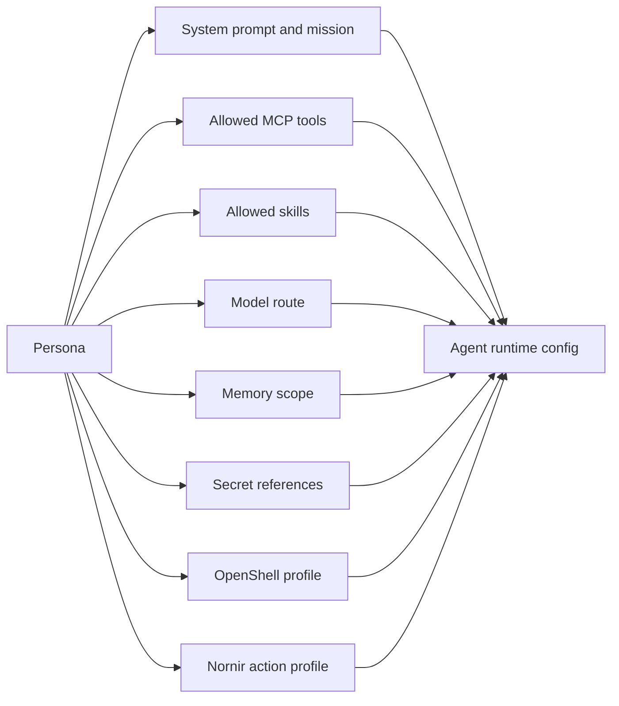

# OpenShell Nornir Agent Runtime Architecture

Status: draft for review
Date: 2026-06-23
Issue: https://github.com/ColtMercer/the-agentic-network-platform/issues/15

This document defines the first capability-focused runtime design for The Agentic Network Platform. The goal is to run network AI agents inside NVIDIA OpenShell while making Nornir a first-class local development and network automation environment.

The first implementation should prove capability: secure terminal access, local development inside an OpenShell sandbox, Nornir-driven network interaction, custom script execution, data collection, and controlled automation planning. Full change-control workflow is intentionally deferred, but the runtime must not be designed in a way that bypasses future approval gates.

## Design Inputs

- NVIDIA OpenShell runs autonomous AI agents in sandboxed environments with declarative policy for filesystem, network, process, credential, and inference controls.
- OpenShell separates the Gateway control plane from sandbox-local Supervisor enforcement. The Gateway owns durable state, settings delivery, policy revisions, provider records, authorization, and sandbox lifecycle. The Supervisor runs inside each sandbox and enforces process, filesystem, network, credential, inference, and observability policy locally.
- The platform UI is a dedicated service, not a process hosted inside the OpenShell sandbox.
- The settings model should prefer Git-backed durable configuration while using a database for UI drafts, effective runtime state, secret references, session state, sync status, and audit.
- Nornir MCP is a standalone project and a primary platform capability.

References:

- NVIDIA OpenShell overview: https://docs.nvidia.com/openshell/about/overview
- NVIDIA OpenShell runtime model: https://docs.nvidia.com/openshell/about/how-it-works
- Existing UI deployment decision: [Web UI Deployment Architecture](web-ui-deployment.md)

## Goals

- Run the AI agent inside an OpenShell-managed sandbox/container.
- Provide secure terminal access to a local development environment without bypassing platform identity, policy, secrets, or audit.
- Treat Nornir as a first-class runtime capability for inventory-backed network interaction.
- Support custom Nornir scripts for collection, diagnostics, parser development, and operational automation.
- Allow future state-changing network automation without weakening the current design.
- Let UI-managed settings flow into runtime configuration through a controlled settings and policy pipeline.
- Make personas, skills, MCP tools, model providers, secrets, identity, knowledge, memory, RAG, observability, and OpenShell runtime settings explicit and reviewable.

## Non-Goals

- No direct production change-control workflow in the first implementation.
- No unrestricted shell access to network credentials or platform secrets.
- No browser-to-MCP direct calls.
- No UI process inside the OpenShell agent sandbox as the production hosting model.
- No agent-global service account that lets users exceed their delegated permissions.

## Best-Practice Callouts

1. OpenShell should not be treated as just "a container."
   The platform should target the OpenShell Gateway/Supervisor contract. The Gateway receives desired state and owns durable runtime records. The sandbox Supervisor enforces local runtime policy.

2. The UI should not mutate sandbox files directly.
   UI changes should become database drafts, Git pull requests, or short-lived runtime overrides. A config controller should validate and materialize effective settings into OpenShell policies and agent config.

3. The database should not store raw secrets.
   Store secret references, provider metadata, certificate identifiers, and access policy. Resolve secret material through a secrets broker or OpenShell provider path at runtime.

4. Secure terminal access should not be SSH into the container.
   Terminal sessions should be explicit platform objects attached to a sandbox through the Gateway relay path, with delegated identity, policy checks, transcript capture, session TTL, and audit.

5. Custom scripts are a high-risk feature.
   Scripts should run inside the OpenShell sandbox with filesystem, network, process, dependency, and timeout controls. Scripts should come from trusted Git sources or signed uploads, produce evidence bundles, and use platform APIs for secrets and policy checks.

6. Write automation needs guardrails even before change control exists.
   Build read-only collection and `plan` capabilities first. Any write-like capability should default to dry-run, diff generation, validation, and evidence capture. Actual apply should stay disabled or approval-gated until change control is implemented.

7. Nornir driver selection should be policy and inventory, not prompt guesswork.
   Driver rules should be versioned configuration based on platform, device role, hardware model, command family, site, and target capability.

## Platform Connectivity

```mermaid
flowchart TB
    user["Network engineer or operator"]
    browser["Browser"]
    ui["Dedicated Web UI service"]
    api["Platform API"]
    idbroker["Identity and delegation broker"]
    settingsdb["Settings database"]
    git["Git-backed config repositories"]
    controller["Config controller"]
    policy["Policy engine"]
    secretbroker["Secrets and PKI broker"]
    gateway["OpenShell Gateway"]
    sandbox["OpenShell sandbox"]
    supervisor["OpenShell Supervisor"]
    agent["Network agent process"]
    terminal["Gateway-mediated terminal session"]
    mcpbroker["MCP broker"]
    nornirmcp["Nornir MCP server"]
    nornirenv["Nornir development environment"]
    graph["Knowledge graph and episodic memory"]
    rag["RAG and document indexes"]
    observe["Observability and audit"]
    network["Network devices and controllers"]

    user --> browser
    browser --> ui
    ui --> api
    api --> idbroker
    api --> settingsdb
    api --> observe

    git --> controller
    settingsdb --> controller
    idbroker --> policy
    controller --> policy
    policy --> gateway
    secretbroker --> gateway

    gateway --> sandbox
    sandbox --> supervisor
    supervisor --> agent
    gateway --> terminal
    terminal --> supervisor

    agent --> mcpbroker
    mcpbroker --> nornirmcp
    nornirmcp --> nornirenv
    nornirenv --> network

    mcpbroker --> graph
    mcpbroker --> rag
    supervisor --> observe
    mcpbroker --> observe
    nornirmcp --> observe
```

Key boundary: the browser calls only the UI and Platform API. Agents call capabilities through MCP and platform-provided endpoints. The sandbox does not become a hidden privileged control plane.

## Runtime Shape

The initial runtime should ship as an OpenShell sandbox image named `network-agent-runtime`.

The image should include:

- Python 3.12 or newer.
- `nornir`, `nornir-utils`, `nornir-netmiko`, `nornir-scrapli`, `nornir-napalm`.
- Network libraries: Netmiko, Scrapli, NAPALM, pyATS/Genie where licensing and packaging allow, TextFSM, TTP, ntc-templates, Jinja2.
- Developer tools: `uv` or Poetry, pytest, ruff, mypy, rich, typer, ipython.
- Platform clients: MCP client, A2A client, Platform API client, evidence bundle writer.
- Local project workspace: checked-out Git repo, trusted script roots, generated evidence directory, read-only config mount, temporary scratch space.

The sandbox should receive:

- Persona runtime profile.
- MCP registry endpoint and token scoped to the delegated user and persona.
- Nornir inventory source config.
- Driver selection rules.
- Runtime policy bundle.
- Model provider route, preferably via OpenShell inference routing rather than raw provider credentials.
- Secret references, not raw long-lived secrets in static files.
- Knowledge, memory, and RAG endpoints scoped by identity and persona.

## Settings Inheritance and Materialization

Settings should have two lives:

- Durable desired configuration in Git.
- Current operational state in the settings database.

Git should hold reviewed, versioned configuration. The database should hold drafts, effective materialized state, live sessions, secret references, sync status, user preferences, audit links, and short-lived runtime overrides.



Inheritance should be conservative:

- Configuration precedence can override defaults, but permissions are not simply additive.
- Effective authorization is the intersection of user identity, persona policy, runtime policy, MCP tool policy, target system permissions, and action risk.
- Runtime overrides must have TTL, owner, reason, and audit ID.
- Any durable change should move through Git PR review.

## Settings Database Sketch



Minimum tables or collections:

- `settings_sources`: Git repositories, branches, paths, owners, sync status, validation status.
- `config_revisions`: immutable imported config revisions with commit SHA, source, environment, and validation result.
- `effective_settings`: resolved configuration snapshots for tenant, environment, persona, runtime, and user scopes.
- `personas`: mission, prompt source, allowed skills, allowed tools, model preferences, approval requirements.
- `skills`: procedural knowledge packages, validators, examples, source policy, risk rating.
- `mcp_servers` and `mcp_tools`: manifests, health, schemas, scopes, audit behavior, action risk.
- `openshell_profiles`: sandbox image, filesystem policy, network egress, process policy, inference route, credential injection.
- `nornir_inventory_sources`: Nautobot, NetBox, Infrahub, Git/YAML, lab fixtures.
- `nornir_driver_rules`: driver selection rules and allowed action families.
- `script_sources`: Git-backed or signed script sources, dependency locks, trust state.
- `model_provider_refs`: provider type, endpoint metadata, inference route, secret reference, data-handling policy.
- `secret_refs`: pointers to external secret stores, PKI entries, rotation metadata, and access policy.
- `terminal_sessions`: sandbox, user, persona, reason, TTL, transcript reference, status.
- `audit_events`: identity, action, policy decision, request ID, evidence digest, result summary.

## UI Settings Coverage

The settings page should control or display these domains. Durable domains should be Git-backed by default; live status and drafts belong in the DB.

| UI setting | Runtime impact | Preferred source |
| --- | --- | --- |
| Personas | Agent mission, prompt, tools, skills, model route, approvals, memory scope | Git with DB effective snapshot |
| Skills | Procedural packages, validators, examples, required MCP tools, runtime policy | Git |
| MCP Servers and Tools | Tool manifests, health, schemas, risk tier, scopes, broker registration | Git plus DB health |
| Tool Explorer | Searchable tool docs, examples, schemas, glossary, policy decisions | Generated from MCP registry |
| Git-backed Config | Source repositories, branches, paths, PR flow, sync state, validation | Git plus DB sync state |
| Ingestion Pipelines | Documentation connectors, parsers, schedules, evidence destinations | Git plus DB run state |
| Event Sources | Kafka, NATS, EventBridge, Pub/Sub, Event Hubs, stream-to-persona routing | Git plus DB offsets |
| Model Providers | Provider metadata, inference routing, model allowlist, data policy | Git plus secret refs |
| OpenShell Runtime | Sandbox image, policy, filesystem, network, inference, sessions | Git plus DB session state |
| Knowledge Graph and Memory | Graph endpoints, entity rules, memory write policy, provenance, retention | Git plus DB operational state |
| Graph Explorer | Query presets, graph views, saved investigations | Git for shared views, DB for user views |
| RAG Configuration | Indexes, retrievers, chunking, citation policy, access filters | Git |
| RAG Testing | Test cases, expected citations, regression suites | Git plus DB run results |
| Episodic Memory | Recall scopes, retention, redaction, review queues, memory writes | Git policy plus DB records |
| Observability | Active provider, traces, logs, audit export, session evidence | Git plus DB active provider |
| Secrets and PKI | Secret references, cert references, rotation policy, access grants | External secret store plus DB refs |
| Identity and Delegation | OBO claims, effective permissions, approvals, impersonation controls | IdP plus policy config |

## Nornir as a First-Class Runtime Capability

Nornir should be available in three related forms:

1. Python library inside the `network-agent-runtime` sandbox for local development and custom scripts.
2. `nornir-mcp` as a standalone MCP server with structured tools and evidence output.
3. Platform-integrated Nornir execution service registered through the MCP broker, policy engine, and audit pipeline.



Initial Nornir capabilities:

- `nornir.inventory.query`: show target set and inventory reasoning.
- `nornir.driver.explain`: explain which driver will be used and why.
- `nornir.command.run_readonly`: run approved read-only commands.
- `nornir.collect.parse`: collect raw and parsed output for parser workflows.
- `nornir.script.validate`: lint, policy-check, and dry-run a custom script.
- `nornir.script.run`: execute an approved script in a constrained sandbox job.
- `nornir.config.plan`: create diffs, validation steps, and risk evidence without applying.
- `nornir.config.apply`: future capability; disabled by default until change control exists.

Example driver rules:

```yaml
driver_rules:
  - name: load-balancers-use-scrapli
    match:
      device_role: load-balancer
    driver: scrapli
    transport: ssh
    allowed_actions:
      - show
      - collect

  - name: network-os-default-netmiko
    match:
      platform_family: network-os
    driver: netmiko
    transport: ssh
    allowed_actions:
      - show
      - collect

  - name: vmware-use-pynomi
    match:
      platform_family: vmware
    driver: pynomi
    allowed_actions:
      - query
      - collect
```

## Custom Script Model

Custom Nornir scripts should be real Python, but they should run through a platform wrapper instead of arbitrary shell execution.

Recommended script contract:

```python
def run(ctx):
    targets = ctx.inventory.select(role="border", site="lab")
    result = ctx.nornir.run_readonly(
        targets=targets,
        command="show bgp summary",
        parser="textfsm",
    )
    ctx.evidence.attach("bgp-summary", result)
    return ctx.output.table(result)
```

The `ctx` object should provide:

- `ctx.identity`: delegated user and effective permissions.
- `ctx.persona`: active persona and policy profile.
- `ctx.inventory`: target selection and inventory explanation.
- `ctx.nornir`: approved Nornir task helpers.
- `ctx.secrets`: reference-based access, never raw secret enumeration.
- `ctx.policy`: check whether an action is allowed.
- `ctx.evidence`: attach raw output, parsed output, diffs, and validation results.
- `ctx.memory`: propose episodic memory records with provenance.
- `ctx.graph`: query topology and dependency context.

Script controls:

- Git-backed source by default.
- Dependency lock file.
- Static checks before execution.
- Runtime timeout, CPU, memory, and network limits.
- Read-only filesystem except approved workspace paths.
- No direct access to raw platform secrets.
- Evidence bundle required for every run.
- Audit event for validation, execution, policy decisions, and result digest.

## Secure Terminal Access

Terminal access is required for local development and operator trust, but it must be designed as a governed runtime feature.



Terminal sessions should include:

- User identity and delegated claims.
- Active persona and sandbox ID.
- Reason, ticket or issue reference, and TTL.
- Command transcript and output transcript.
- Files touched and generated evidence.
- Network destinations attempted.
- Policy decisions and denied actions.

Terminal access should not grant:

- Direct raw secret browsing.
- Unbounded outbound network access.
- Untracked file export.
- Root inside the sandbox.
- Access to other users' sessions or evidence.

## Persona Inheritance

Personas should shape the agent process and Nornir environment at runtime.



Example:

- Engineering Agent can use `nornir.config.plan`, Git proposal tools, graph queries, and config validators.
- Operations Agent can use telemetry queries, read-only Nornir commands, incident memory, and runbook retrieval.
- Security Agent can inspect policy, audit, identity, secrets metadata, and risky tool use.
- Memory Steward can propose, deduplicate, redact, and expire episodic memories.

## Capability Phases

Phase 1: read-only local runtime

- Build `network-agent-runtime` image.
- Run agent in OpenShell with a local dev workspace.
- Configure secure terminal session objects.
- Provide Nornir inventory query and read-only command execution.
- Emit evidence bundles and audit events.

Phase 2: custom scripts

- Add Git-backed script source registration.
- Add script validation and constrained script execution.
- Add parsed output capture and parser fixtures.
- Add script run history in the UI.

Phase 3: data collection and pipelines

- Add scheduled and event-triggered Nornir collection jobs.
- Feed collected evidence into object storage, graph updates, RAG indexes, and episodic memory proposals.
- Add regression tests for parser and collection behavior.

Phase 4: automation planning

- Add `nornir.config.plan` for config diffs and validation.
- Add dry-run evidence and rollback planning.
- Keep `nornir.config.apply` disabled or approval-gated.

Phase 5: change execution

- Integrate change control, approvals, maintenance windows, and post-check evidence.
- Enable apply only through change-policy gates.

## Initial Implementation Artifacts

The first build should create:

- `apps/platform-api`: API skeleton for settings, terminal sessions, effective config, and audit.
- `apps/web`: UI integration with real settings and runtime APIs.
- `projects/nornir-mcp`: standalone MCP server and Python package.
- `containers/network-agent-runtime`: OpenShell-compatible runtime image.
- `packages/config-controller`: settings resolution and OpenShell config materialization.
- `packages/policy`: shared policy contracts and tests.
- `packages/evidence`: evidence bundle schema and writers.
- `configs/personas`: Git-backed persona definitions.
- `configs/openshell`: OpenShell runtime profiles and policies.
- `configs/nornir`: driver rules and inventory source definitions.

## Open Questions

- Which secret backend should the lab target first: local development secrets, Kubernetes Secrets, Vault, Infisical, or cloud-native secret managers?
- Should the first Nornir inventory source be Git/YAML, Nautobot, NetBox, or Infrahub?
- Should secure terminal session playback be stored as text transcripts, asciinema recordings, or both?
- Should custom scripts be committed through Git only, or should the UI support signed upload drafts that become PRs?
- Which model provider path should be first for the lab: local GPU, OpenAI-compatible gateway, Vertex AI, Bedrock, Azure, or OpenRouter?
- Which graph store should be first: Neo4j, Kuzu, RDF, or Postgres graph extensions?
