# Runtime Execution Environment Evaluation

Status: draft for review
Date: 2026-06-25
Issue: https://github.com/ColtMercer/the-agentic-network-platform/issues/23

This document evaluates runtime execution environments for The Agentic Network Platform. The immediate product direction is NVIDIA OpenShell, but the platform should not become incompatible with customers who already standardize on Kubernetes, OpenShift, Docker, Podman, Nomad, or hosted agent sandboxes.

The core recommendation: use NVIDIA OpenShell as the first secure reference runtime, but make the platform contract a runtime adapter and rendered deployment bundle contract. OpenShell should be one high-quality adapter, not the only architecture the rest of the product understands.

## Goals

- Evaluate NVIDIA OpenShell against practical alternatives and adjacent competitors.
- Decide whether OpenShell should be the first runtime.
- Define how portable the product can remain if a first customer uses a different runtime.
- Identify what must be abstracted so personas, skills, Nornir, Ansible, secrets, model providers, terminal access, and audit can run across multiple deployment targets.
- Provide diagrams and comparison tables suitable for discussion with project partners.

## Non-Goals

- No implementation code in this artifact.
- No final vendor selection for every customer deployment mode.
- No guarantee that every runtime can provide identical security controls.
- No recommendation to weaken the threat model for portability.

## Executive Recommendation

Start with OpenShell plus Docker or Podman local mode.

OpenShell is the best first reference runtime because it is directly shaped around autonomous agent execution: Gateway control plane, sandbox Supervisor, policy delivery, provider records, inference routing, terminal or exec relay, credential boundaries, and sandbox lifecycle. Those are the exact problems this platform has to solve for enterprise network automation.

At the same time, OpenShell should not be the product's hard dependency boundary. The platform should define a runtime adapter contract that can render and launch equivalent agent bundles on other runtimes. The first two adapters should be:

| Priority | Runtime path | Why |
| --- | --- | --- |
| 1 | OpenShell adapter | Best fit for secure agent execution, policy, inference routing, and governed terminal access. |
| 2 | Docker or Podman local adapter | Fastest contributor and lab path, easiest way to test Nornir, Ansible, MCP servers, and local network labs. |
| 3 | Kubernetes and OpenShift adapter | Most important enterprise deployment target, either hosting OpenShell or running a native fallback model. |
| Later | Nomad adapter | Useful if a customer is invested in HashiCorp scheduling, Vault, and Consul. |
| Later | E2B, Daytona, Cloudflare, Modal hosted adapters | Useful for remote code execution, demos, elastic data work, and SaaS integrations, but less ideal as the first network automation runtime. |

The adapter contract should preserve these invariants:

- No raw secret material in Git or normal database records.
- No direct browser-to-runtime shell access.
- No agent-global service account that lets a user exceed delegated permissions.
- Runtime-specific security gaps must be visible in deployment planning.
- Nornir and Ansible remain first-class local runtime tools, not only MCP tools.
- Network reachability is a deployment property, not a prompt-time assumption.

## Decision Summary

| Candidate | Category | Best fit | Self-hosted | Enterprise network automation fit | Main risk |
| --- | --- | --- | --- | --- | --- |
| NVIDIA OpenShell | Agent sandbox runtime | Secure autonomous agent execution | Yes | High | Newer ecosystem and customer adoption uncertainty |
| Docker or Podman local | Local container runtime | Contributors, labs, demos, network testbeds | Yes | Medium | Needs platform wrappers for policy, terminal, secrets, and audit |
| Kubernetes native | Cluster orchestrator | Enterprise clusters and customer CI/CD | Yes | High | Agent security controls must be assembled from many platform primitives |
| OpenShift native | Enterprise Kubernetes | Regulated enterprise clusters | Yes | High | More policy power, but more customer-specific platform integration |
| E2B | Hosted sandbox API | Fast isolated code execution | Limited by plan/vendor | Low to medium | Private network access and enterprise data boundaries |
| Daytona | Sandbox and dev environment platform | AI code execution with full computer-like sandboxes | Yes and hosted | Medium | Needs product wrapping for network automation policy and identity |
| Cloudflare Agents and Sandbox SDK | Edge agent platform plus sandbox tools | Web, chat, global SaaS agents, durable sessions | No for Cloudflare runtime | Low to medium | Not a natural fit for private network automation reachability |
| Modal Sandboxes | Hosted elastic compute sandbox | ML, data, GPU, burst workloads | No | Low to medium | Hosted runtime and private network assumptions |
| HashiCorp Nomad | Workload orchestrator | Existing HashiCorp shops and mixed workloads | Yes | Medium to high | No built-in agent supervisor or inference policy model |

Vendor capabilities reflect public documentation reviewed on 2026-06-25. Verify current self-hosting, air-gap, networking, and enterprise-support claims before committing to any non-OpenShell adapter.

## Portability Architecture

The platform should render a runtime-neutral desired state first, then let adapters translate it into OpenShell Gateway config, Docker Compose files, Kubernetes manifests, OpenShift overlays, Nomad jobs, or hosted sandbox API calls.

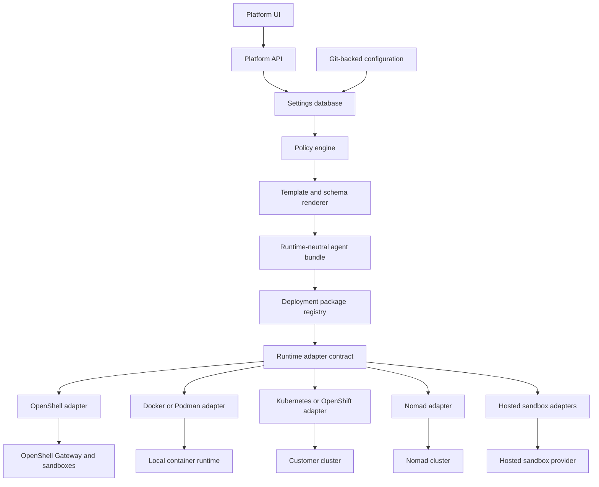

The platform should treat these as runtime-neutral concepts:

| Concept | Runtime-neutral meaning | Runtime-specific translation |
| --- | --- | --- |
| Persona | Agent identity, prompt, mission, tools, skills, memory scope, policy bindings | OpenShell sandbox agent config, Kubernetes workload, Nomad job, hosted sandbox metadata |
| Runtime profile | Image, CPU, memory, GPU, filesystem, environment, command, lifecycle | OpenShell policy, Compose service, Pod spec, OpenShift security context, Nomad task, hosted sandbox template |
| Terminal session | Audited interactive shell bound to identity and policy | OpenShell relay, Kubernetes exec proxy, local container exec wrapper, hosted sandbox command channel |
| Secret reference | Logical reference plus access policy | OpenShell provider, Kubernetes Secret or external secret reference, Vault path, cloud secret manager path, hosted provider secret |
| Model route | Logical inference backend and policy | OpenShell inference route, platform proxy, local model endpoint, cloud provider route |
| Tool policy | Allowed local tools, MCP servers, Nornir actions, Ansible modes | Supervisor policy, shell wrapper, admission policy, command proxy, sidecar enforcement |
| Evidence bundle | Logs, command transcripts, files, diffs, telemetry, artifacts | OpenShell logs, object store, PVC artifact path, Nomad alloc logs, hosted sandbox files |

## Runtime Adapter Contract

The adapter contract should not expose vendor-specific details to the UI. The UI should ask for a deployment plan, preview, launch, session attach, evidence readback, or teardown. The selected adapter owns translation.

Required adapter capabilities:

| Capability | Purpose |
| --- | --- |
| Validate target | Verify customer runtime, versions, namespaces, drivers, policies, image access, and network reachability assumptions. |
| Render overlay | Convert runtime-neutral bundle into target-specific artifacts. |
| Plan deployment | Show what would change before anything runs. |
| Launch sandbox | Create or update the agent execution boundary. |
| Attach terminal | Provide audited terminal or exec access without exposing raw runtime credentials to the browser. |
| Sync files | Move reviewed scripts, Nornir inventory, Ansible playbooks, evidence bundles, and generated artifacts through governed channels. |
| Resolve secret references | Map logical secret references to provider paths without exposing secret material to Git, the UI, or raw DB fields. |
| Route inference | Ensure model access uses approved provider routes and policy. |
| Enforce local tool policy | Restrict shell, Python, Nornir, Ansible, MCP tools, package installation, and network egress. |
| Collect evidence | Return transcripts, logs, command outputs, files, diffs, and run metadata. |
| Stop sandbox | Tear down runtime state and revoke sessions. |
| Report health | Surface runtime, gateway, sandbox, policy, provider, network, and identity health. |

## Evaluation Criteria

Scores are relative for this product, from 1 low to 5 high.

`Overall fit` is a product judgment, not an arithmetic average of the other columns.

| Runtime | Agent security fit | On-prem fit | Private network reach | Terminal and file workflow | Secrets and identity fit | Portability | Operational burden | Overall fit |
| --- | ---: | ---: | ---: | ---: | ---: | ---: | ---: | ---: |
| OpenShell | 5 | 4 | 5 | 5 | 5 | 4 | 3 | 5 |
| Docker or Podman local | 2 | 5 | 4 | 4 | 2 | 5 | 2 | 4 |
| Kubernetes native | 3 | 5 | 5 | 4 | 4 | 5 | 4 | 4 |
| OpenShift native | 4 | 5 | 5 | 4 | 5 | 4 | 4 | 4 |
| E2B | 4 | 1 | 2 | 5 | 3 | 3 | 2 | 3 |
| Daytona | 4 | 4 | 3 | 5 | 3 | 4 | 3 | 3 |
| Cloudflare Agents and Sandbox SDK | 4 | 1 | 2 | 4 | 4 | 3 | 2 | 3 |
| Modal Sandboxes | 3 | 1 | 2 | 4 | 3 | 3 | 2 | 3 |
| Nomad | 2 | 5 | 5 | 3 | 4 | 4 | 3 | 3 |

Interpretation:

- OpenShell has the strongest product fit if its ecosystem and APIs remain stable enough for us to build against.
- Docker or Podman is not enough security by itself, but it is the right contributor and lab mode.
- Kubernetes and OpenShift are mandatory deployment targets because many customers already run them.
- Hosted sandboxes are useful expansion paths, but they should not define the first network automation runtime.

## Candidate 1: NVIDIA OpenShell

OpenShell is the preferred first runtime. Its architecture already separates a control-plane Gateway from sandbox-local Supervisor enforcement. The Gateway owns API access, durable state, sandbox lifecycle, policy delivery, provider and inference configuration, authorization, and relay coordination. The Supervisor runs inside each sandbox workload and enforces process, filesystem, network, credential, inference, logging, exec, and file transfer behavior near the agent.

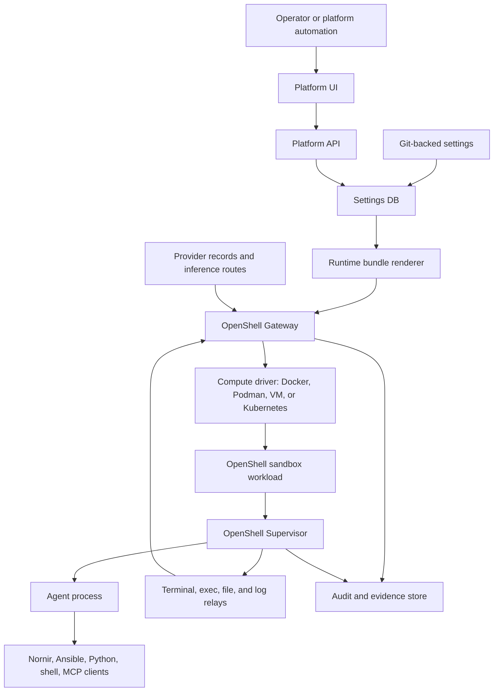

Strengths:

- Best match for autonomous agent safety.
- Gateway and Supervisor split maps cleanly to our UI, Platform API, settings database, policy, and evidence model.
- Policy can cover filesystem, process, network egress, credentials, and inference routing.
- Local and Kubernetes deployment models are already part of the OpenShell mental model.
- Supports the idea that compute, credentials, identity, and secret stores sit behind adapter boundaries.

Weaknesses:

- Newer ecosystem, so customer runtime adoption is uncertain.
- We will need to track OpenShell API and policy evolution closely.
- Customers may resist adopting an unfamiliar runtime if they already have OpenShift, Kubernetes, Nomad, or internal sandbox standards.
- Some controls may be OpenShell-specific unless the platform keeps a neutral adapter layer.

The runtime adapter contract is the mitigation for those weaknesses: OpenShell remains the gold-standard adapter, while non-OpenShell adapters must declare any missing or degraded controls in deployment planning.

Product opinion:

OpenShell should be the reference implementation and the security baseline. It should not be the only runtime contract. The product should say: "OpenShell is our recommended secure runtime; other adapters must declare any missing controls."

## Candidate 2: Docker or Podman Local Runtime

Docker and Podman are the best local contributor and lab runtimes. They make it easy to ship the `network-agent-runtime` image, run the Platform API and UI, run Nornir against network emulators, and test MCP servers. Podman is especially relevant for rootless and open-source-friendly environments.

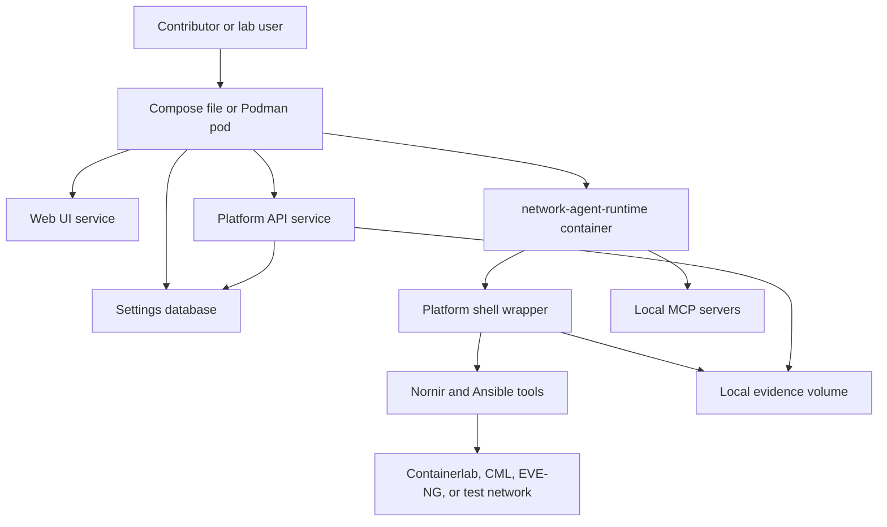

Strengths:

- Fastest way to onboard contributors.
- Most compatible path for labs, demos, and local network simulation.
- OCI images are portable into Kubernetes, OpenShift, Nomad, and many hosted platforms.
- Podman keeps a strong open-source and rootless story.
- Docker Compose is a practical reference deployment for early users.

Weaknesses:

- Containers alone do not provide the complete agent safety model.
- Docker socket access is dangerous and should not be mounted into agent containers.
- Secrets, identity, terminal access, and audit need platform wrappers.
- Local network access can accidentally become broader than intended if not constrained.

Product opinion:

This should be the second adapter. It is not the enterprise security answer, but it is the adoption answer. If contributors cannot run this platform locally with Nornir and Ansible, the open-source project will feel theoretical.

## Candidate 3: Kubernetes Native Runtime

Kubernetes is the most likely enterprise deployment substrate. OpenShell can run on Kubernetes, but the platform should also understand a native Kubernetes deployment shape for customers who will not adopt OpenShell immediately.

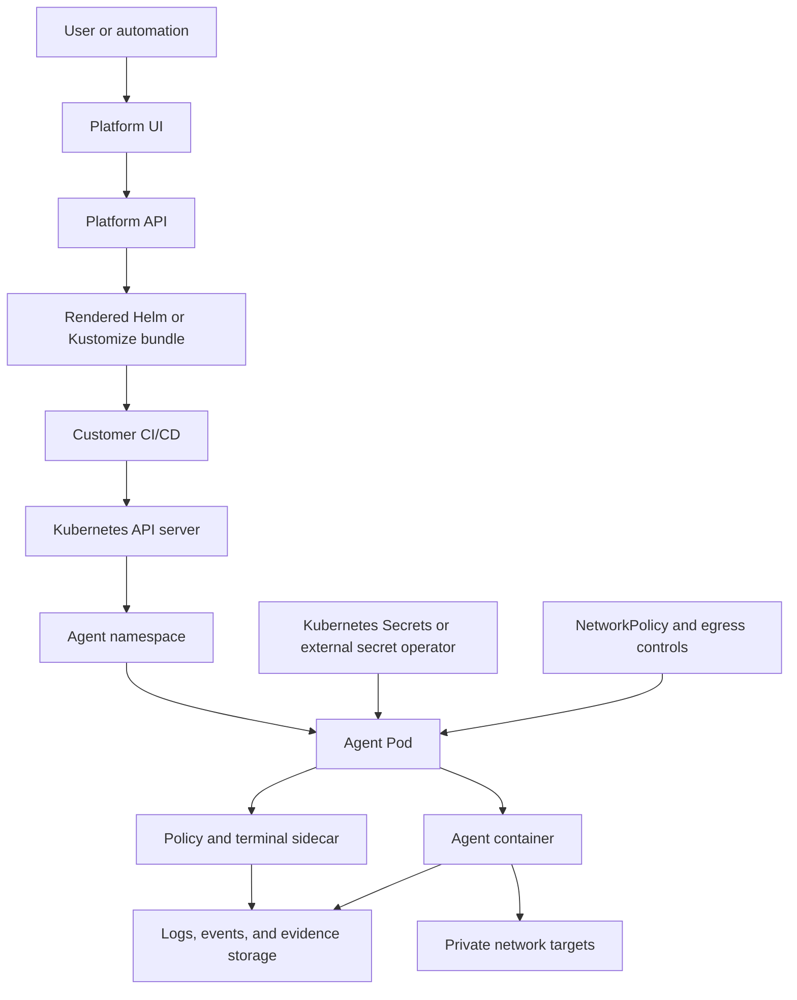

Strengths:

- Strong enterprise adoption and operational familiarity.
- Good fit for customer-owned CI/CD and GitOps.
- RBAC, namespaces, service accounts, NetworkPolicy, admission controllers, Secrets, external secrets, and audit logs provide many required primitives.
- Works well with GPU plugins and private network routing in customer clusters.

Weaknesses:

- Kubernetes does not automatically provide an agent Supervisor, inference proxy, credential broker, or transcript-grade terminal policy.
- Security behavior varies based on cluster configuration.
- Native `kubectl exec` semantics are not enough for the platform's audit and identity requirements.
- More implementation effort if not using OpenShell as the agent control plane.

Product opinion:

Kubernetes should be the first enterprise deployment target. The preferred shape should still run OpenShell Gateway and sandboxes on Kubernetes. A native Kubernetes fallback is valuable, but it will need a platform sidecar or runner to close security gaps.

## Candidate 4: OpenShift Native Runtime

OpenShift is the Kubernetes variant most likely to appear in regulated enterprise environments. It adds platform governance and enterprise security constructs on top of Kubernetes. OpenShift sandboxed containers also support Kata Containers as an optional runtime for stronger workload isolation.

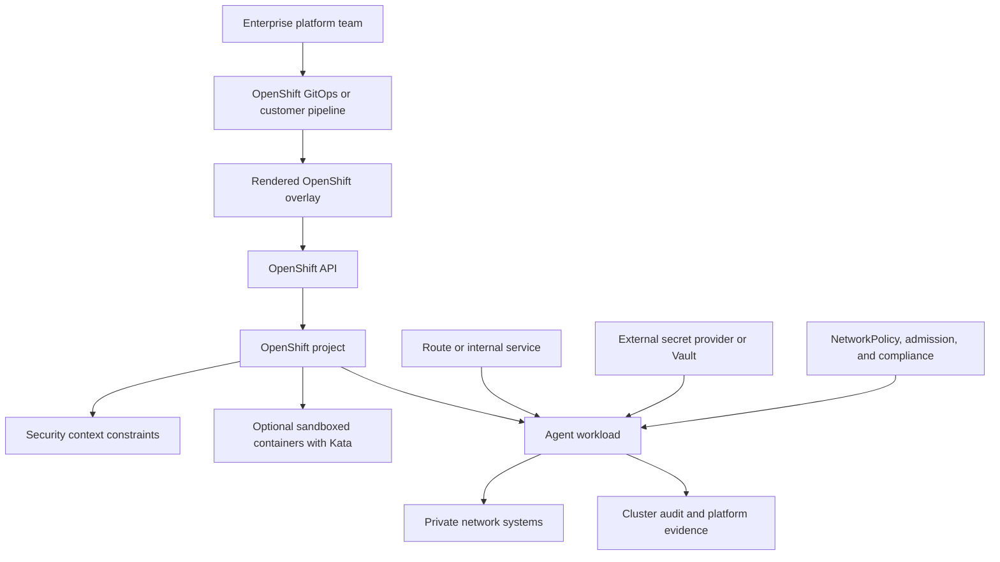

Strengths:

- Strong enterprise identity, platform governance, and security posture.
- Common in large organizations that care about audit, compliance, and operational ownership.
- Can use OpenShift sandboxed containers for stronger isolation where available.
- Fits customer-owned GitOps well.

Weaknesses:

- More customer-specific conventions than vanilla Kubernetes.
- SecurityContextConstraints, Routes, Operators, certs, and cluster policies vary by organization.
- Native OpenShift still lacks agent-specific Supervisor semantics unless paired with OpenShell or a platform runner.

Product opinion:

OpenShift should be treated as a first-class deployment target, not a separate product. If the first enterprise customer uses OpenShift, the platform should deploy OpenShell there or produce a native OpenShift overlay with clearly declared missing controls.

## Candidate 5: E2B

E2B provides isolated sandboxes that agents can use to execute code, process data, and run tools. It is a strong fit for hosted AI code execution and fast sandbox lifecycle operations.

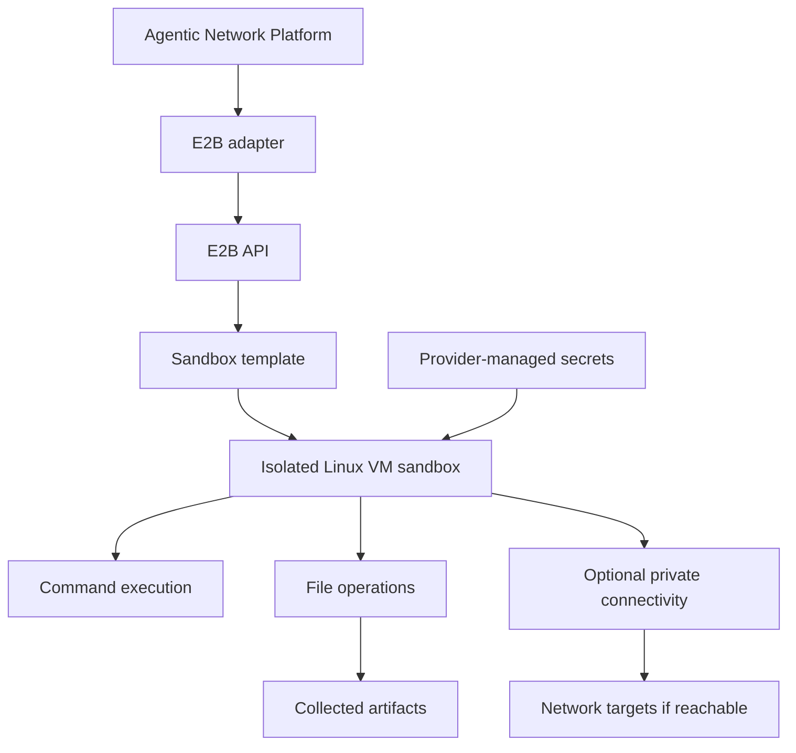

Strengths:

- Excellent developer API for isolated code execution.
- Good fit for ephemeral analysis, parsing, data processing, and demo workloads.
- Strong command and file workflow.

Weaknesses:

- Hosted execution may not satisfy customers with private routing, air-gap, or strict data residency.
- Network automation needs reachability to routers, controllers, source-of-truth systems, and internal APIs.
- Enterprise identity and secrets integration would need careful design.

Product opinion:

E2B should be an optional hosted sandbox adapter, not the first runtime for network automation. It may be very useful for public demos, parser labs, and non-sensitive data work.

## Candidate 6: Daytona

Daytona is an open-source secure and elastic infrastructure runtime for AI-generated code execution and agent workflows. It presents sandboxes as composable computer-like environments with isolation, filesystem, network stack, CPU, memory, and disk resources.

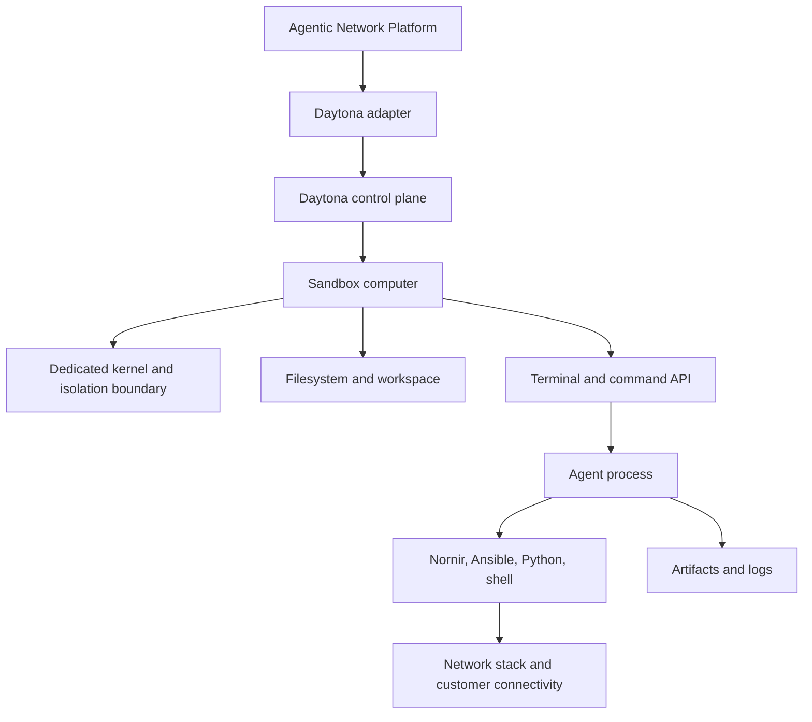

Strengths:

- Open-source option with hosted and self-managed potential.
- Strong fit for AI code execution and rich development environments.
- Full computer-like sandbox is attractive for local scripting and agent workflows.

Weaknesses:

- Still needs platform-specific policy, identity, secret reference, and evidence handling.
- Network automation reachability depends on where the Daytona infrastructure runs.
- Less directly aligned to OpenShell's Gateway and Supervisor security model.

Product opinion:

Daytona is the most interesting non-OpenShell sandbox candidate for code-heavy personas. It should be watched closely and considered for a future adapter after the OpenShell and local container adapters exist.

## Candidate 7: Cloudflare Agents and Sandbox SDK

Cloudflare Agents provide durable agent identity, state, sessions, routing, WebSockets, scheduling, and recovery. Cloudflare Sandbox SDK provides isolated code execution environments built on Cloudflare Containers, with command execution, files, background processes, and service exposure.

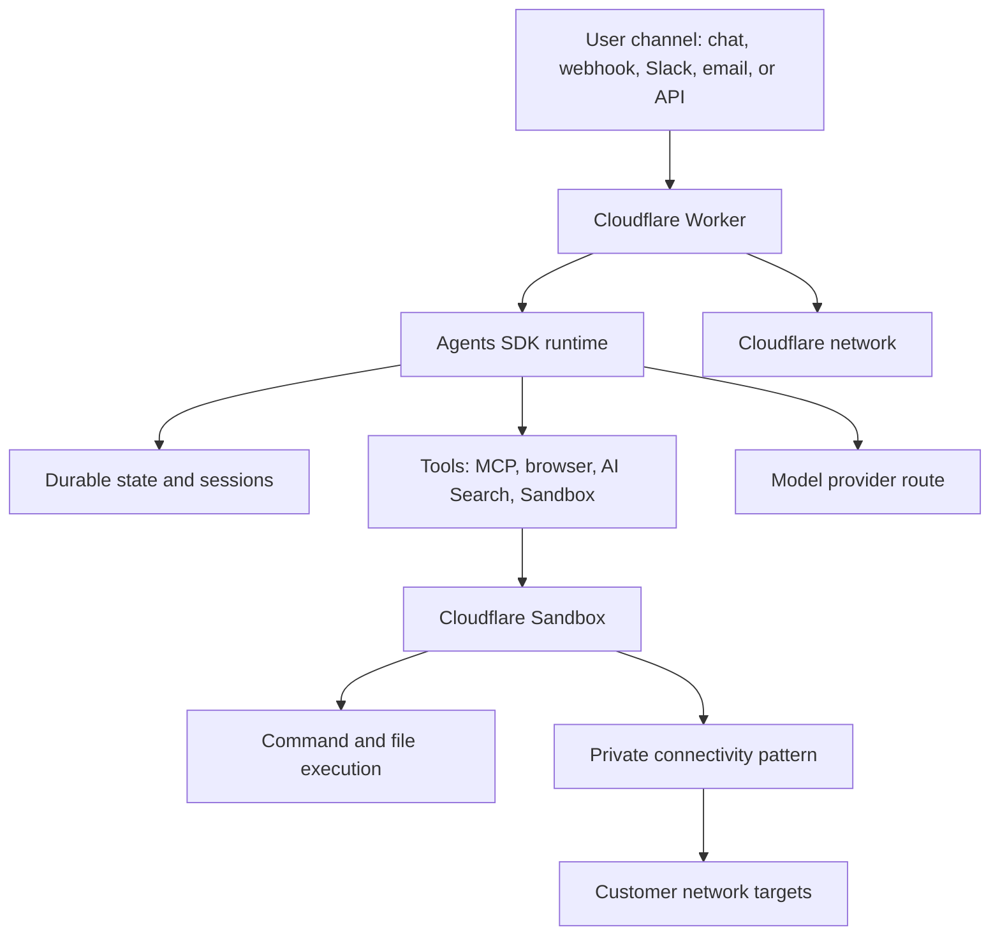

Strengths:

- Strong web-agent platform with durable sessions and global scaling.
- Built-in direction for chat, webhooks, Slack, MCP, browser tools, AI Search, and sandboxed code execution.
- Good fit for SaaS control-plane features and externally reachable integrations.

Weaknesses:

- Not naturally positioned for private network automation from inside customer routing domains.
- Hosted runtime may be difficult for air-gapped or strict-regulated customers.
- Nornir and Ansible workflows that need direct router reachability would need an internal connector or remote worker pattern.

Product opinion:

Cloudflare is attractive for SaaS agent experiences and public integrations, but it should not be the first network execution runtime. It could become a hosted control-plane or edge-adjacent adapter later.

## Candidate 8: Modal Sandboxes

Modal Sandboxes provide API-created container sandboxes with command execution, readiness probes, lifecycle states, CPU, memory, GPU, volumes, network tunnels, and timeout controls. Modal is strong for elastic compute and ML-heavy workloads.

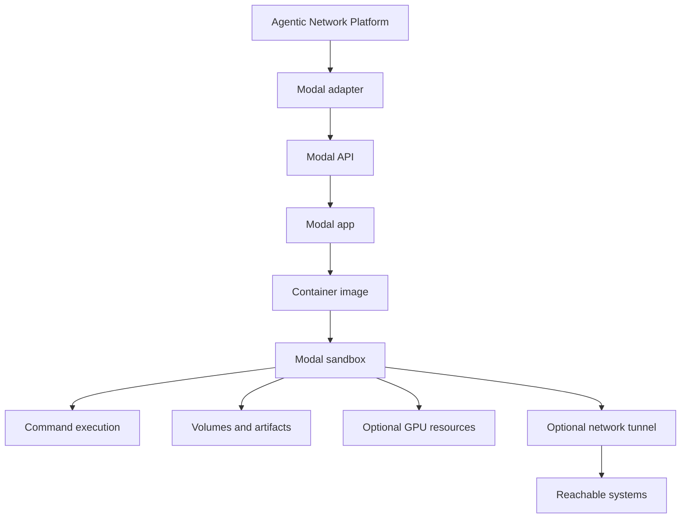

Strengths:

- Strong elastic compute and GPU story.
- Useful for bursty analysis, model-heavy workloads, and controlled command execution.
- Good API ergonomics.

Weaknesses:

- Hosted runtime by default, so private network and data residency constraints are significant.
- Not designed specifically for network automation identity, terminal transcripts, or Nornir inventory access.
- Sandbox timeouts and lifecycle constraints may not match long-running operational agent sessions.

Product opinion:

Modal is a good optional execution backend for compute-heavy analysis, not the main product runtime for enterprise network automation.

## Candidate 9: HashiCorp Nomad

Nomad is a flexible workload orchestrator that can run containers, non-containerized workloads, microservices, batch jobs, and mixed environments. It is especially relevant for organizations already invested in Vault, Consul, and Terraform.

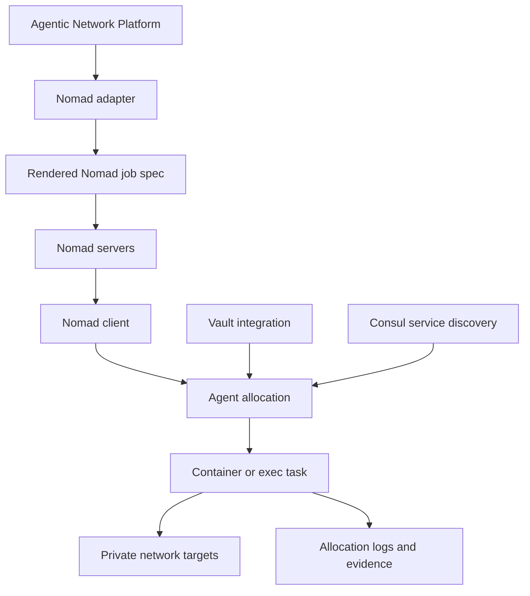

Strengths:

- Flexible scheduler for containers, legacy applications, and batch workloads.
- Strong HashiCorp ecosystem fit with Vault and Consul.
- Easier operational model than Kubernetes for some customers.
- Good fit where customer infrastructure is not Kubernetes-centered.

Weaknesses:

- Not an agent sandbox product by itself.
- The platform would need its own Supervisor-like wrapper for policy, terminal, inference, and evidence behavior.
- Smaller default enterprise footprint than Kubernetes and OpenShift in many environments.

Product opinion:

Nomad should be a customer-driven adapter. If a first customer is a HashiCorp shop, it is realistic to support; otherwise it should wait behind OpenShell, local containers, and Kubernetes/OpenShift.

## Pros and Cons Summary

| Runtime | Pros | Cons |
| --- | --- | --- |
| OpenShell | Agent-native control plane, Supervisor enforcement, policy, provider and inference routing, local and Kubernetes paths | Newer ecosystem, adoption unknown, risk of over-coupling |
| Docker or Podman | Fast contributor path, open OCI image portability, great for labs, Nornir testbeds, and demos | Needs wrappers for real security, Docker socket risk, weaker default audit |
| Kubernetes | Enterprise default, RBAC, namespaces, NetworkPolicy, Secrets, CI/CD, GPUs, private network reachability | Complex, not agent-specific, customer configuration variability |
| OpenShift | Enterprise governance, security context controls, GitOps, optional Kata sandboxing | Customer-specific conventions, operational complexity, still needs agent controls |
| E2B | Fast isolated code sandboxes, strong command and file APIs | Hosted bias, private network challenges, data residency questions |
| Daytona | Open-source sandbox platform, full computer-like environments, strong coding workflow | Needs platform governance wrappers, network reachability depends on deployment |
| Cloudflare | Durable sessions, global scale, strong channels and tools, good SaaS fit | Weak private network fit, hosted runtime, not natural for Nornir-to-router execution |
| Modal | Elastic compute, GPUs, useful for analysis and batch work | Hosted bias, lifecycle limits, not network-automation oriented |
| Nomad | Flexible self-hosted scheduler, Vault and Consul fit, mixed workload support | Needs custom agent supervisor layer, smaller default target than Kubernetes |

## Adapter Effort

| Runtime | Adapter complexity | What maps cleanly | What needs custom work |
| --- | --- | --- | --- |
| OpenShell | Medium | Gateway config, policies, providers, inference routing, sandboxes, relays | Product-specific settings mapping and long-term API compatibility |
| Docker or Podman | Low to medium | OCI image, volumes, env, compose services, local logs | Policy wrapper, terminal gateway, secret broker, network controls, audit |
| Kubernetes | Medium to high | Pods, Jobs, Deployments, service accounts, secrets, NetworkPolicy, logs | Supervisor sidecar, terminal transcript control, inference proxy, policy consistency |
| OpenShift | High | Kubernetes resources, Routes, SCCs, GitOps, external secrets | OpenShift-specific overlays, certs, compliance gates, optional Kata runtime class |
| E2B | Medium | Sandbox create, command run, files, templates | Private connectivity, enterprise secrets, evidence normalization |
| Daytona | Medium | Workspace, terminal, command execution, files | Enterprise policy mapping, secret references, network controls, audit |
| Cloudflare | Medium to high | Durable agent sessions, tools, MCP, sandbox command APIs | Private network automation, Git-backed runtime bundles, Nornir execution model |
| Modal | Medium | Sandbox create, exec, images, volumes, GPU, readiness | Private network access, long-lived sessions, enterprise identity and audit |
| Nomad | High | Job specs, task drivers, Vault, Consul, allocation logs | Supervisor wrapper, terminal policy, inference routing, evidence collection |

## Recommended Product Shape

The codebase should separate the platform from the runtime. The canonical repo layout is defined in [UI and Agent Deployment Framework Architecture](ui-agent-deployment-framework.md#codebase-architecture); this section refines that layout by making runtime contracts and runtime adapters explicit.

Deployment adapters emit artifacts such as Compose, Helm, Kustomize, OpenShift overlays, Nomad job specs, or customer CI/CD bundles. Runtime adapters own launch, terminal/session attach, file sync, secret-reference mapping, runtime health, and evidence readback for a selected execution environment.

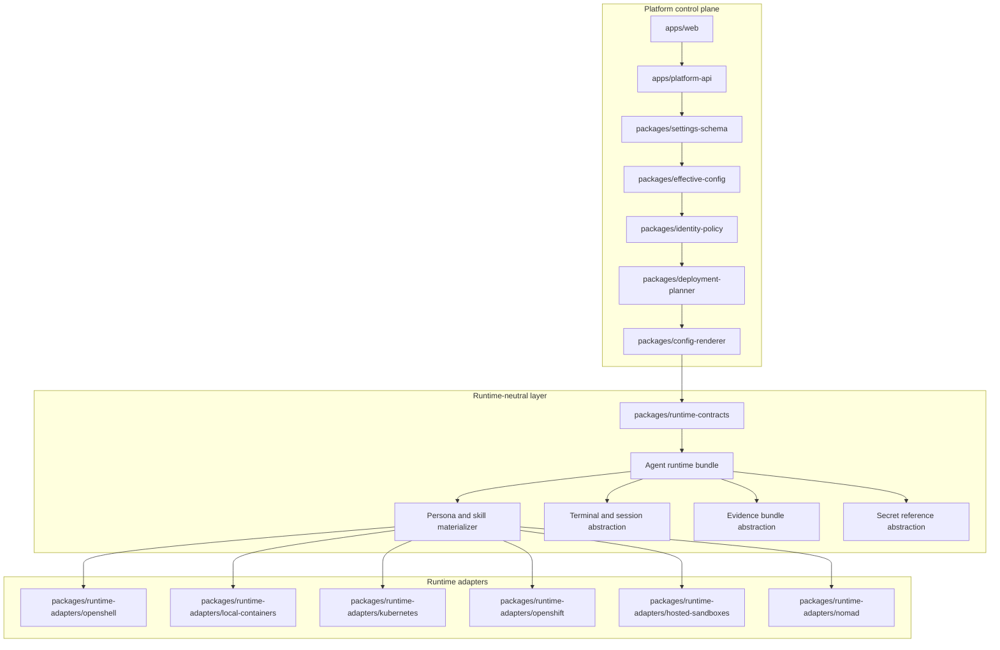

Recommended repository direction:

| Area | Responsibility |
| --- | --- |
| `packages/deployment-adapters` | Render target-specific deployment artifacts such as Compose files, Helm values, Kustomize overlays, OpenShift overlays, Nomad job specs, and CI/CD bundles. |
| `packages/runtime-contracts` | Runtime-neutral schemas for personas, sessions, terminals, files, secrets, model routes, evidence, policy capabilities, and health. |
| `packages/runtime-adapters/openshell` | Gateway, Supervisor, policy, providers, inference routing, sandbox lifecycle, relay, and evidence integration. |
| `packages/runtime-adapters/local-containers` | Docker and Podman local contributor mode with platform shell wrapper and local evidence store. |
| `packages/runtime-adapters/kubernetes` | Helm and Kustomize rendering, service accounts, network policy, secrets references, logs, exec proxy, and optional OpenShell-on-Kubernetes mode. |
| `packages/runtime-adapters/openshift` | OpenShift overlays, Routes, SCCs, runtime classes, GitOps handoff, and external secret conventions. |
| `packages/runtime-adapters/nomad` | Nomad job specs, Vault/Consul integration, allocation lifecycle, and evidence collection. |
| `packages/runtime-adapters/hosted-sandboxes` | E2B, Daytona, Cloudflare, Modal, and future hosted adapters behind a common sandbox API. |

## OpenShell-First Without Lock-In

To stay portable, do not expose OpenShell-specific nouns in product-level UI settings unless the setting is explicitly an OpenShell runtime profile. For example:

| Product-level setting | Avoid exposing as | Better abstraction |
| --- | --- | --- |
| Agent execution boundary | OpenShell sandbox only | Runtime session or sandbox |
| Terminal access | OpenShell relay only | Audited terminal session |
| Model route | OpenShell inference.local only | Approved model route |
| Credential access | OpenShell provider only | Secret reference and credential policy |
| Network access | OpenShell network policy only | Egress policy with target capability labels |
| Persona deployment | OpenShell config only | Rendered persona runtime bundle |

OpenShell-specific details can still appear in advanced settings, deployment previews, and generated artifacts.

## Network Automation Requirements Across Runtimes

Nornir and Ansible change the runtime evaluation. This platform is not only executing code; it is reaching private network systems and producing operational evidence.

Minimum network automation requirements for any runtime adapter:

- Can run the `network-agent-runtime` image or equivalent environment.
- Can install or include Nornir, Netmiko, Scrapli, NAPALM, pyATS, Ansible CLI, parsers, and custom Python dependencies.
- Can reach target routers, switches, load balancers, firewalls, controllers, source-of-truth systems, and observability APIs only through approved network paths.
- Can resolve secret references at runtime without exposing raw secrets to the UI, Git, or raw DB fields.
- Can preserve command transcripts, script inputs, outputs, diffs, errors, and metadata as evidence.
- Can enforce read-only, plan, dry-run, and approval-gated execution modes.
- Can constrain package installation, shell commands, network egress, filesystem paths, CPU, memory, and execution time.

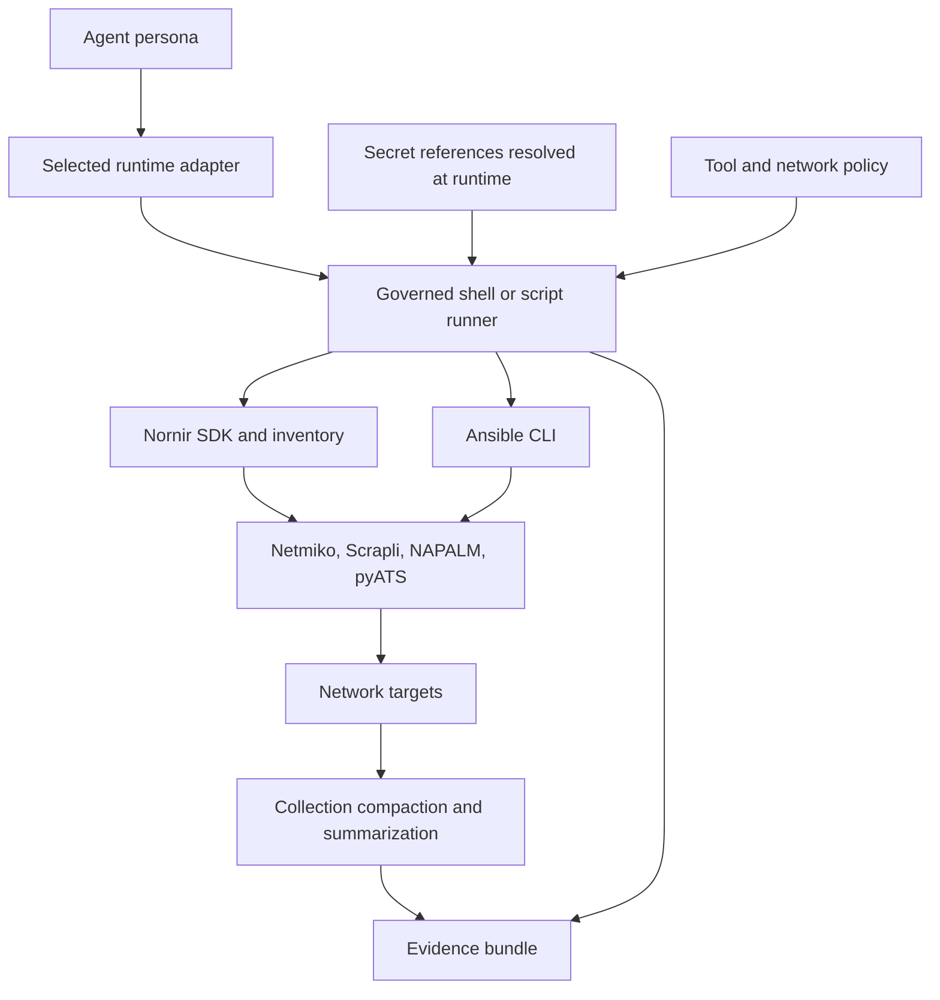

Hosted sandboxes can satisfy the compute side of this model. They usually struggle with the private network side unless the customer provides private connectivity, a relay, a connector, or deploys the runtime inside their environment.

## Best-Practice Callouts

1. OpenShell-first is sound, OpenShell-only is risky.
   Starting with OpenShell gives the project a strong security baseline. Hard-coding the product around OpenShell concepts would make first-customer fit risk higher than necessary.

2. Runtime portability must not erase security differences.
   If Docker local mode lacks OpenShell-style inference interception, the deployment plan should say so. Portability should be honest, not cosmetic.

3. Kubernetes native does not automatically equal safe agent runtime.
   Kubernetes gives useful primitives, but we still need a governed terminal path, tool policy, evidence collection, secret-reference resolution, and model-route enforcement.

4. Hosted sandboxes are not automatically compatible with network operations.
   They are compelling for code execution but may not be able to reach private network devices, controllers, or internal APIs without customer-specific connectivity.

5. OCI images are the portability anchor.
   The `network-agent-runtime` image should remain ordinary OCI-compatible infrastructure wherever possible. OpenShell can supervise it, Docker or Podman can run it locally, and Kubernetes, OpenShift, Nomad, E2B, Daytona, Modal, or future runtimes can consume the image where supported.

6. The UI should show runtime capability gaps.
   A deployment preview should list supported, degraded, unsupported, and customer-supplied capabilities for the chosen runtime.

## Proposed Runtime Capability Matrix

Every adapter should declare capabilities in the database so the UI can warn users before rendering or deploying.

| Capability | OpenShell | Docker or Podman | Kubernetes | OpenShift | E2B | Daytona | Cloudflare | Modal | Nomad |
| --- | --- | --- | --- | --- | --- | --- | --- | --- | --- |
| Audited terminal | Native path | Platform wrapper | Exec proxy needed | Exec proxy needed | API channel | API channel | Sandbox channel | Exec API | Allocation exec wrapper |
| Secret references | Native provider model | Broker needed | External secrets or broker | External secrets or broker | Provider-specific | Provider-specific | Platform bindings | Provider-specific | Vault fit |
| Private network reach | Strong when deployed nearby | Strong in lab | Strong in customer cluster | Strong in customer cluster | Requires connectivity design | Depends on deployment | Requires connector | Requires connectivity design | Strong when deployed nearby |
| Inference routing | Native route | Platform proxy | Platform proxy or sidecar | Platform proxy or sidecar | Platform proxy | Platform proxy | Native/cloud routes | Platform proxy | Platform proxy |
| File sync | Native relay | Volume or wrapper | Sidecar or object store | Sidecar or object store | API | API | API | Volumes/API | Artifact path |
| Evidence collection | Native plus platform store | Wrapper required | Logs plus sidecar | Logs plus sidecar | API artifacts | API artifacts | Logs and state | Logs and volumes | Allocation logs |
| Nornir local SDK | Strong | Strong | Strong | Strong | Possible | Strong | Possible but awkward | Possible | Strong |
| Air-gap potential | Possible | Strong | Strong | Strong | Weak | Depends on self-hosting | Weak | Weak | Strong |

## Practical First Build

The first build should prove portability without overbuilding every adapter.

Phase 1:

- Define runtime-neutral bundle schema.
- Implement OpenShell adapter.
- Implement Docker or Podman local adapter.
- Build capability declaration and deployment preview UI.
- Run Nornir and Ansible inside `network-agent-runtime`.
- Capture evidence bundles from both OpenShell and local container paths.

Phase 2:

- Render Kubernetes and OpenShift artifacts.
- Support OpenShell-on-Kubernetes as the preferred cluster mode.
- Add native Kubernetes/OpenShift fallback with explicit missing-control warnings.
- Integrate external secret references and customer CI/CD PR handoff.

Phase 3:

- Add customer-driven Nomad adapter if needed.
- Add hosted sandbox adapter experiments for E2B, Daytona, Cloudflare, and Modal.
- Decide whether hosted sandboxes are product features, demo paths, or internal test infrastructure.

## Final Opinion

OpenShell is the best place to start if the goal is enterprise-trustworthy autonomous network agents. It already thinks in the right boundaries: Gateway, Supervisor, policy, provider records, inference routing, sandbox lifecycle, and relays.

The safer business strategy is not to bet the whole platform on OpenShell adoption. The product should bet on a portable runtime contract, with OpenShell as the gold-standard adapter and Docker or Podman as the local adoption adapter. Kubernetes and OpenShift should be treated as mandatory deployment targets because they are where enterprise buyers already live.

If the first customer is an OpenShift customer, we should be able to say: "Great, we can deploy OpenShell into OpenShift or render a native OpenShift package with declared control differences."

If the first customer is a HashiCorp/Nomad shop, we should be able to say: "The runtime contract is portable, but Nomad requires an adapter and a Supervisor-like wrapper for parity."

If the first customer wants hosted sandboxes, we should be able to say: "That works for code execution and analysis, but private network automation requires connectivity design."

The product should therefore be OpenShell-first, OCI-grounded, Kubernetes/OpenShift-ready, and adapter-driven.

## Open Questions

- Should the first Kubernetes adapter always deploy OpenShell, or should a native Kubernetes fallback ship in the same milestone?
- What is the minimum runtime capability level allowed for state-changing network automation?
- Should hosted sandbox adapters be community plugins, enterprise features, or lab-only test utilities?
- Should the platform maintain its own Supervisor-like runner for non-OpenShell runtimes?
- Should capability declarations be static adapter metadata, live runtime probes, or both?

## References

- NVIDIA OpenShell How It Works: https://docs.nvidia.com/openshell/about/how-it-works
- NVIDIA OpenShell repository: https://github.com/NVIDIA/OpenShell
- Docker Compose documentation: https://docs.docker.com/compose/
- Docker AI Sandboxes isolation documentation: https://docs.docker.com/ai/sandboxes/security/isolation/
- Docker Enhanced Container Isolation documentation: https://docs.docker.com/enterprise/security/hardened-desktop/enhanced-container-isolation/
- Podman: https://podman.io/
- Podman introduction: https://docs.podman.io/en/latest/Introduction.html
- Kubernetes Pods documentation: https://kubernetes.io/docs/concepts/workloads/pods/
- OpenShift sandboxed containers documentation: https://docs.redhat.com/en/documentation/openshift_container_platform/4.18/html/openshift_sandboxed_containers/index
- E2B documentation: https://e2b.dev/docs
- Daytona documentation: https://www.daytona.io/docs/en/
- Daytona open source deployment documentation: https://www.daytona.io/docs/en/oss-deployment/
- Daytona repository: https://github.com/daytonaio/daytona
- Cloudflare Agents documentation: https://developers.cloudflare.com/agents/
- Cloudflare Sandbox SDK documentation: https://developers.cloudflare.com/sandbox/
- Modal Sandboxes documentation: https://modal.com/docs/guide/sandboxes
- HashiCorp Nomad documentation: https://developer.hashicorp.com/nomad/docs/what-is-nomad
