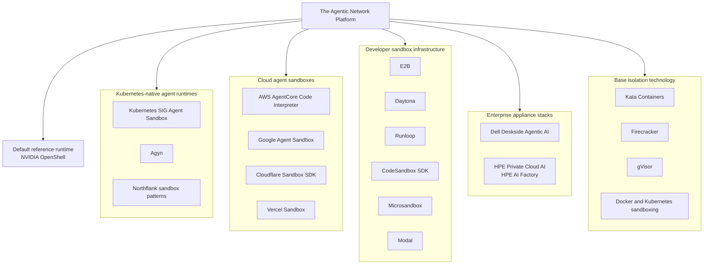
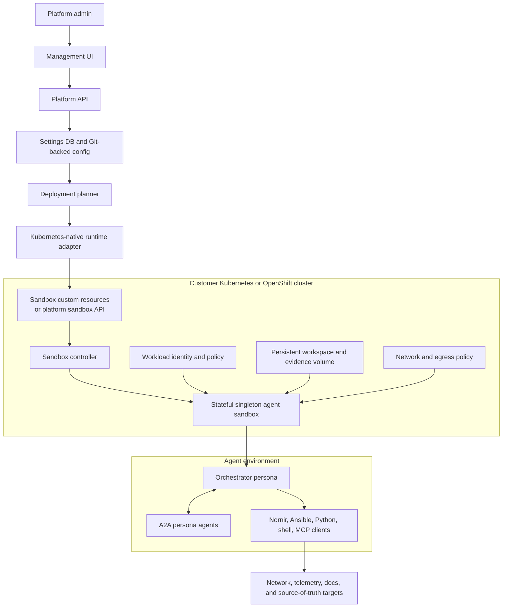
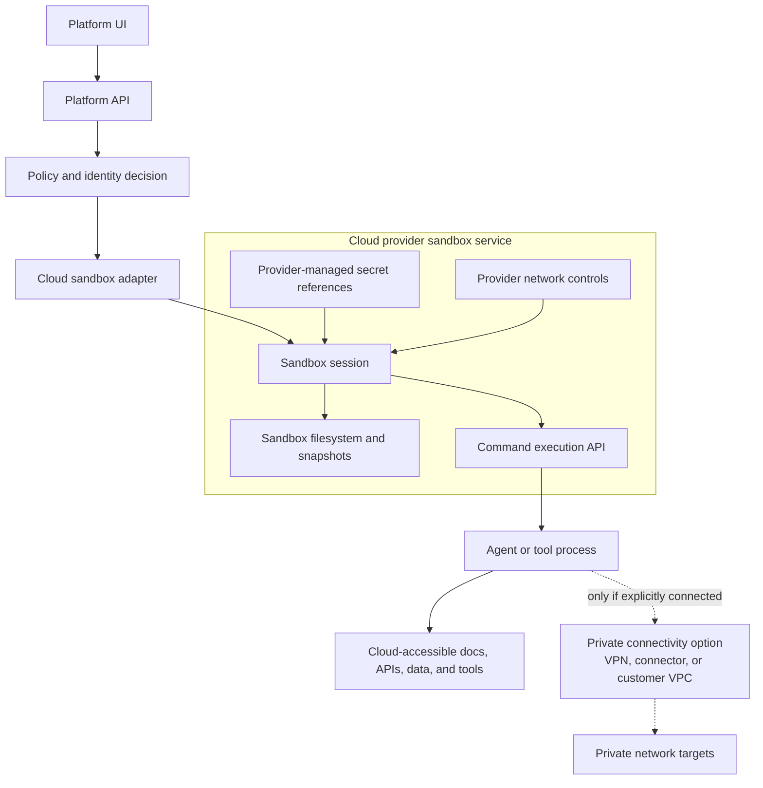
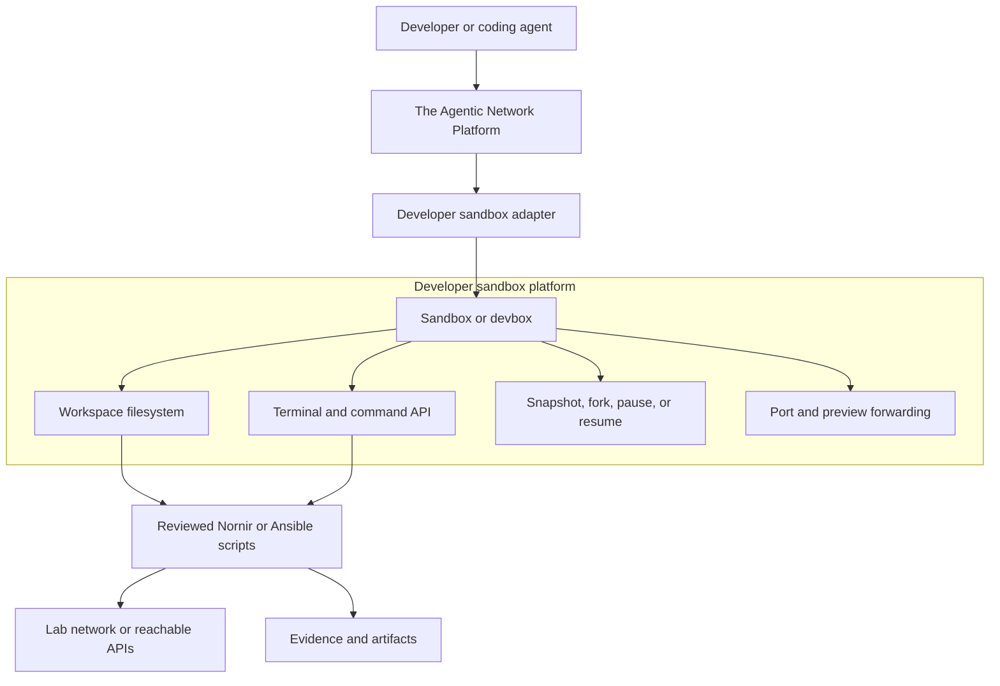
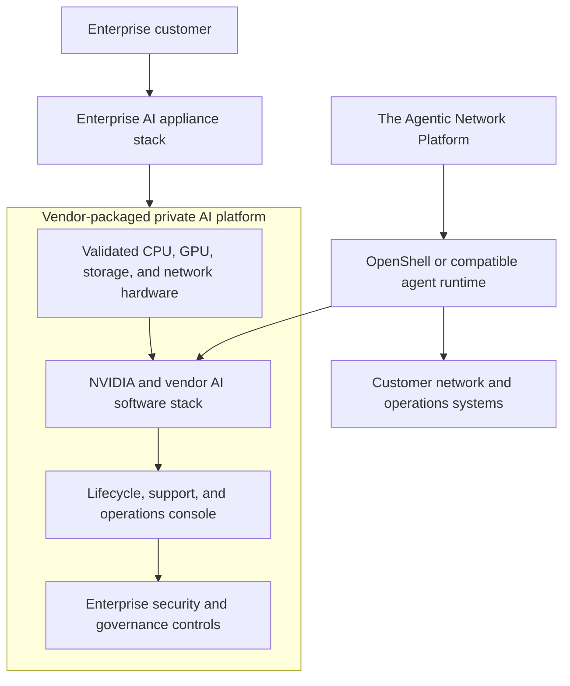
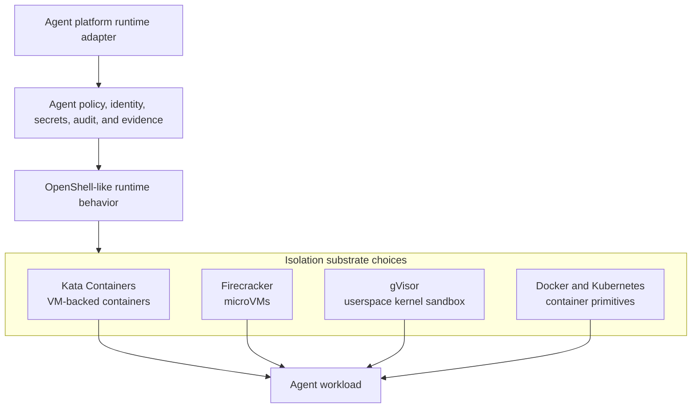
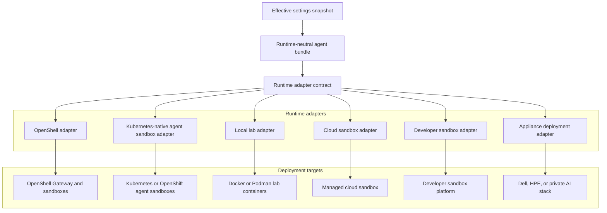

# Runtime Execution Environment Evaluation

Status: draft for review
Date: 2026-06-26
Issue: https://github.com/ColtMercer/the-agentic-network-platform/issues/27

This document evaluates the runtime execution market around The Agentic Network Platform. The platform still treats NVIDIA OpenShell as the default reference runtime, but the comparison now focuses on the competitor categories that are closest to secure, stateful, agentic execution.

The important market pressure is not "OpenShell versus Docker." Docker, Kubernetes, and VM isolation are substrates. The real question is whether the platform can express personas, tools, identity, secrets, terminal access, evidence, and state in a way that can run on OpenShell by default and still adapt to customers who standardize on Kubernetes-native agent sandboxes, managed cloud sandboxes, developer sandbox platforms, enterprise AI appliances, or lower-level isolation technology.

## Goals

- Evaluate the runtime categories most relevant to secure network AI agents.
- Decide how strongly the platform should depend on NVIDIA OpenShell.
- Identify which competitors should influence the platform's runtime adapter, settings, and deployment model.
- Preserve portability for Kubernetes, OpenShift, cloud sandboxes, developer sandboxes, and appliance-backed private AI stacks.
- Give project partners a clear mental model for the runtime landscape.

## Non-Goals

- No implementation code in this artifact.
- No final vendor selection for every customer environment.
- No claim that all runtimes provide equivalent security.
- No recommendation to weaken identity, secret, audit, or network-control requirements for portability.

## Executive Recommendation

Build the product as a Kubernetes-native-capable agent platform with OpenShell as the first reference runtime adapter.

That is a deliberate shift in framing. OpenShell is still the preferred starting runtime because it is purpose-built for policy-governed agent execution. But the platform should not sound like it only understands OpenShell, Docker, or generic Kubernetes pods. The strongest competitive pressure comes from Kubernetes-native agent runtimes: Kubernetes SIG Agent Sandbox, Google or GKE Agent Sandbox patterns, Agyn, and Northflank-style sandbox patterns. These are closest to the problem we care about: isolated, stateful, singleton agent environments that can run near enterprise systems and private networks.

Recommended posture:

| Priority | Runtime posture | Why |
| --- | --- | --- |
| 1 | OpenShell reference adapter | Best default for policy-governed agent execution, secure terminal mediation, model-provider routing, and sandbox supervision. |
| 2 | Kubernetes-native agent sandbox compatibility | Most important enterprise portability story for Kubernetes and OpenShift customers. Should model Agent Sandbox, Agyn, and Northflank patterns rather than generic pods. |
| 3 | Local lab and contributor runtime | Keep Docker or Podman useful for local development, but position it as a lab substrate, not a competitor category. |
| 4 | Cloud and developer sandbox adapters | Useful for demos, SaaS workflows, elastic code execution, and non-network tasks, but weaker for private network reachability unless customers accept cloud lock-in or BYOC models. |
| 5 | Appliance and substrate awareness | Dell, HPE, Kata, Firecracker, gVisor, Docker, and Kubernetes sandboxing shape packaging and implementation choices, but they are not the same kind of product as the agent platform. |

The platform contract should preserve these invariants across every adapter:

- No raw secret material in Git or normal database records.
- No direct browser-to-runtime shell access.
- No interactive user workflow that uses an agent-global service account to exceed delegated permissions.
- Persona-owned agentic credentials are allowed only when explicitly modeled, scoped, audited, and governed.
- Runtime-specific security gaps must be visible in deployment planning.
- Nornir and Ansible remain first-class local runtime tools, not only MCP tools.
- Network reachability is a deployment property, not a prompt-time assumption.

## Competitor Landscape

| Category | Competitors | Why they matter | Our posture |
| --- | --- | --- | --- |
| Kubernetes-native agent runtimes | Kubernetes SIG Agent Sandbox, Agyn, Northflank sandbox patterns | Closest to isolated, stateful, singleton agent environments on Kubernetes and OpenShift. | Treat as the strongest non-OpenShell design pressure and likely first portability target. |
| Cloud agent sandboxes | AWS AgentCore Code Interpreter, Google Agent Sandbox, Cloudflare Sandbox SDK, Vercel Sandbox | Managed sandbox runtimes for executing agent and code workloads safely. Good if customers accept cloud lock-in. | Support later through adapters where network reachability, data residency, and identity can be proven. |
| Developer sandbox infrastructure | E2B, Daytona, Runloop, CodeSandbox SDK, Microsandbox, Modal | Coding-agent oriented, but directly compete on isolated execution, pause and resume, filesystem state, and tool execution. | Borrow developer experience patterns; do not let them define enterprise network controls. |
| Enterprise appliance stacks | Dell Deskside Agentic AI, HPE Private Cloud AI / AI Factory | Package NVIDIA and private AI infrastructure into enterprise on-prem solutions. | Treat as deployment and go-to-market adjacency, not pure runtime competitors. |
| Base isolation technology | Kata Containers, Firecracker, gVisor, Docker/Kubernetes sandboxing | Not agent runtimes themselves, but likely substrate choices for building OpenShell-like runtime behavior. | Use as implementation options behind runtime adapters and security profiles. |

Vendor and project capabilities reflect public documentation reviewed on 2026-06-26 and move quickly. Verify current self-hosting, air-gap, private-network, secret-handling, and enterprise-support claims before committing to any non-OpenShell adapter.

## Category 1: Kubernetes-Native Agent Runtimes

This is the most important competitive category. It maps directly to enterprise deployment reality: customers already run Kubernetes or OpenShift, and they will ask whether the platform can run isolated, stateful agent environments without making OpenShell the only viable option.

Examples:

- Kubernetes SIG Agent Sandbox
- Google or GKE Agent Sandbox patterns
- Agyn
- Northflank sandbox patterns

Strengths:

- Natural fit for Kubernetes and OpenShift customers.
- Supports stateful singleton agent environments rather than disposable job-only containers.
- Can place agents near private networks, source-of-truth systems, observability stacks, and enterprise identity.
- Aligns with GitOps, CI/CD, cluster policy, admission control, NetworkPolicy, service mesh, and external secrets patterns.
- Stronger enterprise story than generic Docker-based local execution.

Weaknesses:

- The exact control model varies by project and provider.
- Kubernetes primitives alone do not provide agent-specific policy, terminal mediation, inference routing, or evidence semantics.
- OpenShift customers will require security context, SCC, route, image registry, and policy integration details.
- Cluster operators may reject long-lived privileged sandboxes unless the security contract is very explicit.

Product opinion:

This should be the first major portability target after OpenShell. The adapter should not render only a generic pod. It should render an agent sandbox model with stable identity, persistent workspace, audited terminal mediation, explicit network policy, external secret references, model-provider routes, and evidence collection.

## Category 2: Cloud Agent Sandboxes

Cloud agent sandboxes provide managed execution environments for code and agent workloads. They reduce infrastructure burden, but they also introduce cloud lock-in, data residency concerns, and private-network reachability problems.

Examples:

- AWS AgentCore Code Interpreter
- Google Agent Sandbox
- Cloudflare Sandbox SDK
- Vercel Sandbox

Strengths:

- Managed isolation and lifecycle reduce operational burden.
- Good fit for code interpretation, data preparation, documentation processing, testing, and SaaS workflows.
- Some providers expose snapshots, drives, files, ports, sessions, and network controls.
- Useful for demos or hosted offerings where customer network access is not required.

Weaknesses:

- Private network automation is often the hard part, and cloud sandboxes may not sit where the devices are.
- Customer data, logs, command outputs, and artifacts may leave the customer environment.
- Provider-specific APIs can leak into product design if adapters are not strict.
- Enterprise customers may require bring-your-own-cloud, private VPC, private link, or air-gapped deployment paths.

Product opinion:

Cloud sandboxes are valuable expansion adapters, not the initial center of gravity for network automation. The platform should support them where their controls are clear, but any cloud adapter must declare degraded private-network reachability, residency, audit, and secret-control constraints.

## Category 3: Developer Sandbox Infrastructure

Developer sandbox platforms compete on a different axis: coding-agent experience. They are important because their UX often defines what users expect from filesystem state, command execution, background sessions, snapshots, and tool workflows.

Examples:

- E2B
- Daytona
- Runloop
- CodeSandbox SDK
- Microsandbox
- Modal

Strengths:

- Strong developer experience for interactive coding agents.
- Often support fast sandbox startup, filesystem persistence, command execution, file transfer, and snapshots.
- Good inspiration for local script authoring, reviewed automation, and large-data context compaction workflows.
- Some are open source or offer self-hosted/BYOC options.

Weaknesses:

- Most are optimized for software engineering agents, not network engineering safety.
- Tool execution is often easier than enterprise authorization, change evidence, or private network reachability.
- Self-hosting, air-gap, and enterprise controls vary widely.
- They may normalize broad shell access unless we impose our own policy layer.

Product opinion:

We should learn heavily from this category's developer experience, especially workspace persistence, pause/resume, snapshots, and tool-output handling. But the platform should keep network automation policy, delegated identity, agentic credential governance, and evidence capture as first-class requirements that these tools do not necessarily solve.

## Category 4: Enterprise Appliance Stacks

Enterprise appliance stacks are not pure runtime competitors. They matter because they package the NVIDIA and private AI stack in a form enterprise buyers can procure, support, and operate on-prem.

Examples:

- Dell Deskside Agentic AI
- HPE Private Cloud AI / HPE AI Factory

Strengths:

- Strong enterprise procurement, support, and on-prem deployment story.
- May make OpenShell, NVIDIA inference, GPU capacity, and private AI governance easier to consume.
- Helps customers that want validated infrastructure rather than assembling a runtime stack themselves.
- Relevant for regulated environments that prefer private infrastructure.

Weaknesses:

- Hardware and vendor stack decisions may be outside our control.
- Appliance packaging can create deployment assumptions that do not fit smaller labs or cloud-first customers.
- These stacks may compete at the buyer conversation level even if they are complementary technically.

Product opinion:

We should treat these as supported deployment environments and partner-adjacent routes, not direct substitutes for the platform. The platform should be able to run on top of them when they provide OpenShell or compatible Kubernetes/runtime infrastructure.

## Category 5: Base Isolation Technology

Base isolation technologies are substrates. They are not agent runtime products by themselves, but they determine how strong a custom runtime or adapter can become.

Examples:

- Kata Containers
- Firecracker
- gVisor
- Docker and Kubernetes sandboxing

Strengths:

- These technologies can improve tenant isolation, syscall isolation, kernel boundary control, or startup speed.
- They are compatible with container and Kubernetes ecosystems in different ways.
- They let us evaluate how to build or harden an OpenShell-like runtime if required.

Weaknesses:

- They do not solve persona configuration, A2A coordination, model routing, terminal mediation, delegated identity, secret reference resolution, or evidence semantics.
- Security properties differ significantly and must be validated per deployment.
- Operational complexity can rise quickly when combining runtime classes, network policy, storage, and external secret providers.

Product opinion:

These are implementation choices behind adapters, not product-level competitors. The platform should record the selected substrate and expose its security characteristics in deployment planning.

## Runtime Adapter Model

The platform should render a runtime-neutral desired state first, then let adapters translate it into OpenShell Gateway settings, Kubernetes agent-sandbox resources, OpenShift overlays, local Compose files, cloud sandbox API calls, developer sandbox sessions, or appliance-specific deployment artifacts.

Runtime-neutral concepts:

| Concept | Runtime-neutral meaning | Runtime-specific translation |
| --- | --- | --- |
| Persona | Agent identity, mission, prompts, tools, skills, memory scope, and policy bindings | OpenShell sandbox config, Kubernetes sandbox custom resource, cloud sandbox metadata, developer workspace template |
| Runtime profile | Image, CPU, memory, GPU, filesystem, environment, command, lifecycle, and persistence | OpenShell policy, SandboxTemplate, Pod spec, Compose service, provider sandbox template |
| Terminal session | Audited interactive shell bound to identity and policy | OpenShell relay, Kubernetes exec proxy, sandbox command API, local shell wrapper |
| Secret reference | Logical reference plus access policy | OpenShell provider path, external secret operator, cloud secret manager reference, Vault path, custom secrets provider |
| Model route | Logical inference backend and policy | OpenShell inference route, platform model proxy, cloud provider route, local model endpoint |
| Tool policy | Allowed local tools, MCP servers, Nornir actions, Ansible modes, package installation, and network egress | Supervisor policy, sidecar enforcement, admission policy, command proxy, sandbox allowlist |
| Evidence bundle | Logs, transcripts, files, diffs, telemetry, artifacts, and decision IDs | OpenShell logs, object store, PVC artifact path, sandbox files, provider audit logs |

Required adapter capabilities:

| Capability | Purpose |
| --- | --- |
| Validate target | Verify runtime versions, namespaces, drivers, policies, image access, identity, and network reachability assumptions. |
| Render overlay | Convert the runtime-neutral bundle into target-specific artifacts. |
| Plan deployment | Show what would change before anything runs. |
| Launch sandbox | Create or update the agent execution boundary. |
| Attach terminal | Provide audited terminal or command access without exposing raw runtime credentials to the browser. |
| Sync files | Move reviewed scripts, Nornir inventory, Ansible playbooks, evidence bundles, and generated artifacts through governed channels. |
| Resolve secret references | Map logical secret references to provider paths without exposing secret material to Git, UI, or normal DB fields. |
| Route inference | Ensure model access uses approved provider routes and policy. |
| Enforce local tool policy | Restrict shell, Python, Nornir, Ansible, MCP tools, package installation, and network egress. |
| Collect evidence | Return transcripts, logs, command outputs, files, diffs, and run metadata. |
| Stop sandbox | Tear down runtime state and revoke sessions. |
| Report health | Surface runtime, gateway, sandbox, policy, provider, network, and identity health. |

## Comparative Fit

Scores are relative for this product, from 1 low to 5 high. `Overall fit` is a product judgment, not an arithmetic average.

| Category | Kubernetes/OpenShift fit | On-prem/private network fit | Stateful agent lifecycle | Terminal and filesystem workflow | Identity/secrets governance | Lock-in risk | Overall fit |
| --- | ---: | ---: | ---: | ---: | ---: | ---: | ---: |
| OpenShell reference runtime | 4 | 5 | 5 | 5 | 5 | 3 | 5 |
| Kubernetes-native agent runtimes | 5 | 5 | 5 | 4 | 4 | 2 | 5 |
| Cloud agent sandboxes | 2 | 2 | 4 | 4 | 3 | 5 | 3 |
| Developer sandbox infrastructure | 3 | 3 | 4 | 5 | 3 | 4 | 3 |
| Enterprise appliance stacks | 4 | 5 | 4 | 4 | 4 | 4 | 4 |
| Base isolation technology | 4 | 5 | 2 | 2 | 2 | 2 | 3 |
| Local Docker or Podman lab mode | 2 | 4 | 3 | 4 | 2 | 1 | 3 |

Interpretation:

- OpenShell remains the strongest default if its APIs, policy model, and ecosystem are stable enough.
- Kubernetes-native agent runtimes are the most serious non-OpenShell design influence.
- Local Docker or Podman remains essential for contributors, but should not be sold as equivalent security.
- Cloud and developer sandboxes matter for product experience, elastic execution, and future adapters, but they are weaker starting points for private network automation.
- Appliance stacks matter because they may become the way enterprises consume NVIDIA/OpenShell-aligned infrastructure.
- Base isolation technology should influence implementation and security profiles, not the top-level product story.

## Updated Product Opinion

The platform should lead with this message:

"The Agentic Network Platform is a runtime-adapter-driven network AI agent platform. NVIDIA OpenShell is the recommended reference runtime. Kubernetes-native agent sandbox models are the primary portability target. Other cloud, developer, appliance, and substrate options can be supported where their controls are explicit and policy gaps are visible."

Practical implications:

- Keep OpenShell as the first high-quality adapter and reference security baseline.
- Build the runtime contract so Kubernetes-native agent sandbox adapters can exist without redesigning personas, skills, identity, secrets, terminal access, model routes, or evidence.
- Model local Docker/Podman as contributor and lab mode only.
- Treat managed cloud sandboxes as opt-in deployment adapters with clear lock-in and reachability warnings.
- Treat E2B, Daytona, Runloop, CodeSandbox SDK, Microsandbox, and Modal as developer-experience competitors whose useful patterns should be borrowed carefully.
- Treat Dell and HPE as enterprise packaging and deployment channels that may wrap or host the platform rather than replace it.
- Treat Kata, Firecracker, gVisor, Docker, and Kubernetes sandboxing as substrate choices whose security properties must be surfaced in deployment planning.

## Design Requirements Added By This Evaluation

- The deployment planner must classify a target runtime by category, not just by provider name.
- The planner must show missing or degraded controls before deployment.
- The UI should distinguish `reference runtime`, `Kubernetes-native runtime`, `cloud sandbox`, `developer sandbox`, `appliance stack`, and `local lab mode`.
- Runtime bundles should be rendered from settings without assuming an OpenShell-only schema.
- The OpenShell adapter should remain the reference implementation for policy and evidence semantics.
- The Kubernetes-native adapter should model stateful singleton agent sandboxes, persistent workspace, controlled network egress, external secret references, and audited session mediation.
- Cloud and developer sandbox adapters must declare data residency, private network reachability, secret handling, and audit limitations.
- Runtime substrate choices must be recorded as effective runtime state for audit and deployment review.

## References

- [Kubernetes SIG Agent Sandbox](https://agent-sandbox.sigs.k8s.io/)
- [Kubernetes SIG Agent Sandbox GitHub repository](https://github.com/kubernetes-sigs/agent-sandbox)
- [Google Cloud: Agent Sandbox on GKE](https://docs.cloud.google.com/kubernetes-engine/docs/concepts/machine-learning/agent-sandbox)
- [Agyn](https://agyn.io/)
- [Agyn platform repository](https://github.com/agynio/platform)
- [Northflank Sandboxes](https://northflank.com/product/sandboxes)
- [Northflank: Sandboxes on Northflank](https://northflank.com/docs/v1/application/sandboxes/sandboxes-on-northflank)
- [AWS AgentCore Code Interpreter](https://docs.aws.amazon.com/bedrock-agentcore/latest/devguide/code-interpreter-tool.html)
- [Cloudflare Sandbox SDK](https://developers.cloudflare.com/sandbox/)
- [Vercel Sandbox](https://vercel.com/docs/sandbox)
- [E2B](https://e2b.dev/)
- [Daytona](https://www.daytona.io/)
- [Runloop](https://runloop.ai/)
- [CodeSandbox](https://codesandbox.io/)
- [Microsandbox](https://github.com/superradcompany/microsandbox)
- [Modal Sandboxes](https://modal.com/products/sandboxes)
- [Dell Deskside Agentic AI](https://www.dell.com/en-us/lp/deskside-agentic-ai)
- [Dell: Production-ready agentic AI from deskside to data center](https://www.dell.com/en-us/dt/corporate/newsroom/announcements/detailpage.press-releases~usa~2026~05~dell-technologies-delivers-production-ready-agentic-ai-from-deskside-to-data-center.htm)
- [HPE Private Cloud AI](https://www.hpe.com/us/en/private-cloud-ai.html)
- [HPE AI Factory](https://www.hpe.com/us/en/ai-factory.html)
- [Kata Containers](https://katacontainers.io/)
- [Firecracker](https://github.com/firecracker-microvm/firecracker)
- [gVisor](https://gvisor.dev/)
- [Docker Hardened Desktop Enhanced Container Isolation](https://docs.docker.com/enterprise/security/hardened-desktop/enhanced-container-isolation/)
