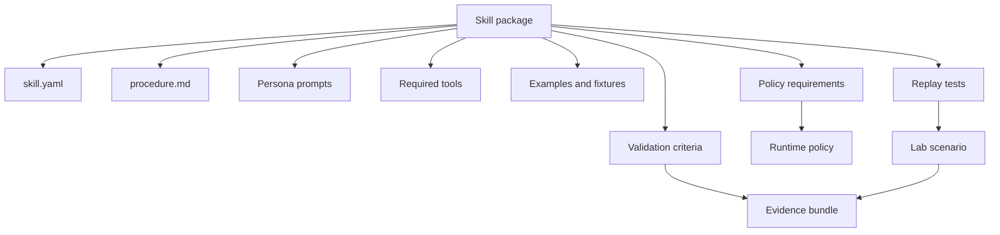

# Skills for Procedural Knowledge

Status: draft for review
Date: 2026-06-25
Issue: https://github.com/ColtMercer/the-agentic-network-platform/issues/25

Skills are versioned procedural knowledge packages. They should be testable, reviewable, policy-bound, and portable across personas and runtime environments.

Skills are not just prompt snippets. A skill should package the human procedure, agent-facing instructions, examples, validators, required tools, risk level, policy requirements, and replayable tests that make procedural knowledge usable and trustworthy.

## Skill Package Contract

A skill package should include:

| Path | Purpose |
| --- | --- |
| `skill.yaml` | Name, owner, version, required tools, approval level, risk rating, supported personas, and source provenance. |
| `procedure.md` | Human-readable workflow, assumptions, prerequisites, and expected outcomes. |
| `prompts/` | Agent instructions and role-specific task framing. |
| `validators/` | Deterministic checks for success, failure, safety, or expected evidence. |
| `examples/` | Known-good inputs, outputs, command traces, and evidence bundles. |
| `policy/` | Runtime, local tool, MCP tool, model, network, and credential permissions required by the skill. |
| `tests/` | Replayable scenarios against lab fixtures or captured evidence. |



## Required Manifest Fields

The initial `skill.yaml` contract should include:

```yaml
name: bgp-troubleshooting
version: 0.1.0
owner: network-engineering
risk: read-only
approval_level: none
supported_personas:
  - engineering-agent
  - operations-agent
required_local_tools:
  - nornir
required_mcp_tools:
  - graph.query
  - telemetry.query
model_routes:
  - default-reasoning
runtime_permissions:
  filesystem:
    read:
      - /workspace/skills/bgp-troubleshooting
    write:
      - /workspace/evidence
  network_egress:
    - telemetry-api
    - source-of-truth-api
credential_refs:
  - nornir-readonly
validators:
  - validators/evidence_required.py
tests:
  - tests/fixture_replay.yaml
```

## Skill Lifecycle

Skills should move through a visible lifecycle:


Lifecycle requirements:

- Skills should be Git-backed and reviewed through pull requests.
- Skills should declare required local tools, MCP tools, model routes, secret references, runtime permissions, and approval thresholds.
- Skills should be schema-validated before publication.
- High-risk skills should require human approval before persona binding.
- Skills should be replay-tested against fixtures where possible.
- Runtime delivery should use rendered persona bundles rather than ad hoc file copies into an agent sandbox.
- Skill execution should produce evidence that can be traced to skill version, Git SHA, persona, runtime, policy decision, and request ID.

## Example Skill Families

| Skill family | Example use | Default risk |
| --- | --- | --- |
| BGP troubleshooting | Investigate peer drops, route visibility, policy drift, and telemetry changes. | Read-only |
| Config diff review | Explain intended changes, compare against source-of-truth, and validate syntax. | Plan |
| Incident triage | Correlate telemetry, graph context, incidents, and recent changes. | Read-only |
| Documentation reconciliation | Compare docs, graph, source-of-truth, and observed network state. | Read-only |
| Change preparation | Build implementation plan, rollback plan, validation checklist, and evidence template. | Approval-gated |

