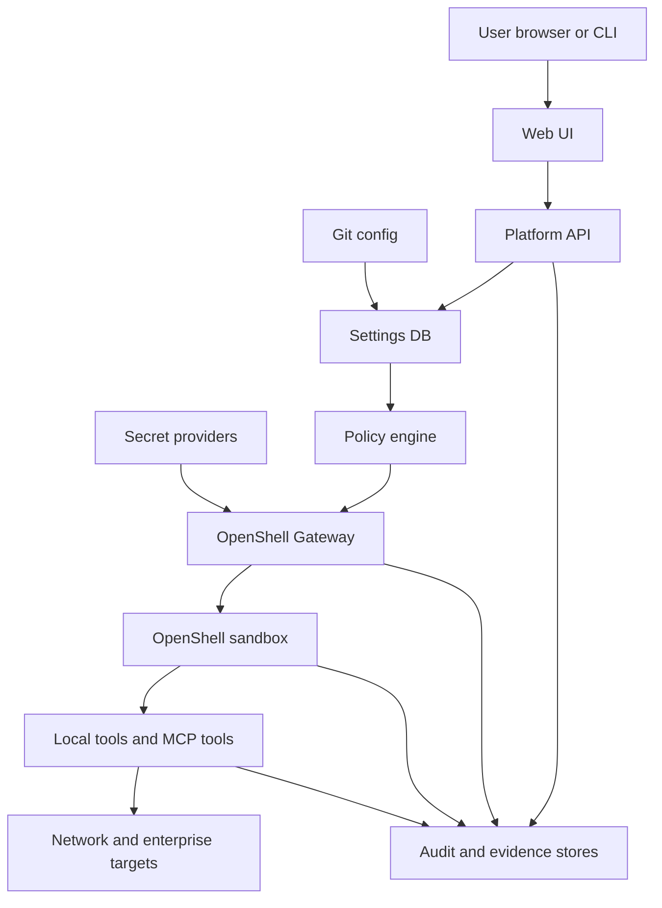

# Threat Model

Status: skeleton
Date: 2026-06-25

This threat model defines the initial security posture for The Agentic Network Platform. It is intentionally a skeleton: each major implementation area should expand this document before production use.

## Security Objective

The platform should let agents perform useful network operations without creating an unchecked shell, credential, model, or network-access path. Every action must be attributable, policy-controlled, scoped to the effective principal, and backed by audit evidence.

## Core Security Invariant

Every request must be authorized by intersecting all relevant scopes. No layer may grant access that another layer denies.

```text
effective_authorization =
  principal_scope
  intersect persona_policy
  intersect runtime_policy
  intersect local_tool_policy
  intersect mcp_tool_policy
  intersect target_system_permission
  intersect credential_scope
  intersect action_risk_policy
  intersect approval_state
```

Where:

- `principal_scope` is either the delegated user scope, an agent-owned identity scope, or a hybrid of both.
- `persona_policy` defines what the configured persona may attempt.
- `runtime_policy` defines what OpenShell and the sandbox permit.
- `local_tool_policy` applies to shell, Nornir, Ansible, Python, and local scripts.
- `mcp_tool_policy` applies to brokered MCP tools and optional adapters.
- `target_system_permission` is the downstream network, source-of-truth, graph, document, or deployment permission.
- `credential_scope` constrains which secret references and downstream identities may be used.
- `action_risk_policy` separates read, plan, write, destructive, and admin actions.
- `approval_state` captures required human, policy, or change-control approval evidence.

## Assets

- User identities, groups, roles, tenants, and session claims.
- Agent-owned identities and credentials.
- Secret references, provider adapters, certificates, and credential mappings.
- OpenShell Gateway state, provider records, runtime policies, and relays.
- OpenShell sandbox filesystem, process, network, and inference boundaries.
- Persona definitions, skills, prompts, templates, and deployment artifacts.
- Nornir, Ansible, local scripts, MCP tools, and target network access.
- Knowledge graph, RAG indexes, episodic memory, raw evidence, and audit logs.
- Git-backed configuration repositories and customer CI/CD handoff artifacts.

## Trust Boundaries



Primary trust boundaries:

- Browser to Platform API.
- Platform API to settings database and Git.
- Settings database to policy and renderer.
- Platform API to OpenShell Gateway.
- Gateway to sandbox Supervisor.
- Sandbox to local tools and optional MCP adapters.
- Tool execution to downstream target systems.
- Runtime components to secret providers.
- Evidence and memory stores to user-facing recall.

## Threats and Initial Mitigations

| Threat | Example | Initial mitigation |
| --- | --- | --- |
| Privilege escalation through agent tools | User asks an agent to use credentials the user should not have | Enforce effective authorization invariant on every request |
| Sandbox escape | Local script accesses host filesystem or unrestricted network | OpenShell Supervisor filesystem, process, and network policy |
| Secret disclosure | Agent reads raw TACACS key, API key, or model provider token | Store references only; resolve through broker/provider path; audit access |
| Prompt or skill injection | Malicious doc changes agent behavior | Signed/versioned skills, source provenance, retrieval filtering, policy-controlled tools |
| Unsafe network change | Agent applies config without review | Read-only default, plan/dry-run first, approvals before apply |
| DB drift from Git | Runtime override outlives intended scope | TTL, owner, reason, audit ID, reconciliation job, drift alerts |
| MCP tool overreach | Tool server performs admin action under broad service account | Broker policy, target scoping, credential scoping, action risk tiering |
| Evidence tampering | Output or audit trail is modified after execution | Immutable evidence digests and append-only audit events |
| Customer deployment overreach | Platform mutates enterprise cluster directly | Generate PRs/artifacts for customer CI/CD by default |

## Git and DB Reconciliation

Git-backed settings should hydrate the database after validation. The database may also contain drafts, imported settings, effective snapshots, live session records, and short-lived runtime overrides.

Runtime overrides must include:

- owner
- reason
- target scope
- TTL
- policy decision ID
- audit ID

When an override expires, the effective setting should be recomputed from Git-backed imported settings and remaining valid overrides. Reconciliation jobs should detect DB effective-state drift from the latest selected Git revision and emit audit events for drift, expiration, recomputation, and failed reconciliation.

## MVP Threat Model Scope

The v0 threat model should be proven against one thin vertical slice:

1. One orchestrator persona.
2. One downstream engineering or operations persona.
3. Git-backed settings hydrated into the DB.
4. Rendered OpenShell local runtime profile.
5. User-delegated read-only Nornir collection.
6. Evidence bundle and audit event.
7. No write actions enabled.

## Open Risks

- Final identity/OBO token propagation model is not selected.
- Final open-source license is not selected.
- Secret provider backend for the first lab deployment is not selected.
- OpenShell Gateway deployment pattern may differ between local, Docker, Kubernetes, and OpenShift targets.
- Memory governance is broad and should be phased carefully.
- Customer CI/CD handoff needs concrete examples before enterprise review.
