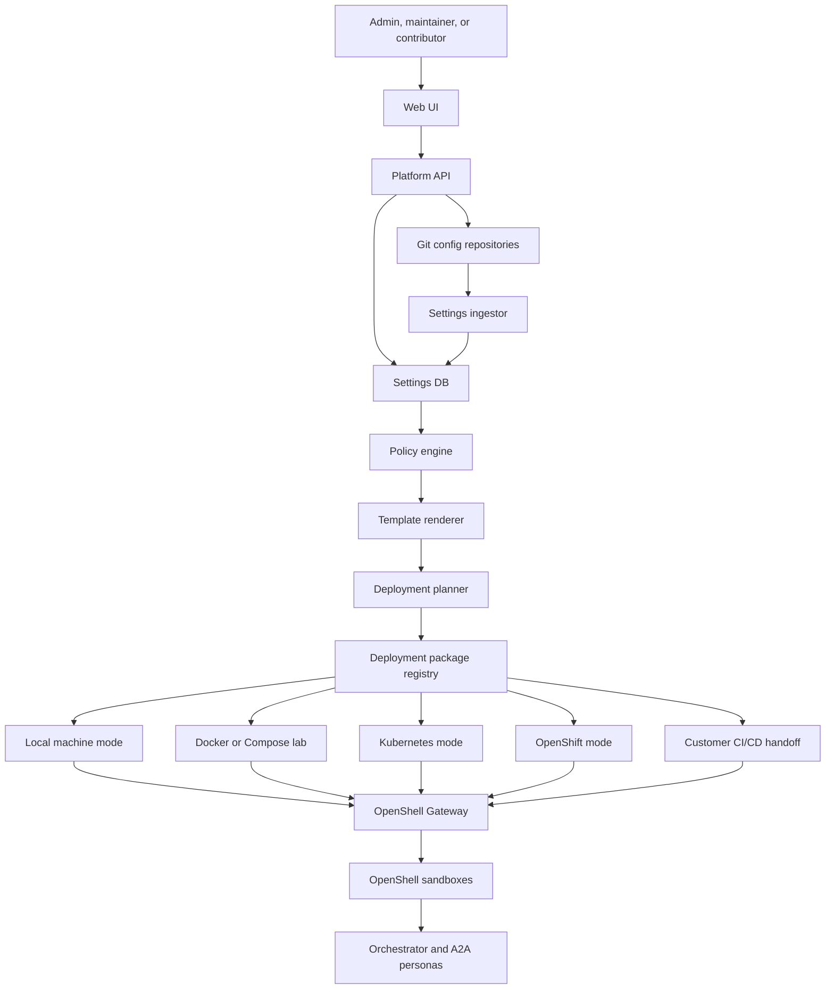
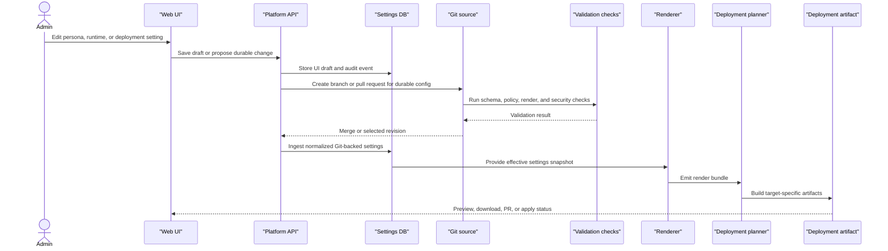
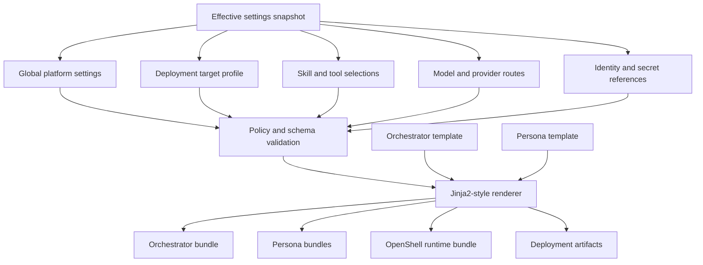
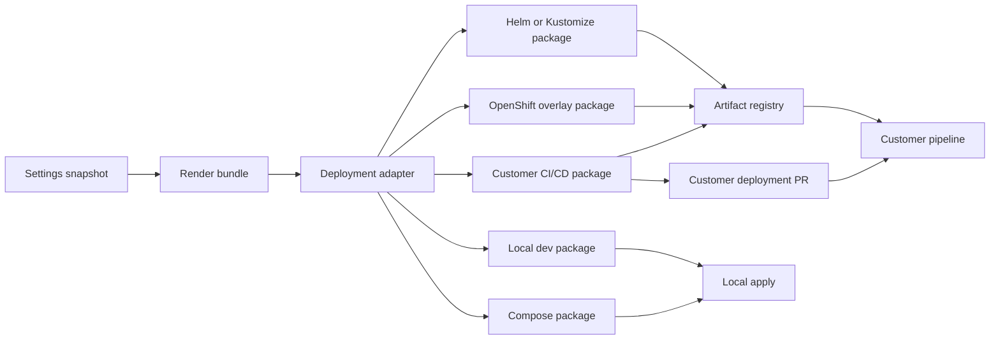
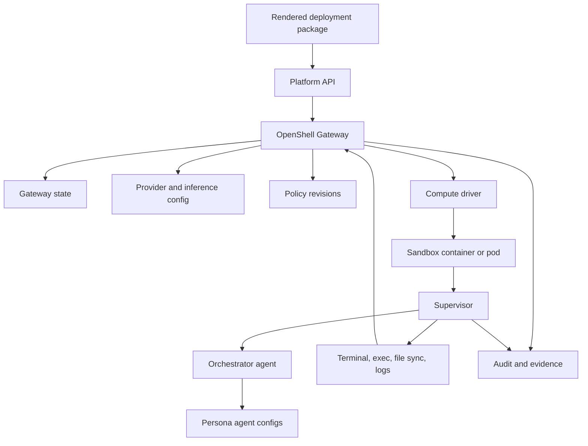
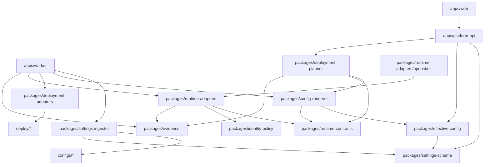
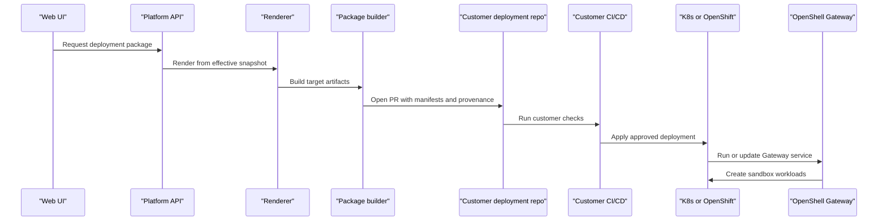

# UI and Agent Deployment Framework Architecture

Status: draft for review
Date: 2026-06-25
Issue: https://github.com/ColtMercer/the-agentic-network-platform/issues/17

This document defines how The Agentic Network Platform UI should configure, render, and deploy agent personas and platform capabilities across local contributor environments, lab Docker deployments, Kubernetes, OpenShift, and customer-owned CI/CD pipelines.

The core design position: the UI is the product control plane, the database is the hydrated and queryable settings substrate, Git is the durable reviewable source, and templates render deterministic deployable bundles. The OpenShell Gateway remains the runtime control plane for sandbox lifecycle, policy delivery, providers, inference routing, relays, and supervisor coordination.

## Goals

- Let project users configure agent personas and capabilities from the UI without hand-editing every runtime file.
- Keep durable settings Git-backed while still populating the settings database for UI, API, validation, rendering, deployment planning, and audit.
- Render orchestrator and persona deployment bundles from templates.
- Support local machines, Docker or Docker Compose labs, Kubernetes, OpenShift, and customer-owned CI/CD.
- Let enterprise customers consume generated artifacts in their own pipeline instead of forcing the platform to apply directly to their clusters.
- Keep OpenShell Gateway and Supervisor boundaries intact.
- Make the codebase structure obvious enough that contributors can build adapters without rewriting the platform.

## Design Principles

1. UI settings do not directly mutate runtime sandboxes.
   The UI writes drafts, proposes Git changes, previews effective settings, and requests deployment plans through the Platform API.

2. Git-backed does not mean DB-free.
   Git remains the durable and reviewable source. Every runtime-impacting config should also be ingested into the database as normalized imported settings and resolved effective settings.

3. Rendering is deterministic.
   A deployment bundle should be reproducible from Git commit SHA, settings snapshot ID, template version, policy revision, image versions, and target environment.

4. Orchestrator is the default agent template.
   The default rendered runtime deploys an orchestrator agent. Configured personas render downstream A2A agent bundles, persona configs, policies, credentials references, and deployment metadata.

5. Deployment adapters should emit artifacts, not own every customer runtime.
   The platform can apply directly in local and lab modes. Enterprise mode should generate PRs or artifact bundles for customer-owned CI/CD.

6. Policy gates rendering and deployment.
   Rendering combines settings, but policy decides whether a persona, secret reference, model route, local tool, MCP tool, network egress rule, or deployment target is allowed.

7. Secret values stay out of Git and raw DB fields.
   UI and Git config may define secret providers, secret references, and access policy. Runtime material resolves through customer-approved secret systems and OpenShell provider paths.

## High-Level Overview



The UI is not a deployment engine by itself. It is the product surface for settings, validation, previews, approvals, and handoff. Deployment work happens through renderers, planners, package builders, and adapters.

## Settings and Capability Domains

The UI should expose settings as product-level domains. The Platform API should normalize those domains into database records, then resolve them into effective deployment input.

| UI domain | What it controls | Rendered outputs |
| --- | --- | --- |
| Personas | Orchestrator and downstream agent mission, identity mode, prompts, A2A cards, tools, skills, models, memory, approvals | Agent config, A2A cards, OpenShell policy bindings |
| Skills | Procedural knowledge packages, validators, examples, tests, source repos | Skill mounts, prompt fragments, validator config, test suites |
| Local tools | Nornir, Ansible, Python, shell utilities, allowed command profiles | Runtime image profile, shell policy, tool allowlist |
| MCP tools | Optional brokered capabilities and schemas | MCP registry config, broker policy, tool scopes |
| Model providers | Local GPU, gateway, cloud, OpenAI-compatible provider routes | OpenShell provider config, inference route, model allowlist |
| Secrets and PKI | Secret providers, secret refs, cert refs, rotation policy, access grants | Secret provider references, runtime credential mapping |
| Identity | User-delegated, agent-owned, hybrid personas, OBO rules, service principals | Identity bindings, policy inputs, audit shape |
| OpenShell runtime | Gateway target, sandbox image, filesystem, network, process, inference, relays | OpenShell gateway config, sandbox policy YAML |
| Deployment targets | Local, Docker, Kubernetes, OpenShift, customer CI/CD | Compose files, Helm values, Kustomize overlays, CI bundles |
| Knowledge and memory | Graph, RAG, episodic memory, retention, provenance | Agent endpoints, memory policy, index access config |
| Observability | Logs, traces, audit export, active provider | OpenTelemetry config, audit export config |
| Event sources | Scheduled jobs, Kafka, NATS, EventBridge, Pub/Sub, Event Hubs | Event router config, persona trigger bindings |

## Settings Flow



Important behavior:

- Draft settings are useful for UI previews and what-if deployment plans.
- Durable settings should become Git changes and then hydrate the DB.
- The renderer should never read directly from random Git files at runtime. It should render from a validated settings snapshot.
- Every artifact should include provenance: settings snapshot ID, Git SHA, template version, policy revision, and render timestamp.

## Template-Based Deployment Model

The platform should use a template-based deployment model. That template system should render multiple artifact types from the same effective settings snapshot:

- OpenShell Gateway config.
- OpenShell sandbox policies.
- Orchestrator agent config.
- Per-persona A2A agent cards.
- Per-persona prompts and capability bindings.
- Local tool profiles for Nornir, Ansible, Python, and shell.
- Optional MCP broker registration and tool policy.
- Model provider and inference route mappings.
- Secret-provider references and credential mapping.
- Docker Compose, Helm values, Kustomize overlays, OpenShift overlays, or customer CI/CD bundle metadata.



Recommendation: keep Jinja2 or a Jinja2-compatible engine for human-readable deployment and config files, but use typed schemas before and after rendering. Templates are excellent for composing configuration; they should not be trusted as policy.

## Persona Deployment Contract

Every persona should render into a versioned bundle. The orchestrator persona is special because it is the default runtime coordinator. Downstream personas follow the same contract but may be deployed as separate A2A agents, subprocesses, sandboxes, or logical agent configs depending on the target.

Minimum persona bundle:

```yaml
persona_id: engineering-agent
persona_version: 0.1.0
identity_mode: user_delegated
runtime:
  openshell_profile: network-agent-runtime
  sandbox_policy: policies/engineering.yaml
a2a:
  card: agents/engineering/card.yaml
  served_by: orchestrator
capabilities:
  local_tools:
    - nornir
    - ansible
    - python
  mcp_tools:
    - graph.query
    - telemetry.query
skills:
  - bgp-troubleshooting
  - config-diff-review
models:
  default_route: private-inference
secrets:
  refs:
    - network-readonly-creds
memory:
  scopes:
    - tenant
    - persona
    - case
deployment:
  target_profile: lab-docker
  rendered_at: 2026-06-25T00:00:00Z
  settings_snapshot: stg_123
```

## Deployment Modes

| Mode | Best for | Platform behavior | Customer behavior |
| --- | --- | --- | --- |
| Local machine | Contributors, quick tests, single-user experiments | Render local config, run UI/API/DB/Gateway locally, use Docker or Podman sandboxes | Developer runs local commands |
| Docker or Compose lab | Home lab, demos, workshops | Render Compose bundle with UI, API, DB, Gateway, runtime image, observability defaults | Lab owner runs Compose and configures local secrets |
| Kubernetes | Shared lab, team environments, production-like runtime | Render Helm values or Kustomize overlays, gateway service, API, UI, DB refs, sandbox namespace | Cluster pipeline applies manifests |
| OpenShift | Enterprise clusters, route/SCC/network-policy needs | Render OpenShift overlays, Route config, SecurityContextConstraints guidance, namespace-scoped policies | Customer validates with OpenShift governance |
| Customer CI/CD | Enterprises with established promotion gates | Create PR, signed artifact bundle, OCI chart, or rendered manifest package | Customer pipeline scans, approves, promotes, and applies |

## Deployment Artifact Flow



Local and lab modes can support direct apply because the blast radius is small and the maintainer owns the target. Enterprise mode should default to handoff: pull request, signed artifact, Helm chart, Kustomize overlay, or customer-specific package consumed by their own pipeline.

OpenShift support should start as overlays and guidance rather than a hardcoded assumption about every customer's cluster. Customers often have established conventions for Routes, SecurityContextConstraints, NetworkPolicies, GitOps controllers, certificate injection, image registries, and namespace ownership. The open source project should generate a good default overlay and make the customer-specific parts explicit.

## OpenShell Gateway Interaction

OpenShell should receive rendered desired state through the Gateway. The platform should not directly mutate sandbox files or bypass Supervisor enforcement.



Gateway-owned concerns:

- Sandbox lifecycle and target compute driver.
- Policy and settings delivery to the Supervisor.
- Provider records and inference routing.
- Authorization decisions and session records.
- Terminal, exec, file sync, log, and relay coordination.

Platform-owned concerns:

- UI settings and product workflow.
- Settings ingestion and DB hydration.
- Effective configuration snapshots.
- Template rendering and deployment package creation.
- Persona registry, skills registry, and deployment target profiles.
- Git PRs, validation checks, and artifact provenance.

## Product Interaction Model

The UI should support four concrete workflows.

### Configure

The user configures personas, skills, tools, providers, secret references, runtime profiles, and deployment targets. The UI shows whether each setting is draft-only, Git-backed, imported, effective, or overridden.

### Preview

The user previews an effective persona deployment before it is applied. Preview should show:

- effective persona configuration
- inherited global settings
- selected skills and tool access
- identity mode and secret references
- rendered OpenShell policy
- rendered deployment artifacts
- policy decisions and validation results
- expected Gateway and sandbox changes

### Publish

The user publishes durable settings through Git:

- create branch
- open PR
- run schema and policy checks
- run render checks
- run security checks
- merge
- hydrate settings DB

### Deploy

The user chooses the deployment target:

- local apply for local/dev
- generated Compose bundle for lab
- generated Helm/Kustomize/OpenShift overlay for cluster deployments
- customer CI/CD PR or artifact bundle for enterprise deployments

## Codebase Architecture

Recommended monorepo layout:

```text
apps/
  web/                     # UI settings, previews, deployment workflows
  platform-api/            # Settings, render, deploy, audit, identity APIs
  worker/                  # Async ingestion, render, validation, package jobs

agents/
  orchestrator/            # Default orchestrator agent template and runtime
  personas/                # Built-in persona templates and fixtures

packages/
  settings-schema/         # Typed config schemas and migrations
  settings-ingestor/       # Git-backed config ingestion into DB
  effective-config/        # Inheritance and snapshot resolution
  config-renderer/         # Jinja2-style renderer with schema validation
  deployment-planner/      # Deployment plan and diff generation
  deployment-adapters/     # Compose, Helm, Kustomize, OpenShift, and CI/CD artifacts
  runtime-contracts/       # Runtime-neutral bundles, capability declarations, sessions, evidence
  runtime-adapters/        # Launch, terminal, file sync, health, evidence readback
    openshell/             # Gateway and Supervisor integration (reference runtime, security baseline)
    kubernetes/            # Kubernetes-native agent sandbox model (SIG Agent Sandbox-style); primary portability target
    openshift/             # OpenShift agent sandbox overlays, SCC, Route, and runtime-class handling
    local-containers/      # Docker and Podman local and lab mode only
    cloud-sandboxes/       # AWS AgentCore, Google Agent Sandbox, Cloudflare, Vercel (opt-in; declared limits)
    developer-sandboxes/   # E2B, Daytona, Runloop, CodeSandbox SDK, Microsandbox, Modal
    appliance/             # Dell, HPE, and other private AI stack deployment channels
  identity-policy/         # User-delegated, agent-owned, hybrid identity rules
  evidence/                # Evidence bundle schema and provenance writers

configs/
  personas/                # Git-backed persona definitions
  skills/                  # Built-in skill manifests
  deployment-targets/      # Local, Docker, K8s, OpenShift, CI/CD profiles
  openshell/               # Gateway profiles and sandbox policies
  templates/               # Runtime, persona, Compose, Helm, Kustomize templates

deploy/
  docker-compose/          # Lab reference deployment
  helm/                    # Kubernetes chart
  kustomize/               # Environment overlays
  openshift/               # OpenShift-specific overlays and notes
  cicd-examples/           # GitHub Actions, GitLab CI, Tekton, Argo CD examples

projects/
  nornir-runtime/          # Local Nornir SDK helpers and script runner
  nornir-mcp/              # Optional MCP adapter
```

## Package Boundaries



Package rules:

- `settings-schema` owns the contract, not the UI.
- `settings-ingestor` turns Git config into normalized DB rows.
- `effective-config` computes inheritance and effective snapshots.
- `config-renderer` turns snapshots into files and validates rendered output.
- `deployment-planner` computes what would change for a target.
- `deployment-adapters` produce target-specific deployment artifacts.
- `runtime-contracts` owns runtime-neutral bundle, session, terminal, secret-reference, model-route, evidence, capability, and health schemas.
- `runtime-adapters` translate runtime-neutral bundles into launch, terminal attach, file sync, secret-reference mapping, model routing, evidence collection, teardown, and health behavior.
- `runtime-adapters/openshell` knows Gateway/Supervisor deployment semantics.
- `apps/web` should never embed deployment rendering logic.

## Required APIs

Initial Platform API surface:

- `GET /settings/domains`: list configurable domains and source state.
- `POST /settings/drafts`: create UI draft.
- `POST /settings/proposals`: create Git-backed config PR.
- `POST /settings/ingest`: ingest selected Git revision.
- `GET /effective-config/{snapshot_id}`: inspect resolved settings.
- `POST /render/preview`: render without publishing artifacts.
- `POST /deploy/plan`: produce deployment diff and policy result.
- `POST /deploy/package`: generate artifact bundle.
- `POST /deploy/apply-local`: local or lab apply only.
- `POST /deploy/handoff`: open customer CI/CD PR or publish signed bundle.
- `GET /deploy/runs/{id}`: render, validation, package, and handoff status.

## Validation Gates

Every render or deployment package should pass:

- schema validation before render
- policy validation before render
- template render
- schema validation after render
- OpenShell policy validation
- secret reference validation
- identity binding validation
- deployment target validation
- artifact provenance generation
- optional security scan or customer CI policy check

## Customer CI/CD Handoff

Enterprise customers should not need to let the platform directly mutate production clusters. The default enterprise flow should be:



This respects existing enterprise controls. The open source project provides artifacts, examples, contracts, and optional adapters. The customer controls promotion, scanning, approvals, and apply.

## Local Contributor Flow

Local contributor mode should be intentionally boring:

```text
git clone
pnpm install or task bootstrap
tanp dev up
open http://localhost:5173
configure local provider and persona
render local deployment preview
start OpenShell Gateway
launch orchestrator sandbox
```

Local mode should use:

- SQLite or local Postgres.
- Docker or Podman.
- local OpenShell Gateway.
- local development secrets provider.
- fake or fixture inventory by default.
- optional real lab inventory after explicit configuration.

## Open Questions

- Should the first deployment renderer use raw Jinja2, Copier, Helm templates, CUE, Dhall, or a typed AST plus template emitters?
- Should the project ship an Operator later, or keep Kubernetes/OpenShift as Helm and Kustomize first?
- Should customer CI/CD handoff support GitHub Actions first, Argo CD first, Tekton first, or generic Git PR first?
- Should the local developer command be `tanp`, `agentic-network`, or a workspace task runner?
- Should persona bundles be stored as OCI artifacts for promotion between environments?
- What minimum runtime-adapter capability level is required before state-changing network automation can be enabled?
- Should generated OpenShell Gateway config be pushed through the Gateway API or deployed as mounted config depending on target mode?
