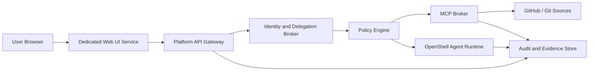
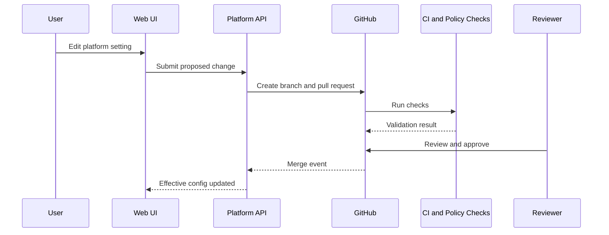

# Web UI Deployment Architecture

The Agentic Network Platform UI should be a dedicated service, not a process hosted inside the NVIDIA OpenShell agent sandbox.

OpenShell is the isolated runtime for autonomous agents. The UI is the human-facing control plane that authenticates users, shows evidence, proposes configuration changes, and calls platform APIs using delegated identity.

## Decision

Run the UI as its own web service.



## Rationale

- OpenShell should constrain agent execution, filesystem access, process behavior, network egress, and inference routing.
- The UI needs a stable web-service lifecycle, browser security headers, static asset delivery, authentication redirects, and user session management.
- Combining the UI and agent sandbox would blur privilege boundaries and make it harder to reason about user identity versus agent capability.
- A dedicated UI service can be deployed, scaled, cached, scanned, and observed independently.

## Configuration Model

Prefer Git-backed settings.

UI-managed settings should be limited to:

- user preferences
- temporary runtime overrides
- approval decisions
- draft changes before they become pull requests
- operational status annotations

Git-backed settings should include:

- persona definitions
- skill sources
- MCP server manifests
- OpenShell runtime policies
- identity and delegation policy
- memory retention rules
- ingestion connector definitions



## Service Boundary

The UI service should:

- serve static application assets
- authenticate users through the platform identity flow
- call only Platform API endpoints
- display effective permissions and audit evidence
- propose Git-backed configuration changes

The UI service should not:

- hold network device credentials
- call MCP servers directly from the browser
- execute agent code
- run inside an OpenShell sandbox as the production hosting path
- bypass Git review for durable configuration changes

## Local Development

The initial implementation lives at `apps/web`.

```bash
npm run web:dev
npm run web:build
```

## References

- NVIDIA OpenShell overview: https://docs.nvidia.com/openshell/about/overview
