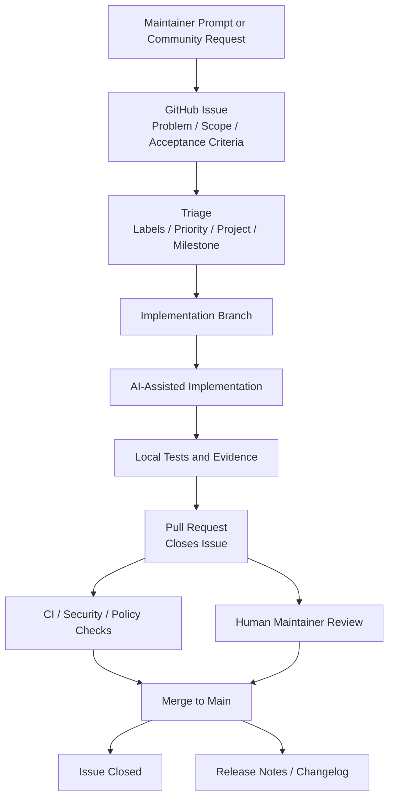

# Issue-Driven Development Workflow

The Agentic Network Platform should earn trust through a visible engineering trail. Open source users should be able to inspect why a change exists, how it was implemented, what reviewed it, what tests ran, and which issue closed.

This workflow is designed for a project where a human maintainer directs the work and an AI coding agent may be the primary code writer.

## Goal

Every code change should produce a public chain of evidence:

```text
issue -> branch -> commits -> pull request -> checks -> review -> merge -> closed issue
```

The project should not pretend that multiple humans wrote code if they did not. Trust comes from transparent process, reproducible checks, clear ownership, and visible review decisions.

## Workflow



## Single-Writer, Public-Review Model

The project can still be credible if one person and one AI agent write most of the code.

The trust model should be:

- The human maintainer owns product direction and merge approval.
- The AI implementer writes code and updates docs.
- GitHub issues define the work before implementation.
- Pull requests expose the diff, rationale, tests, and risk.
- CI verifies objective checks.
- Human approval is required before merge.
- The issue is closed only by the merged PR or a documented maintainer decision.

The AI agent should not merge its own PR without human approval.

## Issue Lifecycle

Recommended issue states:

- `needs-triage`: issue was created but not yet accepted.
- `accepted`: issue is valid and in scope.
- `ready`: acceptance criteria are clear enough for implementation.
- `in-progress`: an implementation branch or PR exists.
- `blocked`: waiting on design, dependency, access, or decision.
- `review`: PR is open and awaiting checks or review.
- `done`: issue was closed by a merged PR or documented decision.

Recommended labels:

- `type: feature`
- `type: bug`
- `type: docs`
- `type: security`
- `type: design`
- `project: nornir-mcp`
- `project: platform`
- `project: identity`
- `project: governance`
- `risk: low`
- `risk: medium`
- `risk: high`
- `ai-assisted`

## Required Issue Template

Each code issue should answer:

- What problem are we solving?
- Why does this matter for users or trust?
- What is in scope?
- What is out of scope?
- What acceptance criteria must be met?
- What tests or validation evidence are required?
- What security, identity, network, or data impact exists?
- Which project is affected?

## Required PR Template

Each PR should answer:

- Which issue does this close?
- What changed?
- Why is the approach acceptable?
- What tests ran?
- What security or identity impact exists?
- What documentation changed?
- Was AI assistance used?
- What reviewer decision is needed?

## Branch Protection

When the repository is published, configure `main` so merges require:

- Pull request before merge.
- At least one approving review from a human maintainer.
- Passing status checks.
- Conversation resolution.
- No force pushes.
- No direct pushes to `main`.

For high-risk areas, require stricter review:

- Identity and authorization.
- MCP tool execution.
- Network write actions.
- Secrets handling.
- OpenShell policy.
- Release automation.

## Issue-to-PR Mechanics

Use GitHub closing keywords in the PR body:

```text
Closes #123
Fixes #123
Resolves #123
```

This links the PR to the issue and closes the issue when the PR is merged into the default branch.

## AI Agent Operating Procedure

When the maintainer prompts the AI agent:

1. Convert the prompt into one or more issue drafts.
2. Ask for confirmation if the issue scope is ambiguous or high risk.
3. Create or update the GitHub issue.
4. Create a branch named `issue-<number>/<short-slug>`.
5. Implement only the issue scope.
6. Run tests and capture evidence.
7. Open a PR using the template.
8. Include `Closes #<number>`.
9. Mark AI assistance transparently.
10. Wait for human review before merge.

## Bootstrapping Exception

The initial repository setup may include direct commits while there is no published remote, issue tracker, branch protection, or CI.

After the repository is public and governance files are merged, the project should treat direct commits to `main` as exceptional maintenance events that require a follow-up issue explaining why the normal workflow was bypassed.

## Minimal GitHub Setup

Before public launch:

- Publish the repository.
- Add issue forms under `.github/ISSUE_TEMPLATE/`.
- Add `.github/pull_request_template.md`.
- Configure branch protection or repository rulesets for `main`.
- Add CI checks.
- Add security scanning.
- Add labels and milestones.
- Create the first public roadmap issues.

## Trust Signals for Users

Open source users should be able to see:

- Clear issue history.
- PRs linked to issues.
- Review decisions.
- CI and security results.
- Changelog entries.
- Release tags.
- Security policy.
- Threat models for high-risk components.
- Signed releases when practical.
