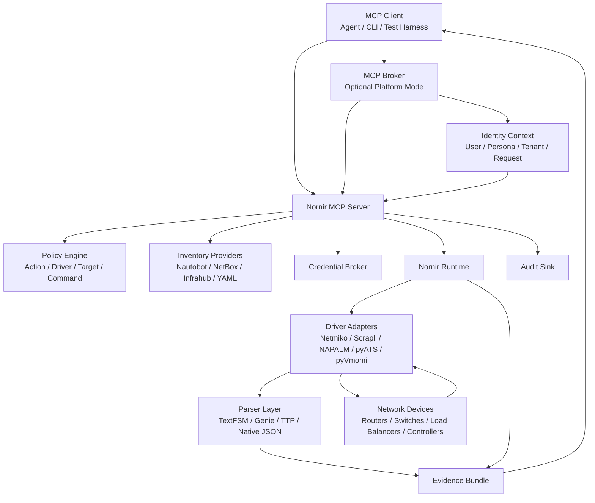

# Nornir MCP

A standalone MCP server for safe, inventory-backed network interaction using Nornir.

`nornir-mcp` is one of the first primary projects in The Agentic Network Platform monorepo. It should run independently for open source users, and it should also integrate with the larger agent environment through the MCP registry, delegated identity, policy checks, and audit events.

## Purpose

Agents need to inspect and operate networks through controlled tools, not through raw shell access or prompt-level guesses. `nornir-mcp` provides that control plane for network command execution, collection, parsing, config planning, and eventually approved change execution.

Nornir provides the inventory and task-execution framework. Driver adapters provide the device access layer. Policy decides which users, agents, targets, commands, and drivers are allowed.

## Requirements

- Use Nornir for inventory, groups, host metadata, task execution, concurrency, and result aggregation.
- Support Netmiko, Scrapli, NAPALM, pyATS, pyVmomi, and future driver adapters.
- Keep driver selection in configuration and policy, not agent prompts.
- Support inventory from Nautobot, NetBox, Infrahub, static YAML, and test fixtures.
- Support read-only collection by default.
- Require approval, dry-run, and audit for write actions.
- Return structured evidence for every run.
- Preserve delegated user identity from chat or API through MCP and downstream network access.
- Support standalone mode and platform-integrated mode.
- Provide replay fixtures for parser development, regression testing, and demos.

## Architecture



## Driver Selection

Driver selection must be explainable. The agent should ask `nornir.driver.explain` when it needs to understand why a device will use a given driver.

Initial driver policy examples:

```yaml
driver_rules:
  - name: load-balancers-use-scrapli
    description: Prefer Scrapli for load balancers when the platform adapter is available.
    priority: 100
    match:
      device_role: load-balancer
    driver: scrapli
    allowed_actions:
      - show
      - collect

  - name: network-os-default-netmiko
    description: Use Netmiko as the broad default for network OS platforms.
    priority: 50
    match:
      platform_family: network-os
    driver: netmiko
    allowed_actions:
      - show
      - collect

  - name: napalm-for-state-validation
    description: Use NAPALM where normalized getters are available.
    priority: 80
    match:
      capability: napalm
      action_family: state_validation
    driver: napalm
    allowed_actions:
      - get_facts
      - get_interfaces
      - get_bgp_neighbors

  - name: pyats-for-deep-cisco-parsing
    description: Use pyATS or Genie parsing for supported Cisco commands.
    priority: 75
    match:
      platform_vendor: cisco
      parser_family: genie
    driver: pyats
    allowed_actions:
      - parse
      - learn

  - name: vmware-use-pyvmomi
    description: Use pyVmomi for VMware controller interactions.
    priority: 90
    match:
      platform_family: vmware
    driver: pyvmomi
    allowed_actions:
      - query
      - collect
```

Selection inputs:

- platform
- platform family
- network OS
- vendor
- hardware model
- device role
- site
- tenant
- tags
- command family
- action type
- parser requirement
- driver capability
- user permission
- persona permission

## MCP Capabilities

Initial read capabilities:

- `nornir.inventory.query`: search hosts and groups, then return the resolved target set.
- `nornir.driver.explain`: explain driver selection for one host or target set.
- `nornir.command.run_readonly`: run approved read-only commands.
- `nornir.collect.raw`: collect raw CLI output with evidence metadata.
- `nornir.collect.parse`: collect raw output and parse with TextFSM, Genie, TTP, or native JSON.
- `nornir.test.fixture_replay`: replay known outputs for parser and policy tests.

Initial write-gated capabilities:

- `nornir.config.plan`: build intended changes, diffs, validation steps, and rollback notes.
- `nornir.config.stage`: stage approved configuration to a safe intermediate state where supported.
- `nornir.config.apply`: apply approved changes only after policy and human approval.
- `nornir.config.rollback`: execute an approved rollback plan.

## Delegated Identity

`nornir-mcp` must not run as an omnipotent network automation account for every user.

Every request should include:

- user ID
- user groups and roles
- tenant or business scope
- persona ID
- request ID
- approval ID when required
- target set
- requested action
- downstream identity mode

Effective authorization must follow the platform invariant in [Threat Model](../../docs/architecture/threat-model.md#core-security-invariant). For `nornir-mcp`, that means Nornir-specific policy, target-device permission, and credential scope are part of the broader effective authorization decision.

```text
effective_authorization =
  principal_scope
  intersect persona_policy
  intersect runtime_policy
  intersect local_tool_policy
  intersect mcp_tool_policy
  intersect target_system_permission
  intersect credential_scope
  intersect action_risk_policy
  intersect approval_state
```

Downstream identity modes:

- Per-user credentials or delegated tokens where the network platform supports them.
- Privileged service account with explicit user attribution and target-scoped policy where per-user auth is not possible.
- Lab fixture identity for offline tests and demos.

## Evidence Bundle

Every capability should return structured evidence:

```yaml
request_id: req-123
user_id: user@example.com
persona_id: network-engineering-agent
capability: nornir.command.run_readonly
target_count: 2
targets:
  - hostname: edge-01
    platform: cisco_ios
    driver: netmiko
    command: show version
    status: success
    started_at: "2026-06-22T00:00:00Z"
    duration_ms: 842
    raw_output_ref: evidence/req-123/edge-01/show_version.txt
    parsed_output_ref: evidence/req-123/edge-01/show_version.json
  - hostname: lb-01
    platform: f5_tmsh
    driver: scrapli
    command: show sys version
    status: success
    started_at: "2026-06-22T00:00:00Z"
    duration_ms: 611
    raw_output_ref: evidence/req-123/lb-01/show_sys_version.txt
policy:
  decision: allow
  policy_id: readonly-collection-v1
audit_id: audit-456
```

## Security Rules

- Default deny for all commands and target sets.
- Read-only commands require explicit allow lists.
- Write commands require dry-run, approval, target scope, and rollback evidence.
- Secrets are resolved by a broker and never returned to agents.
- Raw output can be sensitive and must inherit source sensitivity labels.
- Command output should be retained according to policy.
- Every run must emit an audit record.
- Driver errors must be returned per device without hiding partial failure.

## Standalone Versus Platform Mode

Standalone mode:

- Runs as an MCP server with local config.
- Uses local inventory, lab credentials, and file-based policy.
- Useful for developers, labs, demos, and open source users.

Platform-integrated mode:

- Registers with the platform MCP registry.
- Uses delegated identity from the platform.
- Uses central policy, secrets, audit, and observability.
- Is available only to approved agent personas and users.

## Initial Project Shape

```text
projects/nornir-mcp/
├── README.md
├── pyproject.toml
├── src/
│   └── nornir_mcp/
│       ├── server.py
│       ├── capabilities/
│       ├── drivers/
│       ├── inventory/
│       ├── policy/
│       ├── identity/
│       └── evidence/
├── examples/
│   ├── standalone/
│   └── platform-integrated/
├── fixtures/
│   ├── inventory/
│   ├── raw-output/
│   └── policies/
├── tests/
│   ├── unit/
│   ├── policy/
│   └── integration/
└── docs/
    ├── threat-model.md
    ├── driver-selection.md
    └── capability-manifest.md
```

## MVP

1. Standalone MCP server with static YAML inventory.
2. Driver policy evaluator and `nornir.driver.explain`.
3. Read-only command execution through Netmiko and Scrapli.
4. Structured evidence bundle.
5. Policy tests for denied commands, denied targets, and denied driver paths.
6. Platform registration manifest.
7. Delegated identity request envelope.
8. Fixture replay for parser development.
